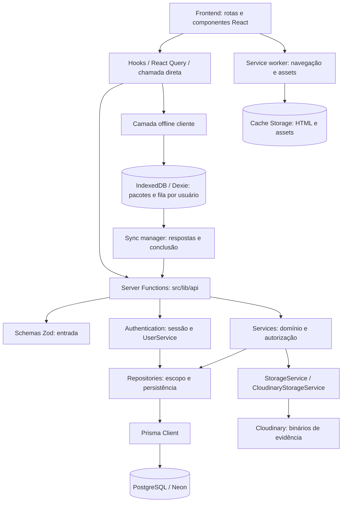

# Arquitetura da plataforma

## Escopo e fontes

Arquitetura implementada, reconferida na Fase 5 em 4 de outubro de 2026 sobre
`edc6170`. Fontes: [Server Functions](../src/lib/api/), [backend](../src/server/),
[hooks](../src/hooks/), [rotas](../src/routes/), [offline](../src/offline/),
[worker](../public/sw.js) e [build](../vite.config.ts). Revisão estática/documental,
sem consultas ao banco ou nova homologação funcional.

React 19/TypeScript estrito, TanStack Router e TanStack Start compõem a aplicação.
Frontend, SSR e Server Functions integram o mesmo projeto/build; Nitro usa
preset Vercel. A fronteira de negócio são Server Functions, sem backend REST
separado, Express, Fastify, NestJS ou API Gateway implementados. O nome acadêmico
[API REST](../Documentation/EspecificacaoAPIREST.md) não muda esse mecanismo.
Contratos: [API.md](./API.md).

## Camadas e relações

Fluxo principal online: Tela → Hook/React Query ou chamada direta → Server
Function → Service → Repository → Prisma → PostgreSQL. Tela não acessa Prisma.
Validação de entrada e sessão precedem operação de domínio; autorização combina
verificações dos Services e filtros de persistência.



PlantUML equivalente: [application.puml](../Documentation/diagrams/architecture/application.puml).
Setas representam dependências/fluxos possíveis, não transação conjunta.
IndexedDB e Cache Storage são mecanismos separados. Authentication resolve
conta por UserService/UserRepository; autorização dos recursos usa a identidade
resolvida, não o proprietário fornecido no payload.

| Camada            | Responsabilidade implementada                                                               |
| ----------------- | ------------------------------------------------------------------------------------------- |
| Rotas/componentes | Interface, formulários, validação para UX, erro e proteção de navegação                     |
| Hooks/React Query | Loading, consultas/mutações, cache em memória e invalidação; inspeções usam fachadas locais |
| Server Functions  | GET/POST gerados pelo Start, entrada, sessão, adaptação para Service e retorno              |
| Schemas Zod       | UUIDs, enums, limites, coerções, normalização e combinações de campos                       |
| Services          | Domínio, elegibilidade, autorização, diretivas de estado, hashes, snapshots e DTOs          |
| Repositories      | Consultas/joins, ownership/visibilidade, revisão, deduplicação e transações                 |
| Prisma/PostgreSQL | ORM/client, conexão via adapter-pg e persistência relacional principal                      |

## Estrutura real

```text
src/
  components/             UI, AppShell e relatório imprimível
  hooks/                  Hooks de consulta/mutação
  lib/api/                *.functions.ts, query keys e server-result.ts
  lib/validation/         Schema compartilhado do cadastro
  routes/                 Roteamento por arquivos; __root e layout _app
  offline/                Dexie, sessão local, pacotes e sincronização
  server/
    auth/                 Sessão e bcrypt
    catalog/              Definições institucionais
    errors/               ApiError e subclasses
    prisma/               Prisma Client e adapter-pg
    repositories/         Persistência e conflitos internos
    responses/            Result e paginação
    schemas/              Contratos Zod
    services/             Operações de domínio
    storage/              StorageService e CloudinaryStorageService
    types/                Tipos compartilhados
    utils/                Hashes canônicos e helpers
  generated/prisma/       Cliente gerado a partir do schema
prisma/                   Schema, migrations, Demo Seed e Platform Seed
public/                   Manifest, worker, fallback e ícone
scripts/                  Utilitários e validadores operacionais
```

Server Functions carregam Services/sessão por imports dinâmicos nos handlers.
Schemas podem ser compartilhados; importação de tipos não consulta Prisma.
`getGreeting` usa configuração server-only e retorna `{ greeting, mode }`, sem
Service/Repository ou persistência de SST.

## Fluxos de requisição e exceções

Exemplo Empresas: rota → hook/mutation → `company.functions.ts` → schema Zod →
`getAuthenticatedUser` → `CompanyService` → `CompanyRepository` → Prisma/PostgreSQL.
Service força createdById da sessão; Repository filtra leitura/mutação pelo dono.
O resultado retorna pelo handler/hook à tela. `inputValidator`/`validator` podem
rejeitar entrada antes do handler.

- **Login:** formulário em login.tsx chama `login` diretamente, sem mutation
  React Query. Cadastro usa React Hook Form, Zod compartilhado e mutation.
- **Proteção de rota:** `/_app.beforeLoad` chama `getAppSession`, redirecionando
  falhas para /login antes do AppShell. Guard é separado da autenticação de
  cada Server Function protegida.
- **Sessão:** logout limpa cookie e retorna sucesso sem persistência de domínio;
  getCurrentSession usa helper de sessão/UserService, sem CRUD de sessões.
- **Inspeção:** hooks de resposta/conclusão gravam localmente primeiro, inclusive
  online. `inspection-client.ts` protege pacote com alterações pendentes de refetch.
- **Normas:** leitura autenticada de catálogo compartilhado, sem filtro por dono
  ou administração de normas exposta.
- **Scripts/seeds:** externos à fronteira web, podem usar Prisma direto e/ou
  Services; não dispensam sessão na aplicação.

## Autenticação e identidade

[session.ts](../src/server/auth/session.ts): `createAuthSession` chama updateSession
após UserService.authenticate comparar bcrypt. Dados de domínio da sessão:
userId. Não existe model/tabela própria de sessões nem fluxo JWT.
Cookie `safe_watch_session`, maxAge=28800 segundos, HttpOnly, SameSite=lax,
Path=/, Secure em produção. SESSION_SECRET aparado é obrigatório em produção;
fallback de desenvolvimento somente em outros ambientes. Não há renovação de
login explicitamente implementada pela aplicação.

`getAuthenticatedUser` lê getSession, resolve ID e reconsulta
UserService.getUserById/UserRepository.findActiveById (deletedAt=null). Sem
identidade: UNAUTHORIZED. Conta ausente/excluída: limpa cookie e devolve NOT_FOUND
do Service. Exceções inesperadas podem propagar. `requireAuthenticatedUser`
lança erro se a resolução falhar; handlers atuais usam getAuthenticatedUser.

Registro público atribui TECHNICIAN, normaliza e-mail, gera bcrypt custo 12 e
retorna RegisteredUser (id/name/email), sem sessão. Login/sessão retornam SafeUser
(usuário sem password). Roles armazenadas não implementam RBAC.

```mermaid
sequenceDiagram
    actor U as Usuário
    participant F as Frontend
    participant SF as Auth Server Functions
    participant US as UserService
    participant DB as UserRepository / Prisma / PostgreSQL
    participant S as Session helpers / TanStack Start
    U->>F: Cadastro ou login
    F->>SF: register ou login: validação Zod
    SF->>US: register ou authenticate
    US->>DB: Consulta conta / persiste cadastro com bcrypt
    DB-->>US: Usuário
    US-->>SF: RegisteredUser ou SafeUser / erro
    alt Cadastro com sucesso
        SF-->>F: RegisteredUser; sem sessão
        F-->>U: Navegar para login
    else Login com sucesso
        SF->>S: createAuthSession: updateSession com userId
        S-->>F: Cookie HttpOnly safe_watch_session
        SF-->>F: SafeUser
    end
    F->>SF: getCurrentSession ou chamada protegida com cookie
    SF->>S: getAuthenticatedUser: getSession
    S->>US: getUserById a partir da sessão
    US->>DB: findActiveById: deletedAt=null
    DB-->>US: Conta atual ou ausente
    US-->>S: SafeUser / NOT_FOUND
    S-->>SF: Identidade revalidada; sem identidade: UNAUTHORIZED
    SF-->>F: Resultado / acesso ao fluxo protegido
```

PlantUML equivalente: [authentication.puml](../Documentation/diagrams/architecture/authentication.puml).
Fluxos de sucesso/revalidação: credenciais inválidas não criam cookie; sessão
identifica usuário, sem dar permissão sobre qualquer recurso.

`getAppSession` usa remoto quando possível ou usuário seguro cacheado por oito
horas offline/em exceção; no SSR chama função remota. Cache local não estende
cookie nem autoriza sincronização. AppShell tenta logout remoto e limpa dados
locais/cache de navegação; falha remota não significa revogação confirmada.

## Fronteira de autorização

Identidade vem da sessão no servidor. InspectionService.listInspections
sobrescreve filters.userId pelo ID autenticado; aceitar esse campo no schema não
permite selecionar dono. Company/Checklist têm schemas clientes sem createdById.
canManage orienta UI, sem constituir autorização.

Services verificam elegibilidade; Repositories aplicam escopo em consultas,
joins, connects e updates. Company usa createdById; Checklist pessoal usa
createdById/isOfficial=false; Inspection usa userId; NC/ação/evidência seguem
relações até inspeção. Relatório, dashboard e sincronização restringem o mesmo
contexto. Recurso privado alheio/inexistente geralmente retorna NOT_FOUND.

Publicação acessível permite leitura/reutilização autenticada, sem expor draft
alheio ou inspeções do autor. Oficial tem dono NULL/isOfficial=true/isTemplate=true;
API pessoal impede mutações inclusive para ADMIN. Bootstrap externo à web.
Matriz: [BusinessRules.md](./BusinessRules.md).

## Services, Repositories e schemas

Services coordenam domínio, sem concentrar toda validação técnica:
ChecklistVersionService prepara publicação/hash; ChecklistService decide
origem/conteúdo/nome da cópia; InspectionService prepara snapshot;
InspectionResponseService decide NC/conclusão e hash offline; EvidenceService
valida bytes/contexto e coordena storage; ReportService/DashboardService montam
DTOs reais. OfficialChecklistService é bootstrap operacional.

Repositories encapsulam Prisma e executam isolamento/deduplicação/revisão,
joins e updates condicionais. Na cópia, Repository controla transação e invoca
callback síncrono do Service para preparar domínio. BaseRepository não implica
CRUD exposto de todas as entidades. ChecklistItemRepository é legado; edição
atual usa ChecklistVersionItemRepository.

Schemas validam entrada: paginação/enums/UUIDs, coerções de número/data/boolean,
trim, limites e campos combinados. Cadastro reexporta
src/lib/validation/registration.schema.ts; Company/Checklist também têm wrappers
de ID/update nas Server Functions. Cadastro/cópia rejeitam extras; objetos comuns
normalmente removem desconhecidos. Upload usa parseEvidenceUploadFormData;
resposta exige exatamente um identificador; metadados offline exigem conjunto
completo.

Zod não consulta ownership nem recalcula hash. Service valida estado/integridade;
constraints PostgreSQL validam estrutura. UUID não prova pai elegível; completude
é domínio; CHECK de hash valida formato, não digest do conteúdo. Coerção de prazo
NULL para epoch permanece concern, sem correção nesta fase.

## Persistência, histórico e transações

Prisma 7 gera src/generated/prisma; client.ts usa PrismaPg com DATABASE_URL e
reutilização global fora de produção. Migrations definem evolução estrutural;
índices parciais/CHECKs não estão integralmente no schema. Modelo, legado,
cardinalidades e divergência da FK Checklist pertencem a
[Database.md](./Database.md) e ao [Dicionário](../Documentation/DicionarioDeDados.md).

Checklist/versões/itens/normas são manutenção; inspeção/snapshot/itens/normas são
histórico. Snapshot congela conteúdo de checklist, sem empresa/usuário/operação
inteira. Backfill UNVERIFIED_LEGACY não prova histórico. Criação aceita hash
presente, recalculado só no formato 1; cópia exige formato 1 íntegro.

| Operação            | Unidade atômica implementada                                                                                                               |
| ------------------- | ------------------------------------------------------------------------------------------------------------------------------------------ |
| Checklist           | ChecklistRepository.createWithDraft: nested write atômico de identidade/draft/itens/normas; aceita cliente transacional                    |
| Cópia               | copyFromSource: leitura/seleção/preparação/inserts em RepeatableRead, UUIDs e lotes; não reserva nome global                               |
| Draft               | ChecklistVersionRepository/ChecklistVersionItemRepository: metadados/itens/associações e revisão                                           |
| Publicação/retirada | UPDATE condicional/leitura; publicação confere expectedUpdatedAt preparado no Service                                                      |
| Inspeção/snapshot   | InspectionRepository.createWithSnapshot: escrita conjunta; leitura/preparação do Service precede transação                                 |
| Resposta/NC         | InspectionResponseRepository.saveWithNonConformity: estado/resposta/NC; revisão/confirmação offline quando presentes                       |
| Conclusão           | updateStatusIfCurrent ou completeWithOfflineOperation: estado condicional e confirmação no segundo; completude verificada antes no Service |
| Ação                | CorrectiveActionRepository.createWithNonConformityTransition: ação/diretiva condicional à NC na transação quando há transição              |
| Evidência           | EvidenceRepository: transações locais para contexto/metadados; Cloudinary fora delas                                                       |
| Bootstrap           | OfficialChecklistRepository.createPublished: identidade/draft/publicação por template, sem atomicidade global da carga                     |

Não há transação por toda Server Function nem snapshot global das consultas do
dashboard. Leituras de lista/detalhe de NC e lista de ações chamam markOverdue e
persistem atrasos; dashboard somente deriva, sem atualizar estados.

## Evidências e integração externa

uploadEvidence → EvidenceService → StorageService → CloudinaryStorageService →
Cloudinary; depois EvidenceRepository → PostgreSQL para metadados. FormData,
JPEG/PNG/WebP até 4 MB; Service confere nome/tamanho real/assinatura binária.
Autorização precede storage e é reconferida na persistência. publicId, URL HTTPS,
nome, MIME, tamanho, dimensões e legenda no banco, sem binário/Base64. EvidenceDto
omite publicId e converte BigInt de tamanho para number.

Upload/destroy assinados no servidor, timeout 15 segundos, sem overwrite no
upload, destroy com invalidação. Falha de persistência tenta remover arquivo;
falha nessa compensação conserva erro original e pode deixar órfão. Remoção
arquiva metadados antes de destroy; falha externa tenta restaurá-los. Provedor
`not found` é aceito idempotentemente. Não há atomicidade distribuída.
URLs são usadas diretamente pelo cliente; não há proxy que exija sessão da
aplicação em cada download Cloudinary.

## Relatórios e dashboard

Rotas/hooks → report.functions.ts/dashboard.functions.ts → ReportService/
DashboardService → Repositories → Prisma/PostgreSQL. Dados reais, inclusive
quando alimentados pelo Demo Seed. ReportRepository lê Inspection com snapshot,
respostas, NCs, ações e evidências ativas; não insere Report a cada visualização.
DTO/HTML sob demanda e window.print permitem imprimir/Salvar como PDF, sem PDF
gerado/armazenado no backend. Lista exige COMPLETED; detalhe exige snapshot/dono,
sem requisito COMPLETED. Empresa/usuário são dados atuais.

DashboardRepository agrega por Inspection.userId; Service monta resumo,
conformidade/distribuição e cinco recentes. Conformidade: COMPLIANT/NON_COMPLIANT
com item de snapshot em COMPLETED, exclui NOT_APPLICABLE; percentual NULL sem
respostas aplicáveis. Sem persistência de métricas/BI/visão administrativa global.

## Offline e sincronização

Online: frontend → Server Functions → Services → Repositories → PostgreSQL.
Execução local: frontend → IndexedDB/Dexie → fila → sync manager → Server
Functions → validação/sessão/domínio/persistência no servidor.

database.ts define safe-watch-insight v1: sessions, inspectionPackages, operations.
Pacotes têm inspeções já disponibilizadas e snapshot completo. Fachada prefere
local offline/pendente e oferece fallback em falha; lista remota conserva
estado local pendente. Não é CRUD offline geral.

Resposta/conclusão e operações são gravadas em transação Dexie, com UUID estável,
sequência por usuário e dependências. sync-manager recupera SYNCING interrompido,
envia FIFO, remove só após confirmação. Até cinco tentativas automáticas/backoff
limitado a cinco minutos. 409 bloqueia avanço; 401/422 vira ERROR e exige
intervenção. Exceções lançadas recebem NETWORK_ERROR no cliente, sem distinção
de origem.

Servidor deriva identidade da sessão, valida inspeção/item, calcula hash e
compara updatedAt da resposta, sem Last Write Wins. Mesmo UUID exige mesmo
usuário/inspeção/tipo/hash. Confirmação OfflineSyncOperation e mutação são
atômicas; tabela remota não guarda payload/status de fila. Sincronização não
substitui snapshot. Criação integral offline, reconciliação assistida, binários,
Background Sync e quota são futuros. [Offline.md](./Offline.md) detalha protocolo
e homologações históricas.

## PWA e limites do cache

__root.tsx registra /sw.js (escopo /) e pede update. Manifest: standalone,
start_url=/inspecoes, scope=/, tema/ícone próprios. Worker safe-watch-v1 tem
static/navigation. install pré-carrega somente offline.html/manifest/ícone e
usa skipWaiting; activate limpa versões antigas safe-watch e faz clients.claim.

- Navegações GET mesma origem: network-first; guarda resposta OK exceto pathname
  /login; falha de rede usa página já cacheada ou offline.html.
- Script/style/font/image/manifest mesma origem: cache-first; módulos Vite
  /src/, /node_modules/, /@ são network-first com fallback.
- POST/outra origem/GET sem destino estático ou navegação não são cacheados;
  Server Functions não são API cacheada.
- Nitro/Vercel define MIME do manifest; worker JavaScript/no-cache e
  Service-Worker-Allowed=/; não existe vercel.json neste checkout.

**HTML autenticado pode entrar no cache de navegação.** Não é segregado por
usuário nem expira como sessão. Guard cliente/IndexedDB e autorização remota não
tornam cache HTML um controle de acesso. Logout, troca de usuário cacheado e
resposta remota 401 limpam navegação nos caminhos implementados; exclusão isolada
de sessão local vencida não limpa esse cache. Reabertura requer página previamente
interceptada/armazenada; fallback estático não carrega dados de qualquer tela.
Concern no [relatório](../Documentation/RelatorioFase5.md), sem nova homologação.

## Seeds e utilitários

prisma/seed.ts (Demo Seed, npm run db:seed) cria dados sintéticos via Prisma direto
e Services. prisma/seed-platform.ts (npm run db:seed:platform) chama
OfficialChecklistService.bootstrap/desconecta cliente, sem usuário fictício.
Demo também chama bootstrap. Comandos explícitos, sem execução automática ao
iniciar aplicação, sem endpoint/migration. [OfficialTemplates.md](./OfficialTemplates.md)
detalha conteúdo/implantação. scripts contém validadores operacionais, alguns com
fixtures/escritas, não executados nesta fase.

## Erros e apresentação

Result é sucesso `{ success: true, data, message? }` ou falha
`{ success: false, message, code, statusCode, errors? }`, sem campo error.
ApiError/subclasses e erros Prisma selecionados (P2002/P2025)/conflitos internos
são mapeados conforme Service. Muitos relançam exceções inesperadas;
EvidenceService/DashboardService usam resultFromError também para genéricas.

`toServerResult` preserva sucesso e adapta detalhes de falha para JsonValue; há
helper compartilhado e versões locais. statusCode é lógico, sem garantia do
HTTP de transporte. Zod pré-handler, imports/sessão e exceções inesperadas podem
rejeitar chamada sem Result. Hooks/telas verificam success e erro lançado:
falha retornada pode chegar ao onSuccess da mutation. getGreeting não tem envelope.

Telas apresentam mensagens/toasts/estados de erro; root oferece boundary de erro.
src/server.ts contém wrapper SSR, mas seleção explícita desse entry está comentada
em vite.config.ts; não se afirma handler global de toda API. Códigos reais em
[API.md](./API.md) e [README backend](../src/server/README.md).

## Referências

- [BusinessRules.md](./BusinessRules.md): ownership, estados, autorização.
- [Entities.md](./Entities.md) / [Database.md](./Database.md): domínio e garantias físicas.
- [ChecklistCopy.md](./ChecklistCopy.md): cópia, transação, linhagem.
- [README das rotas](../src/routes/README.md): guard e fluxos locais.
- [RelatorioFase5.md](../Documentation/RelatorioFase5.md): validação e concerns.

## Fluxos operacionais detalhados — Fase 6

Inspeção/snapshot/resposta/NC/ação e os fluxos externos/read models estão em
[BusinessRules.md](./BusinessRules.md), com Mermaid equivalentes aos standalone:
[inspection.puml](../Documentation/diagrams/flows/inspection.puml),
[evidence.puml](../Documentation/diagrams/flows/evidence.puml) e
[reports-dashboard.puml](../Documentation/diagrams/flows/reports-dashboard.puml).
[Offline.md](./Offline.md) contém o Mermaid de execução local equivalente a
[offline-inspection.puml](../Documentation/diagrams/flows/offline-inspection.puml).
Diagramas têm escopo de fluxo, sem substituir cardinalidades físicas dos modelos.

Atrasos de relatório também são derivados sem escrita, enquanto consultas de NC
e ações podem persistir OVERDUE. Snapshot de checklist não congela cadastro de
empresa/inspetor nem andamento de tratativas. Autorização remota por sessão é
separada da retenção local em React Query/IndexedDB/Cache Storage. Concorrência
entre abas/dispositivos e cache de queries após troca de conta exigem Final QA:
[RelatorioFase6.md](../Documentation/RelatorioFase6.md). Sem alteração de código.
