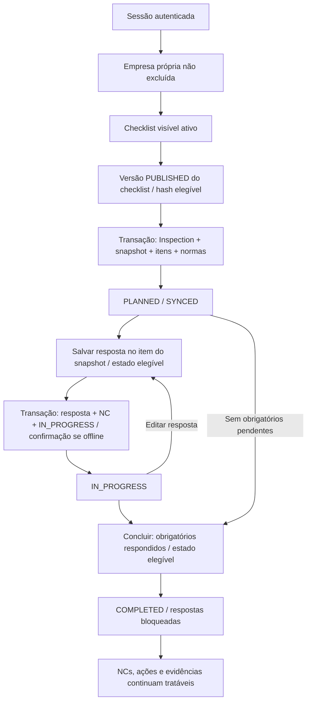
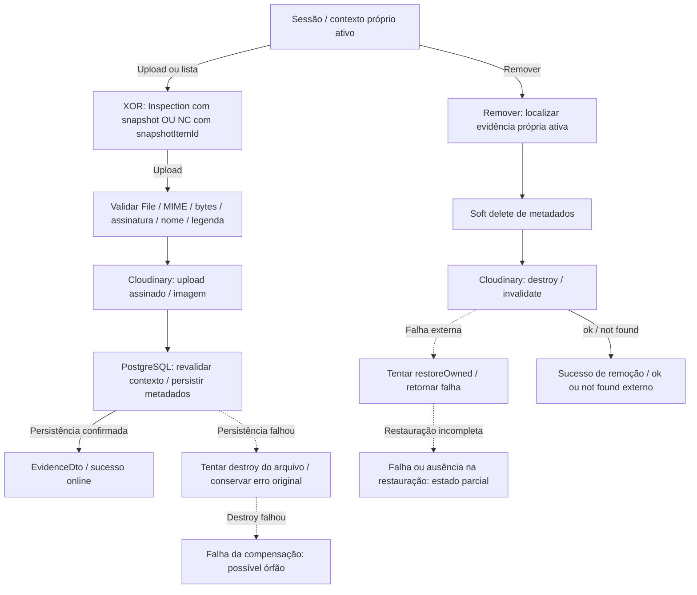
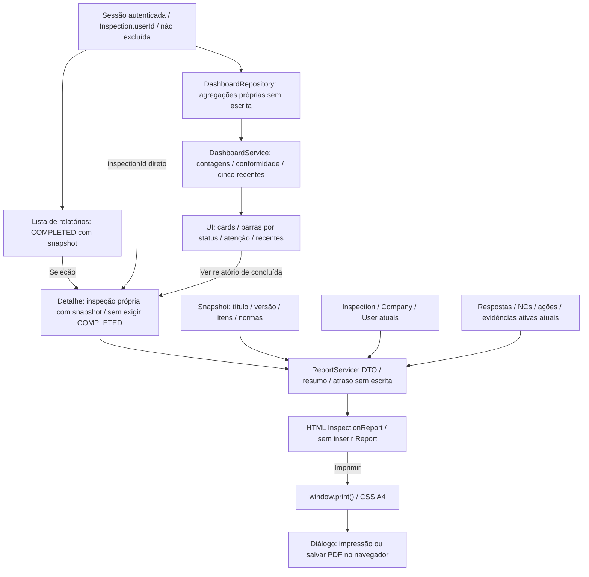

# Regras de negócio implementadas

## Estado atual e fontes

Revisão documental da Fase 4 em 3 de outubro de 2026, sobre a Fase 3 consolidada
em `42aeb64`, preservando a referência estrutural da Fase 2 (`0a19b44`). Esta referência normativa
descreve o comportamento existente. Em divergência com documentação antiga,
prevalece o código; diferenças frente a regras desejadas devem ser registradas,
sem mudar a aplicação nesta fase.

Fontes: [schema](../prisma/schema.prisma), [migrations](../prisma/migrations/),
[Dicionário de Dados](../Documentation/DicionarioDeDados.md),
[Services](../src/server/services/), [Repositories](../src/server/repositories/),
[schemas Zod](../src/server/schemas/) e [Server Functions](../src/lib/api/).
Constraints físicas e validações da aplicação são garantias distintas.

## Identidade, cadastro e papéis

- `/register` é público e usa React Hook Form, Zod e mutation React Query.
  Recebe somente `name`, `email`, `password` e `confirmPassword`; schema
  compartilhado rejeita extras. Nome obrigatório após trim; e-mail validado,
  aparado e convertido para minúsculas; senha com mínimo de oito caracteres,
  sem trim nem exigência de composição; confirmação deve ser igual.
- O Service normaliza novamente e consulta duplicidade case-insensitive,
  inclusive em contas excluídas logicamente. UNIQUE SQL de email e tratamento
  de `P2002` cobrem disputa pelo mesmo valor gravado; o índice SQL não é
  uma constraint case-insensitive.
- Hash bcrypt com custo **12**; servidor atribui `TECHNICIAN`. Cliente não
  escolhe papel, ID ou proprietário. Resposta pública somente `id`, `name` e
  `email`. Cadastro **não inicia sessão**; tela encaminha para `/login`.
- Duplicidade retorna CONFLICT (409 lógico). Payload inválido é rejeitado por
  Zod na entrada da Server Function; essa exceção não é necessariamente o mesmo
  envelope de um erro retornado pelo Service.
- `ADMIN`, `TECHNICIAN`, `SUPERVISOR`, `AUDITOR` são papéis armazenados,
  **não RBAC funcional**. Contas históricas podem ter outro papel, sem ganhar
  administração por isso. Persona de análise não é permissão.
  `countActiveAdmins` no Repository não constitui fluxo de autorização.
- Confirmação/ativação de e-mail, recuperação de senha, edição persistida de
  perfil e administração de usuários não estão implementadas.

Evidências: [cadastro](../src/lib/validation/registration.schema.ts),
[UserService](../src/server/services/user.service.ts),
[UserRepository](../src/server/repositories/user.repository.ts) e
[auth.functions](../src/lib/api/auth.functions.ts).

## Login, sessão e frontend

Login valida e-mail aparado e senha não vazia; Service normaliza e-mail, busca
`deletedAt=null` e compara bcrypt. Conta ausente/excluída ou senha incorreta
recebe mesma mensagem de credenciais inválidas (401 lógico). “Usuário ativo”
significa não excluído; não existe User.isActive. Login devolve SafeUser sem
password e cria sessão TanStack Start.

[session.ts](../src/server/auth/session.ts) configura:

| Propriedade                | Valor implementado                                             |
| -------------------------- | -------------------------------------------------------------- |
| Cookie                     | `safe_watch_session`                                           |
| Dados de domínio na sessão | `userId`                                                       |
| Duração configurada        | `maxAge=28800` segundos (oito horas)                           |
| HttpOnly / Path            | `true` / `/`                                                   |
| SameSite                   | `lax`                                                          |
| Secure                     | `true` em `NODE_ENV=production`                                |
| Segredo                    | SESSION_SECRET aparado; fallback fixo somente fora de produção |

Sem segredo em produção, helper rejeita a operação. Não utiliza JWT nem tabela
própria de sessões. Expiração é do mecanismo de sessão, sem renovação de login
expressamente implementada pela aplicação. Cada autenticação no servidor
consulta novamente o usuário não excluído. Se ausente, limpa sessão e devolve
erro do Service (NOT_FOUND); ausência de identidade devolve UNAUTHORIZED.

Logout limpa sessão/cookie no servidor. UI também limpa IndexedDB e cache
privado de navegação e navega para login; falha remota é informada e não equivale
a revogação confirmada do cookie. Rota interna `/_app` protege telas usando
getAppSession e redireciona falhas para `/login`. Login redireciona sessão válida
para `/dashboard`; register não possui esse guard. Shell consulta sessão/exibe
papel, sem aplicar RBAC.

No dispositivo, getAppSession usa sessão remota quando possível e pode usar
usuário seguro previamente validado por oito horas offline ou em falha de rede.
Validade local renovada ao cachear sessão **não estende sessão remota**. Troca
de usuário limpa dados do anterior. Servidor exige sessão própria na
sincronização. Limites: [Offline.md](./Offline.md).

## Ownership e autorização

Autenticação identifica o usuário por sessão e reconsulta sua conta no servidor.
Autorização decide acesso/mutação pela propriedade do recurso e seu contexto.
Visibilidade permite consultar publicação acessível sem transferir propriedade.
Estado editorial pertence à versão (`DRAFT`, `PUBLISHED`, `RETIRED`); atividade
e exclusão pertencem à identidade do checklist. Um papel armazenado, um nome de
responsável ou a marcação de template não substituem essas verificações.

Server Functions de negócio obtêm usuário da sessão e repassam aos Services e
Repositories. userId/createdById/autoria enviados pelo cliente não determinam
identidade confiável. Schemas comuns removem campos desconhecidos; cadastro e
cópia são estritos. Não há transferência de proprietário nem acesso anônimo ao
catálogo institucional. O caminho de ownership depende do recurso:

```text
Company.createdById -> User.id
Checklist.createdById -> User.id (pessoal) ou NULL (institucional)
Inspection.userId -> User.id
NonConformity -> InspectionResponse -> Inspection.userId
CorrectiveAction -> NonConformity -> InspectionResponse -> Inspection.userId
Evidence -> Inspection.userId
      OU -> NonConformity -> InspectionResponse -> Inspection.userId
Relatório sob demanda / Dashboard -> Inspection.userId
OfflineSyncOperation.userId -> sessão, com contexto Inspection validado
```

Não é cadeia Company → Checklist: checklists são independentes da empresa.
Inspeção exige empresa própria, mas pode usar publicação própria, de terceiro
ou oficial. Dono do checklist não ganha acesso às inspeções de quem o reutiliza.
Autoria de versão/publicação também não substitui ownership.

### Matriz de autorização

Todos os acessos abaixo exigem sessão ativa no servidor. Em recursos operacionais,
“próprio” significa Inspection.userId; exclusão lógica/contextos ativos são
filtrados conforme o Repository.

| Recurso                           | Próprio                                                                 | Terceiro                                                                        | Institucional/compartilhado                                    |
| --------------------------------- | ----------------------------------------------------------------------- | ------------------------------------------------------------------------------- | -------------------------------------------------------------- |
| Company                           | Criar/listar/ler/editar/excluir logicamente                             | Sem acesso                                                                      | Sem catálogo público                                           |
| Checklist DRAFT                   | Ler/editar itens e metadados/publicar/copiar elegível                   | Sem acesso ao draft                                                             | Draft oficial não exposto nem gerenciável                      |
| Checklist PUBLISHED               | Ler; derivar draft para editar; copiar; retirar                         | Ler/copiar publicação de checklist ativo não excluído; usar em inspeção própria | Oficial ativo publicado permite leitura/cópia/inspeção própria |
| Checklist RETIRED                 | Ler histórico/derivar draft; não é origem direta de cópia/inspeção      | Sem acesso à versão                                                             | Sem acesso à retirada institucional                            |
| Template oficial                  | Não há dono usuário                                                     | Sem mutações pessoais, inclusive ADMIN                                          | Consulta/reutilização autenticadas; bootstrap fora da API      |
| Inspection / respostas / snapshot | Criar/consultar/excluir logicamente; responder/concluir conforme estado | Sem acesso                                                                      | Publicação não compartilha inspeção                            |
| NonConformity                     | Criar/ler/editar/excluir via resposta própria elegível                  | Sem acesso                                                                      | Sem acesso público                                             |
| CorrectiveAction                  | Criar/listar/editar/concluir/excluir via NC própria                     | Sem acesso                                                                      | responsible textual não concede acesso                         |
| Evidence                          | Upload/listagem/remoção em contexto próprio histórico                   | Sem acesso                                                                      | Sem API pública; filtro não protege URL externa                |
| Relatório sob demanda             | Consulta por inspeção própria; listagem somente concluídas              | Sem acesso                                                                      | Sem compartilhamento público                                   |
| Dashboard                         | Agregados e cinco inspeções recentes próprias                           | Sem acesso                                                                      | Sem visão global administrativa                                |
| Sincronização offline             | Responder/concluir inspeção própria com sessão/deduplicação             | Sem acesso                                                                      | Catálogo compartilhado não autoriza inspeção alheia            |
| Standard                          | Leitura do catálogo autenticada                                         | Mesmo catálogo                                                                  | Sem administração de normas na UI/API                          |

Recursos privados alheios e inexistentes normalmente retornam NOT_FOUND (404
lógico). Matriz não concede edição direta de publicação: altera-se draft
derivado. Evidence usa filtros relacionais na consulta/persistência/restauração;
proteção da API de metadados não garante acesso protegido à URL Cloudinary.

## Empresas

Criação atribui createdById à sessão. Razão social/CNAE obrigatórios, risco
inteiro de 1 a 4, empregados inteiro não negativo na validação Zod. Lista/detalhe/
edição/soft delete limitados ao dono; edição exige um campo. Exclusão não remove
inspeções nem libera CNPJ; impede usar empresa excluída em nova inspeção.

CNPJ opcional: ausência/vazio resulta NULL. Entrada pública aceita 14 dígitos ou
máscara compatível e converte para dígitos; não verifica dígitos verificadores
nem consulta cadastro externo. Service consulta duplicidade global, inclusive
excluídos/de terceiros; P2002 vira conflito. UNIQUE permite vários NULL.
Consulta interna de disponibilidade não é uma API de leitura de empresas alheias.

## Checklists, itens e visibilidade

| Classificação                        | Identidade e conteúdo                                                             | Acesso implementado                                                                         |
| ------------------------------------ | --------------------------------------------------------------------------------- | ------------------------------------------------------------------------------------------- |
| Checklist pessoal                    | `isOfficial=false`, proprietário obrigatório; `isTemplate=false` no personalizado | Proprietário mantém conteúdo no draft                                                       |
| Checklist pessoal publicado          | Mesma identidade pessoal, com uma ou mais versões `PUBLISHED`                     | Outros usuários autenticados consultam publicações enquanto identidade ativa e não excluída |
| Template pessoal                     | Pessoal com `isTemplate=true`; pode ter draft e/ou publicação                     | Mesmas regras de ownership/visibilidade do pessoal                                          |
| Checklist oficial / template oficial | Institucional, `isOfficial=true`, `isTemplate=true`, proprietário NULL            | Publicação institucional ativa consultável/reutilizável; sem mutação pela API pessoal       |

“Publicado” é estado da versão, não flag de compartilhamento na identidade.
`isTemplate` não publica conteúdo nem implica `isOfficial`.

Criar pessoal cria atomicamente identidade e **DRAFT v1**, dono/autor da sessão.
Título aparado 1–255 caracteres, descrição opcional; padrões isOfficial=false,
isTemplate=false e isActive=true. Cliente pode marcar template pessoal/atividade,
sem atribuir oficialidade.

Checklist guarda identidade/catalogação; ChecklistVersion guarda conteúdo
numerado; InspectionChecklistSnapshot pertence à inspeção e não é versão
editorial. No máximo um draft (índice parcial SQL) e número único por checklist;
várias publicações podem coexistir.

Editar título/descrição usa draft ou deriva próximo da publicação/retirada de
maior número. Novo número = máximo existente + 1; disputa P2002 pode reaproveitar
draft concorrente. Alterar apenas isTemplate/isActive muda catálogo, sem derivar
draft. Soft delete preserva versões/snapshots. “Ativo” em nomes de métodos de
Repository frequentemente significa deletedAt=null: pessoal inativo pode ser
consultado/editado/copiado, mas não iniciar inspeção.

Itens editáveis são ChecklistVersionItem, não ChecklistItem legado. Service
resolve item publicado/retirado no draft pela linhagem; se não encontrar derivado,
retorna conflito. Texto/ordem positiva/obrigatoriedade/normas pertencem à versão.
Ordem única por versão, sem continuidade obrigatória. Criar sem ordem usa próximo
índice; trocar standardIds copia metadados de normas ativas e substitui associações
na transação. Excluir remove fisicamente somente item/associações do draft.
Mutação toca updatedAt da versão para proteger publicação concorrente.

Lista/detalhe próprios incluem draft/histórico. Terceiros/oficiais: somente
checklist ativo não excluído com PUBLISHED; Service filtra versões e devolve
título/descrição da última publicação. canManage orienta UI, sem substituir
autorização. listChecklistItems prefere draft próprio, depois publicação;
sem ambos, só dono recebe itens da versão mais recente. Draft alheio não é exposto.
Busca/ordenação da lista usam campos atuais da identidade; ver limite no
[relatório](../Documentation/RelatorioFase3.md).

## Publicação, revisão e retirada

publishDraft exige checklist pessoal próprio não excluído e draft existente.
**Não exige quantidade mínima de itens nem isActive=true.** Calcula SHA-256 no
formato canônico **1**, registra publicador da sessão/data/status PUBLISHED.
Versão conserva ID/número; não cria outra ao publicar.

Revisão esperada é draft.updatedAt lida pelo Service, conferida no UPDATE com
status/ownership. **Cliente não envia revisão** no body da publicação. Mudança
da revisão/status gera conflito; não há retry geral. Conteúdo canônico inclui
título/descrição, texto/ordem/obrigatoriedade dos itens e metadados das normas,
com NFC e ordenação determinística. UUIDs/linhagem/autores/timestamps/isTemplate/
isOfficial não integram hash; standardId desempata ordem, mas não é serializado.

Editar após publicar deriva/reutiliza draft; nova publicação não retira antigas
automaticamente. retireVersion exige ownership, versão do mesmo checklist e
PUBLISHED, alterando status para RETIRED. Conteúdo/hash/autor/data/snapshots
permanecem. Não há autor/data próprios de retirada nem republicação direta de
retirada. Imutabilidade é do fluxo de aplicação, sem trigger SQL de bloqueio.

UI tem Biblioteca, edição, publicação no detalhe, **Copiar checklist**, **Usar
template**, e seleção de publicação na nova inspeção. Retirada tem Server
Function/hook, **sem ação nas telas atuais**; histórico/editoria institucional
não têm interface completa.

### Garantias físicas e regras da aplicação

| Regra                 | Garantia física vigente                                                                    | Regra do fluxo implementado                                                                   |
| --------------------- | ------------------------------------------------------------------------------------------ | --------------------------------------------------------------------------------------------- |
| Draft e numeração     | UNIQUE parcial limita a um `DRAFT`; UNIQUE de checklist/número e CHECK de número positivo  | Próximo draft usa máximo existente + 1                                                        |
| Publicação            | CHECK exige metadados de publicação e formato hexadecimal do hash                          | Service calcula SHA-256 formato 1 e Repository confere `expectedUpdatedAt`/estado/propriedade |
| Autoria institucional | CHECK do Checklist exige template oficial sem proprietário; autores de versão aceitam NULL | Bootstrap grava criador/publicador NULL; CHECK de versão não consulta o pai                   |
| Imutabilidade         | FKs/CHECKs protegem referências e forma; não há trigger de bloqueio de conteúdo            | Edição limitada a draft; retirada conserva conteúdo e snapshots                               |
| Snapshot da inspeção  | Versão nullable e no máximo um snapshot por inspeção                                       | Criação atual grava inspeção, snapshot, itens e normas atomicamente                           |

Referência física: [Database.md](./Database.md) e
[Dicionário de Dados](../Documentation/DicionarioDeDados.md). A revisão esperada
da publicação não é a revisão de resposta usada na sincronização offline.

## Templates e cópia

Dois templates institucionais: construção/NR-18 (12 itens) e altura (8 itens,
NR-1/NR-6/NR-35). isOfficial=true, isTemplate=true e dono NULL identificam
curadoria Safe Watch Insight, sem chancela governamental. Autor/publicador NULL
no bootstrap. IDs/fontes/limites/hashes: [OfficialTemplates.md](./OfficialTemplates.md).

Cópia própria prefere draft, inclusive inativo; sem draft, última publicação.
Terceiro/oficial usa somente última publicação acessível, ativa e não excluída.
Publicação exige formato 1 e hash recalculado igual; draft próprio não verifica
hash publicado. Só retirada não é origem elegível. Sem acesso retorna NOT_FOUND;
formato/hash inválido retorna CONFLICT.

Resultado: identidade ativa privada inicialmente, isOfficial=false,
isTemplate=false, DRAFT v1, dono/autor da sessão, UUIDs e associações novos.
Reutiliza Standard/copia metadados; não copia inspeções/respostas/NCs/ações/
evidências/Report/snapshots. **Não há sourceVersionId em Checklist/ChecklistVersion**;
linhagem vive em sourceVersionItemId e referência legada opcional nos itens.
De publicação aponta ao item publicado; de draft conserva ancestral anterior
ou NULL, sem fixar item mutável.

Nomes exatos: `Título — Cópia`, `Título — Cópia (2)` etc.; travessão U+2014,
maiúscula C e espaços. Primeiro sufixo disponível entre títulos pessoais não
excluídos do usuário, inclusive inativos/templates; comparação exata, base
truncada para 255 caracteres. Sem UNIQUE SQL de título/reserva concorrente.

Leitura/autorização/preparação síncrona/inserts checklist → draft → itens →
associações ocorrem na mesma transação RepeatableRead. Falha reverte a cópia;
não inclui publicação futura ou Cloudinary. [ChecklistCopy.md](./ChecklistCopy.md)
detalha diagramas, nomes e transação.

## Inspeções e snapshot: limites relevantes

Criar exige empresa própria não excluída, checklist visível ativo e versão
PUBLISHED do mesmo checklist; sem versão explícita, usa publicação de maior
número. Hash obrigatório; formato 1 recalculado, **outros formatos, incluindo
legado 0, passam sem recálculo**. Diferente da cópia, Service não rejeita todo
formato distinto. Inspeção/snapshot/itens/normas gravados atomicamente; leitura
e preparação da origem precedem essa transação.

Snapshot é fotografia do **conteúdo de checklist**: título/descrição/número/IDs
de origem/isTemplate do catálogo na captura/formato/hash/itens/ordem/
obrigatoriedade/metadados normativos. Não congela empresa, usuário, respostas,
NCs, ações, evidências ou relatório inteiro. Relatórios combinam snapshot com
dados operacionais/cadastrais atuais. isOfficial não é campo congelado.

Criação atual define PLANNED/SYNCED e INSPECTION_CREATION/VERIFIED, inclusive
em formato não recalculado; rótulo não comprova integridade canônica do legado.
Backfill é LEGACY_BACKFILL/UNVERIFIED_LEGACY/formato 0. No banco versão e snapshot
são opcionais em Inspection; fluxo exige ambos para execução/detalhe.

Respostas usam item do próprio snapshot. Contrato exige exatamente um
snapshotItemId ou checklistItemId legado, resolvido para snapshot; CHECK SQL
permite ambos. Salvar move PLANNED/IN_PROGRESS para IN_PROGRESS. Conclusão exige
todos os obrigatórios respondidos, inclusive NOT_APPLICABLE como resposta válida.
COMPLETED/CANCELLED bloqueiam novas respostas/conclusão. Retry idempotente de
operação confirmada não é nova mutação. NCs/ações/evidências podem continuar
sendo mantidas depois da conclusão.

Itens opcionais podem permanecer sem resposta. A conclusão verifica presença de
resposta por `snapshotItemId`, sem exigir observação, evidência, resolução de NC
ou conclusão das ações. Uma inspeção sem itens obrigatórios pendentes também
pode ser concluída; não há regra de mínimo de respostas no Service.

Errata Murbach inclui **72–74** em catálogo atual, exibição institucional e
novos drafts de cópia, sem reescrever v1/hash/datas/snapshots. Inspeção direta da
publicação histórica copia descrição original; relatório desse snapshot não
aplica automaticamente errata. Ver [templates](./OfficialTemplates.md).

## Não conformidades

Salvar uma resposta e manter sua NC ocorre na mesma transação, junto da mudança
da inspeção para `IN_PROGRESS` e da confirmação offline quando presente:

| Resposta e registro existente             | Efeito real                                                                                                                                            |
| ----------------------------------------- | ------------------------------------------------------------------------------------------------------------------------------------------------------ |
| `NON_COMPLIANT`, sem NC                   | Cria NC `MEDIUM`/`OPEN`; descrição da observação aparada não vazia ou do item do snapshot; prazo calculado no servidor como data atual + 7 dias em UTC |
| `NON_COMPLIANT`, NC ativa                 | Conserva descrição, severidade, prazo e status existentes; editar observação não reescreve a NC                                                        |
| `NON_COMPLIANT`, NC arquivada             | Limpa `deletedAt` e volta para `OPEN`, conservando descrição, severidade, prazo, ações e evidências existentes                                         |
| `COMPLIANT` ou `NOT_APPLICABLE`, NC ativa | Preenche `deletedAt`; não marca `RESOLVED` nem exclui fisicamente ações/evidências                                                                     |

Há no máximo uma NC por resposta, inclusive arquivada, pela FK única. Criação
explícita exige resposta própria `NON_COMPLIANT` e ausência de qualquer NC:
descrição e severidade obrigatórias, prazo opcional (NULL quando omitido), status
padrão `OPEN`. O prazo automático de sete dias não é default de banco nem regra
da criação explícita.

Atualização aceita descrição, severidade, prazo e qualquer valor do enum
`OPEN`/`IN_PROGRESS`/`RESOLVED`/`OVERDUE`, com pelo menos um campo. Não há máquina
de transições adicional nem exigência de todas as ações concluídas para escolher
`RESOLVED`. Exclusão explícita é soft delete. A propriedade vem de
NC → resposta → inspeção não excluída do usuário; não depende do status de
conclusão da inspeção.

Detalhe e lista de NCs chamam `markOverdue` antes da consulta: marcam `OVERDUE`
as NCs não excluídas do usuário com prazo anterior ao instante da consulta e
status `OPEN` ou `IN_PROGRESS`. Não há job agendado nem retorno automático ao
status anterior ao adiar o prazo. Atraso em Reports/Dashboard é derivado sem escrita.

Fontes: [InspectionResponseService](../src/server/services/inspection-response.service.ts),
[persistência da resposta/NC](../src/server/repositories/inspection-response.repository.ts),
[NonConformityService](../src/server/services/non-conformity.service.ts) e
[Repository de NC](../src/server/repositories/non-conformity.repository.ts).

## Ações corretivas

A NC deve estar não excluída e vinculada à inspeção não excluída do usuário.
`description` é o conteúdo obrigatório; o plano 5W2H não exige preencher todos
os campos. Schemas Zod e Service reconciliam os campos nullable do Prisma:

| Campo                                      | Entrada pública implementada                                                                                |
| ------------------------------------------ | ----------------------------------------------------------------------------------------------------------- |
| `nonConformityId`                          | UUID obrigatório na criação; vínculo não editável pelo contrato de atualização                              |
| `description`                              | Texto aparado, 1–2000 caracteres na criação; opcional na atualização, com o mesmo limite se enviado         |
| `why`, `method`                            | Opcionais/nullable, texto aparado até 2000 caracteres; vazio vira NULL                                      |
| `location`, `responsible`, `estimatedCost` | Opcionais/nullable, texto aparado até 255 caracteres; vazio vira NULL                                       |
| `dueDate`                                  | Opcional; data coercível; string vazia vira NULL; sem exigência de data futura (ver coerção de NULL abaixo) |
| `status`                                   | Padrão `PENDING` na criação; atualização aceita `PENDING`, `IN_PROGRESS`, `COMPLETED`, `OVERDUE`            |
| `completedAt`                              | Definido pelo servidor; não é campo editável do contrato                                                    |

`responsible` é texto, não User/FK/permissão; `estimatedCost` é texto, sem
validação monetária. Na criação, campos opcionais omitidos viram NULL. Na
atualização, omissão conserva o valor; exige ao menos um campo reconhecido.

**Implementation Concern — coerção de prazo:** nos schemas de NC e ação, a
união testa `z.coerce.date()` antes de `z.null()`. Com a dependência instalada,
JSON `null` é convertido em `1970-01-01T00:00:00.000Z`, enquanto string vazia
resulta em NULL. Omissão na criação continua resultando em NULL pelo Service.
Esse comportamento foi conferido localmente sem banco; a nulabilidade física
não equivale à semântica de limpar prazo enviando JSON null. Não foi corrigido.

Criar qualquer ação quando a NC está `OPEN` muda a NC para `IN_PROGRESS` na
mesma transação, inclusive se a ação já nascer `COMPLETED`. Em outros estados
da NC, a criação não muda seu status. Enviar `COMPLETED` define `completedAt`
com a data atual; enviar outro status limpa-o; sem status, conserva-o. Concluir
todas as ações não resolve NC automaticamente; remover ação não reabre NC.

Listar ações de NC própria chama `markOverdue`: persiste `OVERDUE` em ações
ativas do usuário com prazo vencido e status `PENDING`/`IN_PROGRESS`. NCs
arquivadas ocultam o acesso às ações pela API, sem apagar os registros.
Alterar prazo sozinho não reverte `OVERDUE`. Nenhuma dessas mutações exige
inspeção ainda aberta.

Fontes: [schema Zod](../src/server/schemas/corrective-action.schema.ts),
[CorrectiveActionService](../src/server/services/corrective-action.service.ts) e
[Repository](../src/server/repositories/corrective-action.repository.ts).

## Evidências, relatórios e offline — visão geral

Evidence pertence exatamente à inspeção **ou** NC, nunca ação corretiva. Upload/
listagem exigem contexto próprio não excluído com snapshot (NC exige também item
de snapshot). JPEG/PNG/WebP até 4 MB com assinatura validada; Cloudinary via
servidor, PostgreSQL só metadados. Falha de gravação tenta remover arquivo; falha
do provedor na remoção tenta restaurar metadados. Não é transação atômica entre
banco/provedor. Binários/upload offline permanecem futuros.

Report é model persistível, zero ou um por inspeção. API atual consulta Inspection
e monta DTO/HTML, sem inserir Report/armazenar PDF. Listagem de concluídas próprias;
detalhe backend não exige COMPLETED, mas exige snapshot. Imprimir/Salvar como PDF
usa diálogo nativo. Dashboard agrega dados próprios, conformidade de respostas
aplicáveis com snapshot em concluídas e cinco recentes; sem visão de dados alheios.

Offline cobre respostas/conclusão de inspeções já disponíveis no dispositivo.
Sessão revalidada no servidor, revisão esperada e identidade/hash idempotente
limitam sincronização; confirmação remota e mutação são atômicas. Linha
OfflineSyncOperation é confirmação, não fila/payload completo. Sem Last Write
Wins para inspeção; conflito bloqueia dependentes. Criação integral offline,
reconciliação assistida e evidências binárias são futuras.

## Evidências e pendências

Conferência estática, sem seeds/migrations/fixtures/consultas ao banco nesta fase.
Correções documentais e limites da implementação constam do
[RelatorioFase4.md](../Documentation/RelatorioFase4.md); o
[RelatorioFase3.md](../Documentation/RelatorioFase3.md) preserva a revisão anterior. Fluxo de acesso:
Tela → React Query → Server Function → Service → Repository → Prisma → PostgreSQL.

## Operações de inspeção — Fase 6

Conferência estática em 4 de outubro de 2026 sobre `5080142`. Os quatro estados
Prisma são distintos das operações públicas:

| Operação                                    | Estado e efeito                                                  | Disponibilidade                                |
| ------------------------------------------- | ---------------------------------------------------------------- | ---------------------------------------------- |
| Criar                                       | PLANNED, SYNCED e snapshot criado junto                          | Server Function e assistente                   |
| Responder/observar                          | PLANNED ou IN_PROGRESS → IN_PROGRESS                             | UI local-first e Server Function               |
| Concluir                                    | PLANNED ou IN_PROGRESS → COMPLETED, obrigatórios respondidos     | UI local-first e Server Function               |
| Consultar histórico                         | Própria não excluída; detalhe exige versão e snapshot            | Lista/detalhe                                  |
| Excluir                                     | deletedAt preenchido; sem filtro por estado; filhos não apagados | deleteInspection e hook, sem ação na UI        |
| Editar dados da inspeção, cancelar, reabrir | Sem operação pública                                             | CANCELLED é apenas estado modelado/consultável |

Após concluir, não há edição de resposta/observação ou troca de checklist,
empresa, data, notas e snapshot pelo contrato atual. NCs, ações e evidências
continuam acessíveis nos contextos ativos; dados atuais de empresa/inspetor
podem alterar a projeção do relatório. Não há audit log completo nem relatório
congelado de toda a operação. Histórico de tratativas na UI é derivado dos
registros/timestamps, não uma coleção persistida de todos os eventos.



PlantUML equivalente: [inspection.puml](../Documentation/diagrams/flows/inspection.puml).
Fluxo implementado; setas não representam cardinalidades físicas nem garantias globais de atomicidade.

## Respostas e relógios

O schema exige exatamente um snapshotItemId ou checklistItemId legado; o Service
resolve esse ID dentro do snapshot da inspeção própria. O Repository faz upsert
por inspectionId/snapshotItemId. Observação é opcional, aparada, vazia/omitida
resulta em NULL no salvamento; não há limite máximo definido nesse schema.
O status é COMPLIANT/NON_COMPLIANT/NOT_APPLICABLE, sem valor remoto PENDING.
Ausência de resposta representa pendência.

| Dado                             | Significado real                                                                |
| -------------------------------- | ------------------------------------------------------------------------------- |
| updatedAt remoto                 | Revisão do servidor, comparada por milissegundos                                |
| expectedResponseUpdatedAt        | Revisão remota esperada no payload; NULL espera ausência de resposta            |
| clientCreatedAt da operação      | Horário original do dispositivo; participa do hash                              |
| clientUpdatedAt remoto           | Horário do dispositivo preservado ao sincronizar resposta; não ordena conflitos |
| updatedAt local                  | Estado provisório do pacote; pode ser horário local até confirmação             |
| OfflineSyncOperation.completedAt | Confirmação remota; não é horário original da conclusão local                   |

Sem metadados offline, a chamada direta não confere revisão esperada e não grava
clientUpdatedAt novo. Com metadados, ID/horário/revisão formam conjunto completo;
UUID + usuário + inspeção + tipo + hash identificam retry. Repetição retorna
estado atual do recurso, sem armazenar cópia integral da resposta original da
operação. A deduplicação de resposta precede a verificação de estado editável,
permitindo retry já confirmado após conclusão. Não há Last Write Wins por
relógio do cliente. UI grava pacote/fila primeiro inclusive online.

## Mapeamento 5W2H

Os termos de UI não são sete campos com esses nomes no Prisma:

| Termo              | Campo real    | Obrigatoriedade na criação |
| ------------------ | ------------- | -------------------------- |
| what / O quê?      | description   | Obrigatório                |
| why / Por quê?     | why           | Opcional/nullable          |
| where / Onde?      | location      | Opcional/nullable          |
| when / Quando?     | dueDate       | Opcional/nullable          |
| who / Quem?        | responsible   | Opcional/nullable, texto   |
| how / Como?        | method        | Opcional/nullable          |
| how much / Quanto? | estimatedCost | Opcional/nullable, texto   |

Não há campos separados what/where/when/who/how. completedAt é calculado no
servidor ao enviar status COMPLETED e limpo ao enviar outro status. Concluir
uma ação não exige todos os campos 5W2H nem encerra a NC.

## Evidências online: validação, persistência e remoção

Fontes: [EvidenceService](../src/server/services/evidence.service.ts),
[schema](../src/server/schemas/evidence.schema.ts),
[Repository](../src/server/repositories/evidence.repository.ts) e
[CloudinaryStorageService](../src/server/storage/cloudinary-storage.service.server.ts).

- FormData com File e exatamente um UUID inspectionId/nonConformityId (XOR).
  Contexto deve ser próprio e não excluído; inspeção precisa de snapshot e NC
  precisa também de snapshotItemId na resposta. Não exige COMPLETED nem inspeção
  aberta. XOR é também CHECK SQL; FKs simples não garantem ownership/snapshot.
- MIME exato image/jpeg, image/png ou image/webp; tamanho maior que zero e
  no máximo **4 × 1024 × 1024 = 4.194.304 bytes**, inclusive; bytes lidos devem
  corresponder ao tamanho declarado. Nome não vazio, até 255 caracteres; Service
  retira caminho antes de validá-lo. Legenda opcional, trim, até 500 caracteres
  no schema da Function. Não exige extensão do nome correspondente ao MIME.
- Service confere prefixo JPEG/PNG; WebP exige RIFF e marcador WEBP nos bytes
  8–11. Essa checagem não é garantia de decodificação completa da imagem.
  Dimensões vêm da resposta do provedor e são nullable; não há limite de pixels.
- StorageService recebe bytes no servidor. Cloudinary recebe upload assinado
  SHA-1, publicId pasta/UUID, overwrite=false e timeout de 15 segundos. Resposta
  exige publicId esperado, URL HTTPS, resource_type=image e tamanho igual.
  Segredo permanece no servidor; não há upload direto autenticado pelo cliente.
- PostgreSQL persiste id, alvo exclusivo, publicId único, storageUrl, fileName,
  mimeType, fileSize BigInt, width/height, caption e createdAt/updatedAt/deletedAt;
  não guarda binário/Base64. DTO omite publicId/deletedAt e converte tamanho para
  number. Lista de evidências ordena createdAt DESC, id DESC.
- Após upload, Repository revalida contexto/propriedade na transação dos
  metadados. Falha tenta remover arquivo; falha da compensação é suprimida e
  preserva erro original, podendo deixar arquivo órfão.
- Remoção busca evidência própria ativa, preenche deletedAt e chama destroy com
  invalidate=true. Provedor aceita ok/not found. Falha tenta restoreOwned;
  restauração pode falhar ou não encontrar contexto já arquivado. Não há
  transação conjunta PostgreSQL/Cloudinary nem garantia de rollback externo.
- Arquivar inspeção/NC não chama destroy para cada filho. Filhos ficam no banco
  e deixam de ser acessíveis pelo contexto ativo da API. URL externa usada em
  img/link não exige sessão da aplicação por download.
- Seleção múltipla na UI envia um arquivo por chamada, sequencialmente; sucesso
  parcial não constitui lote atômico. Sem compressão automática neste fluxo.



PlantUML equivalente: [evidence.puml](../Documentation/diagrams/flows/evidence.puml).
Fluxo implementado; setas não representam cardinalidades físicas nem garantias globais de atomicidade.

Evidência online está implementada; upload/fila de binários, compressão offline
e quota de evidências offline não estão implementados. Metadados em memória
não equivalem a arquivo disponível offline nem a upload confirmado.

## Relatórios sob demanda e dashboard

Fontes: [ReportService](../src/server/services/report.service.ts),
[ReportRepository](../src/server/repositories/report.repository.ts),
[DashboardService](../src/server/services/dashboard.service.ts),
[DashboardRepository](../src/server/repositories/dashboard.repository.ts).

| Parte do relatório                                                             | Origem                                                                                        |
| ------------------------------------------------------------------------------ | --------------------------------------------------------------------------------------------- |
| Identificação, data, status, notas e timestamps                                | Inspection atual                                                                              |
| Razão social, nome fantasia, CNPJ, CNAE, risco, funcionários, endereço         | Company atual; não há snapshot cadastral                                                      |
| Nome, e-mail e role do inspetor                                                | User atual da inspeção, não gerador de Report                                                 |
| Título/descrição, versão, captura, origem/integridade, itens e obrigatoriedade | InspectionChecklistSnapshot e InspectionSnapshotItem                                          |
| Fundamentação normativa                                                        | InspectionSnapshotItemStandard; DTO tem tipo/código/título/resumo/URL, UI exibe código/título |
| Status/observação/revisão da resposta                                          | InspectionResponse associada por snapshotItemId; legadas sem esse ID ficam fora               |
| NCs e suas ações/evidências                                                    | Registros atuais não excluídos, por resposta; NC arquivada não integra o DTO                  |
| Evidências gerais                                                              | Evidence direta da inspeção, não excluída                                                     |
| Resumo e atrasos                                                               | Calculados pelo Service, sem escrita                                                          |

Itens: orderIndex ASC/id ASC; normas: type ASC/code ASC; ações/evidências no
relatório: createdAt ASC/id ASC. Resumo conta total de itens, respondidos,
conformes, não conformes, N/A e pendentes. Pendentes = total − respondidos;
preenchimento = round(100 × respondidos/total), ou **0** se total=0; N/A conta
como respondido. Esse preenchimento não é a conformidade do dashboard.
O relatório mantém opcionais pendentes mesmo em inspeção concluída. Atraso
transforma OPEN/IN_PROGRESS de NC ou PENDING/IN_PROGRESS de ação em OVERDUE no
DTO quando dueDate < Date.now(); OVERDUE existente permanece como está.

Report é entidade persistível (zero ou um por inspeção pela FK única). A
consulta atual lê Inspection e monta InspectionReportDto/HTML; não insere
Report, não incrementa sua version e não guarda PDF. A lista disponível exige
COMPLETED/snapshot/ownership; o detalhe exige ownership e snapshot, **sem filtro
COMPLETED**. /relatorios aceita inspectionId UUID opcional na busca e consulta-o
mesmo fora da lista; preocupação de política registrada no relatório da fase.
Sem parâmetro seleciona o primeiro disponível. Imprimir chama window.print()
sobre HTML com CSS A4; salvar como PDF depende do diálogo do navegador. Sem
biblioteca PDF, download direto ou geração de arquivo PDF backend. Rodapé
“Impressão em” usa new Date() da renderização, sem registro persistido do evento.

### Métricas do dashboard

Escopo base: Inspection.userId da sessão e deletedAt=NULL. NC/ação segue essa
inspeção e exclusões dos seus contextos; não se exige COMPLETED para contar NC.
Consulta não persiste métricas/OVERDUE; agregações independentes em Promise.all
não constituem snapshot transacional único.

| Indicador                | Fórmula/filtro implementado                                                                                        |
| ------------------------ | ------------------------------------------------------------------------------------------------------------------ |
| Total e distribuição     | Contagem das inspeções próprias não excluídas por cada um dos quatro estados                                       |
| NCs totais/resolvidas    | NCs não excluídas nesse escopo; resolvidas = status RESOLVED                                                       |
| NCs abertas              | totalNonConformities − resolvedNonConformities; inclui OPEN/IN_PROGRESS/OVERDUE                                    |
| NCs vencidas             | OVERDUE persistido OU OPEN/IN_PROGRESS com dueDate < instante de referência                                        |
| Ações vencidas           | Ação não excluída, NC OPEN/IN_PROGRESS/OVERDUE não excluída; ação OVERDUE OU PENDING/IN_PROGRESS com prazo vencido |
| Requer atenção           | Planejadas + NCs vencidas + ações vencidas; soma de recursos, não inspeções distintas                              |
| Conformidade             | round(100 × COMPLIANT / (COMPLIANT + NON_COMPLIANT)), somente respostas com snapshotItemId em COMPLETED            |
| Sem respostas aplicáveis | percentage=NULL e UI “—”; não é 0% nem 100%                                                                        |
| Recentes                 | Até cinco; inspectionDate DESC, createdAt DESC, id DESC; todos os estados                                          |

NOT_APPLICABLE, pendentes, respostas sem snapshotItemId e inspeções não
concluídas ficam fora da conformidade. A fórmula agrega respostas, não média
de percentuais por inspeção nem proporção de NCs resolvidas. Atraso persistido
continua contado mesmo após adiar prazo, até mudança explícita de status.
Ações de NC RESOLVED ficam fora da contagem de ações vencidas do dashboard.
Recentes usam título/versão do snapshot e empresa/inspetor atuais; snapshot
faltante exibe “Histórico indisponível”/versão NULL. UI mostra cinco cards,
gráfico de barras por status, Requer atenção e recentes; concluídas abrem
/relatorios?inspectionId=UUID. Sem BI/filtros avançados/séries temporais/
exportação. Dashboard/relatório não têm pacote/fila offline dedicados.



PlantUML equivalente: [reports-dashboard.puml](../Documentation/diagrams/flows/reports-dashboard.puml).
Fluxo implementado; setas não representam cardinalidades físicas nem garantias globais de atomicidade.

### Matriz operacional de autorização

Todas as operações exigem identidade revalidada da sessão no servidor, sem
RBAC por papel ou autorização por userId enviado no cliente.

| Recurso               | Operação    | Regra de acesso                                                                                                   |
| --------------------- | ----------- | ----------------------------------------------------------------------------------------------------------------- |
| Inspection            | create      | Sessão define userId; empresa própria ativa; checklist visível ativo e publicação elegível                        |
| Inspection            | read/list   | Inspection.userId da sessão e deletedAt=NULL; detalhe exige snapshot/versão                                       |
| InspectionResponse    | write       | Inspeção própria ativa em PLANNED/IN_PROGRESS; item do seu snapshot; retry confirmado tem deduplicação            |
| Inspection            | finish      | Própria ativa, snapshot/obrigatórios respondidos e estado elegível; retry com mesma identidade/hash               |
| Inspection            | delete      | Própria ativa; soft delete, sem condição de estado                                                                |
| NonConformity         | read/write  | Resposta → inspeção própria ativa; NC ativa para ler/editar/excluir; criação exige NON_COMPLIANT e ausência de NC |
| CorrectiveAction      | read/write  | NC ativa → resposta → inspeção própria ativa; ação ativa nas mutações                                             |
| Evidence              | upload/list | XOR inspeção própria ativa com snapshot OU NC própria ativa com resposta em item do snapshot                      |
| Evidence              | delete      | Evidência ativa e contexto próprio ativo, validado também em soft delete/restore; sem exigir estado aberto        |
| Relatório sob demanda | read/list   | Própria ativa; detalhe com snapshot; lista COMPLETED com snapshot                                                 |
| Dashboard             | read        | Agregações limitadas à inspeção própria ativa e filhos/contextos ativos                                           |

Recurso privado alheio e inexistente têm mesma semântica NOT_FOUND; conhecer
UUID, URL de navegação ou ser dono do checklist compartilhado não dá acesso.
URL Cloudinary possui política de entrega própria, distinta da API de metadados.
Riscos locais de cache/concorrência estão separados em
[RelatorioFase6.md](../Documentation/RelatorioFase6.md); não anulam filtros
remotos nem representam correções efetuadas nesta revisão.
