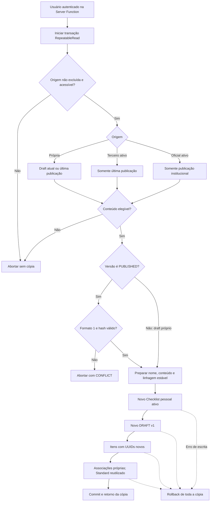

# Cópia independente de checklist

## Estado atual e fontes

Conferência documental da Fase 4 em 3 de outubro de 2026, sobre `42aeb64`
(Fase 3), com modelo estrutural preservado de `0a19b44` (Fase 2). Regras conferidas em
[ChecklistService](../src/server/services/checklist.service.ts),
[ChecklistRepository](../src/server/repositories/checklist.repository.ts),
[ChecklistVersionService](../src/server/services/checklist-version.service.ts),
[Server Functions](../src/lib/api/checklist.functions.ts),
[schema](../prisma/schema.prisma) e [migrations](../prisma/migrations/).
Resultados de integração ao final são **históricos**, não reexecutados nesta
fase e não constituem instrução para modificar o banco.

## Operação e autorização

`ChecklistService.copyChecklist(sourceId, authenticatedUserId)` é a operação
única de domínio. `useOfficialTemplate` delega a ela, exigindo adicionalmente
origem institucional. As Server Functions recebem somente `{ id: UUID }`,
rejeitam propriedades extras e obtêm o proprietário da sessão autenticada.
Nenhum ID de usuário, versão, item ou status é escolhido pelo cliente.

| Origem                                                            | Conteúdo copiado                                         | Quem pode copiar                                                 |
| ----------------------------------------------------------------- | -------------------------------------------------------- | ---------------------------------------------------------------- |
| Template oficial ativo                                            | Última versão `PUBLISHED` íntegra                        | Usuário autenticado                                              |
| Checklist próprio não excluído                                    | Draft atual; na ausência dele, última publicação íntegra | Proprietário, inclusive se estiver inativo                       |
| Checklist de outro usuário ativo                                  | Somente última versão `PUBLISHED` íntegra                | Usuário autenticado, conforme a visibilidade preexistente        |
| Privado de terceiro, inativo de terceiro ou excluído              | Nenhum                                                   | Operação retorna `NOT_FOUND`                                     |
| Somente versões `RETIRED`, sem draft elegível                     | Nenhum                                                   | Operação retorna `NOT_FOUND`                                     |
| Sem draft próprio ou publicação elegível                          | Nenhum                                                   | Operação retorna `NOT_FOUND`                                     |
| Publicação legada/formato diferente de 1, selecionada como origem | Nenhum                                                   | Operação retorna `CONFLICT`, mesmo que sirva para criar inspeção |

Um draft mais recente de terceiro nunca é usado como origem. O hash de uma
publicação é verificado antes de criar a cópia; inconsistência retorna
`CONFLICT`. Publicação exige `contentSchemaVersion=1` e hash igual ao SHA-256
recalculado; formato 0 e outros formatos são rejeitados para cópia. Draft próprio
não passa por checagem de hash publicado. Cliente escolhe somente checklist,
sem selecionar versão: Service resolve draft próprio ou publicação de maior
número. Não busca publicação anterior se a selecionada falhar na integridade;
um draft próprio elegível tem preferência mesmo havendo publicação legada.
Nenhuma regra de RBAC/marketplace foi criada.

Isso difere da **criação de inspeção**, que exige hash presente, mas só recalcula
no formato 1 e aceita outros formatos, inclusive legado 0. Não confundir essa
compatibilidade com elegibilidade de cópia. Ver
[BusinessRules.md](./BusinessRules.md#inspeções-e-snapshot-limites-relevantes).

Na Biblioteca, o usuário abre o checklist e usa **Copiar checklist**. Templates
oficiais conservam **Usar template**. A nova identidade recebe o título
`Título — Cópia`, depois `Título — Cópia (2)`, `(3)` etc., considerando os títulos
pessoais não excluídos. O título-base é truncado para preservar o sufixo dentro
de 255 caracteres. O usuário pode renomeá-lo pela edição existente da Biblioteca.
A numeração é calculada para o estado transacional lido; não cria uma restrição
global de unicidade de títulos nem reserva nomes entre solicitações concorrentes.

Separador exato: espaço + travessão U+2014 + espaço; `Cópia` tem C maiúsculo.
Algoritmo inicia em 1 (sem número no sufixo) e busca primeiro nome disponível,
podendo reutilizar lacunas. Compara strings exatas, distinguindo maiúsculas e
acentos. Considera Checklist.title pessoal do mesmo usuário com deletedAt=null,
inclusive inativos/templates, sem consultar títulos de todas as versões.
Não remove sufixo pré-existente: copiar `Título — Cópia` pode resultar em
`Título — Cópia — Cópia`.

## Persistência, versões e snapshots

`ChecklistRepository.copyFromSource` abre uma única transação Prisma com
`RepeatableRead`. A leitura da origem, permissões de persistência, títulos
existentes e criação usam exclusivamente o cliente dessa transação. O Service
prepara o conteúdo através de um callback síncrono, sem chamadas ao Prisma global.
Isso mantém regras de negócio no Service e persistência no Repository, com uma
fotografia consistente dos itens e associações durante a leitura.

A transação grava, nesta ordem:

1. nova identidade: UUID próprio, `isOfficial=false`, `isTemplate=false`, ativa,
   `createdById` obtido da sessão;
2. nova versão `DRAFT` v1, com UUID e autoria próprios, sem hash/publicação;
3. todos os itens em `createMany`, com UUIDs próprios;
4. todas as associações normativas em `createMany`, preservando os metadados.

FKs de linhagem (`sourceVersionItemId` e a referência legada quando existente)
registram a origem publicada; não compartilham conteúdo editável. Ao copiar um
draft, conserva-se somente a linhagem anterior de seu item, sem referenciar o
item mutável do draft. Isso evita que uma FK `RESTRICT` da cópia bloqueie a
exclusão de um item editável na origem. O catálogo `Standard`
continua reutilizável, enquanto as associações/metadados pertencem à nova versão.
Não são copiados inspeções, respostas, evidências, relatórios ou snapshots.
Também não copia NCs ou ações corretivas. Checklist/ChecklistVersion **não têm
sourceVersionId**: a linhagem disponível é por item.
Snapshots novos surgem somente na criação de uma inspeção após a publicação
normal da cópia. Editar/publicar a cópia não escreve na origem, na publicação
original ou nas cópias de outros usuários.

Qualquer erro desfaz checklist, versão, itens e associações. O timeout padrão do
Prisma permanece intacto. Não há espera artificial, retry, FK desativada ou
alteração estrutural do banco.

### Linhagem da origem e do item copiado

| Origem selecionada                            | ID do novo item | `sourceVersionItemId` do novo item             |
| --------------------------------------------- | --------------- | ---------------------------------------------- |
| Item A de versão publicada                    | UUID novo B     | A, preservando referência à publicação estável |
| Item D do draft, derivado de item publicado A | UUID novo B     | A (valor anterior de D), nunca D               |
| Item D do draft sem ancestral                 | UUID novo B     | NULL                                           |

`sourceChecklistItemId` também é conservado quando houver referência legada.
Na derivação de próximo draft dentro do mesmo checklist, `toDraftItems` referencia
o item da publicação/retirada de origem. A cópia independente de um draft aplica
o ajuste adicional que conserva o ancestral já registrado. A FK não verifica
se esse ancestral está publicado: a estabilidade decorre dos fluxos da aplicação,
não de uma constraint que imponha status à linhagem.

As associações normativas têm PK composta (`checklistVersionItemId`, `standardId`),
sem UUID próprio: o novo ID do item cria uma associação independente, reutilizando
o ID de Standard e copiando `type`, `code`, `title`, `summary`, `officialUrl`.
Falha em leitura, preparação, inserts ou leitura final aborta a transação;
`RepeatableRead` não serializa reserva de nomes nem garante unicidade de títulos.

## Fluxo implementado

Autorização de sessão precede a transação. Elegibilidade/seleção/preparação da
origem acontecem dentro dela. Falha de persistência reverte inserts; sessão,
UI e publicação posterior não fazem parte do commit da cópia.



H é condicional: draft próprio não tem hash de publicação a conferir. Linhagem
de publicação aponta ao item publicado; de draft conserva ancestral anterior/NULL.
PlantUML equivalente: [checklist-copy.puml](../Documentation/diagrams/flows/checklist-copy.puml).

## Ciclo posterior e independência

Cópia é editável/privada até publicar. Publicação transforma DRAFT v1 em
PUBLISHED v1 com hash/autor/data próprios. Editar depois deriva DRAFT v2 na
**mesma identidade copiada**; copiar de novo cria **outra identidade** com v1.
Retirar publicação impede novas inspeções dessa versão, sem remover snapshots.
Retirada/histórico não têm interface completa, embora existam API/hook.

Snapshot surge ao criar inspeção e congela conteúdo de checklist, sem congelar
empresa/usuário/NCs/ações/evidências. Alterar draft de origem não modifica cópia;
excluir item mutável não é bloqueado por nova FK de linhagem da cópia.
Ancestrais publicados/legados continuam sujeitos a RESTRICT; não se promete
excluir fisicamente qualquer origem estável.

## Histórico — causa comprovada do P2003

No checkpoint `efa1d03ae652154a3b5eddbfe5a84b499fd958f0`, o cliente transacional
já era propagado corretamente para `createWithDraft`. Não foi encontrado uso do
Prisma global dentro dessa criação. O problema era o plano de escrita aninhada:
`connect` da linhagem e da norma e inserts individuais dos itens/associações,
com dezenas de viagens sequenciais ao Neon dentro da transação interativa.

O diagnóstico instrumentou `pg.Client.query` sem registrar parâmetros ou
credenciais. Na reprodução real, o `BEGIN` ocorreu em 1547 ms, o `ROLLBACK` em
6606 ms (5059 ms depois), uma consulta ainda foi enviada em 6668 ms e o PostgreSQL
retornou `23503` em 6868 ms. A restrição exata foi
`ChecklistVersionItem_checklistVersionId_fkey`: o insert em andamento tentou
referenciar uma versão pai que já havia sido revertida. O Prisma reportou
`P2003`, mascarando a expiração no meio da escrita aninhada. Na auditoria anterior,
o mesmo padrão atingiu também
`ChecklistVersionItemStandard_checklistVersionItemId_fkey`, outra dependência
interna da criação. Ambas as FKs permanecem preservadas.

A correção reduz as viagens de escrita a quatro operações ordenadas, com IDs
pré-gerados e inserts em lote, eliminando a sequência de connects/inserts por
item. Cópias repetidas no Neon passaram com o cliente normal em cerca de 0,94 s
na primeira validação. A falha deliberada de uma associação com norma inexistente
retornou `P2003` em `ChecklistVersionItemStandard_standardId_fkey` e reverteu
integralmente a tentativa, demonstrando a integridade das FKs e a atomicidade.
Esse erro deliberado é um teste negativo, não uma falha na cópia válida.

## Referência Murbach e preservação histórica

O catálogo para novas instalações cita páginas impressas **72–74**, 83–84 e
113–114 de Murbach (2019). Os itens não foram alterados. A v1 já publicada no TCC
mantém descrição, hash e datas originais; a interface exibe uma errata explícita
incluindo a página 72 através de `getOfficialChecklistDescription`. Novas cópias
dessa publicação incorporam a errata na descrição de seu draft. Publicações
futuras da cópia calculam seu próprio hash. Não houve reescrita da publicação
oficial nem criação de outro template. A atribuição permanece à Safe Watch
Insight, baseada/adaptada de Murbach, sem chancela governamental.

O alcance da errata é catálogo atual, exibição institucional e descrição dos
novos drafts de cópia. Inspeção direta da publicação histórica captura descrição
original, sem helper da errata; seu relatório usa esse snapshot. Não há atualização
automática de snapshot, publicação histórica ou relatório derivado diretamente dela.

## Histórico — validação funcional anterior

Node 22.23.2 e banco TCC/Neon corrente, sem reset. Fixtures usam UUIDs gerados e
limpeza limitada às identidades temporárias. Não executar contra produção.

```bash
npm test
npm run validate:workflow-authorization
OFFICIAL_TEMPLATE_TEST_DATABASE=configured-tcc npm run validate:official-templates
CHECKLIST_COPY_TEST_DATABASE=configured-tcc npm run validate:checklist-copy
npm run test:e2e:templates
npm run validate:checklist-versioning
npm run validate:dashboard
npm run test:e2e:offline
```

Os validadores de integração também aceitam PostgreSQL local. A confirmação
`configured-tcc` habilita explicitamente fixtures no banco TCC configurado;
não muda URL, timeout ou políticas da aplicação. O E2E verifica login, uso de
template, edição, duplicação pessoal, independência e invocação direta do servidor
por terceiro/sem sessão. O teste negativo reutiliza os headers de mesma origem
para alcançar a autorização do domínio sem desligar a proteção CSRF.

Resultados finais daquela execução: [OfficialTemplates.md](./OfficialTemplates.md).
Validações documentais atuais: [RelatorioFase4.md](../Documentation/RelatorioFase4.md).
Revisão anterior: [RelatorioFase3.md](../Documentation/RelatorioFase3.md).
