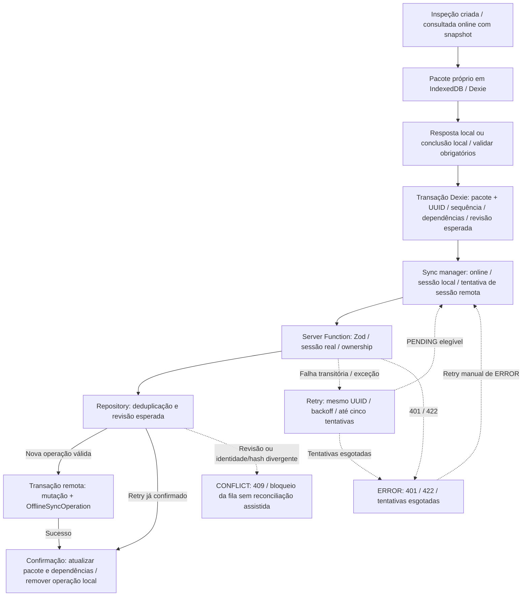

# Offline.md

# Arquitetura Offline

Este documento define a estratégia oficial de funcionamento offline da plataforma **Safe Watch Insight**.

O suporte ao funcionamento offline é um requisito não funcional prioritário do projeto e constitui um dos principais diferenciais da solução.

Toda implementação futura deverá seguir as definições descritas neste documento.

---

# Objetivo

A plataforma deve permitir que inspeções sejam realizadas normalmente mesmo em locais sem acesso à internet.

Durante entrevistas realizadas com profissionais de Segurança e Saúde no Trabalho (SST), foi identificado que diversas inspeções ocorrem em:

- áreas industriais;
- obras;
- áreas rurais;
- minas;
- usinas;
- ambientes com sinal instável.

Por esse motivo, o sistema não pode depender continuamente de conexão com a internet.

---

# Princípio

A aplicação seguirá a estratégia **Offline First**.

Sempre que possível, as operações serão realizadas localmente.

A sincronização com o servidor ocorrerá automaticamente quando houver conexão disponível.

Fluxo esperado:

```
Usuário

↓

Executa inspeção

↓

Dados gravados localmente

↓

Internet indisponível

↓

Usuário continua trabalhando

↓

Internet retorna

↓

Sincronização automática

↓

Banco PostgreSQL
```

---

# Tecnologias

Frontend

- Progressive Web App (PWA)

Persistência local

- IndexedDB

Biblioteca implementada

- Dexie.js

Backend

- TanStack Start Server Functions

Banco remoto

- PostgreSQL

## Estado do primeiro incremento — revisão de encerramento em 17 de agosto de 2026

Implementado e validado por testes/build:

- banco Dexie `safe-watch-insight` sobre IndexedDB;
- tabelas locais `sessions`, `inspectionPackages` e `operations`;
- pacote autocontido somente para inspeções do usuário autenticado que foram
  consultadas/listadas online;
- leitura do snapshot, itens e normas sem conexão;
- gravação local de respostas/observações e estado correspondente de NC;
- conclusão local após validar itens obrigatórios;
- fila FIFO com sequência, UUID estável, dependências por item, tentativas e
  próximo horário de retry;
- recuperação de operações deixadas como `SYNCING` após reinício;
- sincronização automática ao reconectar e sondagem enquanto online;
- deduplicação remota por `OfflineSyncOperation` na mesma transação da mutação;
- detecção de conflito pela revisão `InspectionResponse.updatedAt`;
- indicadores reais de conexão, fila, erro e conflito;
- manifest, service worker e ativos PWA presentes no artefato Vercel.
- cenário Chromium online → offline → reabertura → retry → sincronização com
  conferência final no Neon;
- persistência do mesmo UUID após interrupção e falha transitória, deduplicação
  idempotente e preservação da identidade/hash do snapshot;
- erro de autenticação retido localmente e recuperado após novo login;
- expiração da sessão local, isolamento na troca de usuário e limpeza de dados
  privados no logout;
- manifest sem erro de parsing/instalabilidade, service worker sob escopo `/`,
  navegação offline e remoção de cache obsoleto no Chromium.

Ainda não validado/concluído:

- homologação no domínio HTTPS publicado e em Chrome/Edge/Android adicionais;
- criação de uma nova inspeção sem conexão;
- reconciliação assistida de conflito (o bloqueio seguro já existe);
- armazenamento e sincronização de binários de evidência;
- Background Sync e política avançada de quota/retention.

---

# Progressive Web App

A aplicação deverá ser instalada como PWA.

Objetivos:

- funcionamento semelhante a aplicativo nativo;
- acesso rápido;
- cache local;
- instalação em smartphones;
- funcionamento offline.

---

# Dados Armazenados Localmente

O primeiro incremento armazena:

- sessão local limitada aos dados seguros do usuário e validade de oito horas;
- inspeções do próprio usuário previamente disponibilizadas no dispositivo;
- snapshot completo, itens, metadados normativos e respostas dessas inspeções;
- estado local correspondente de não conformidade e conclusão;
- fila de operações de resposta e conclusão.

Empresas, catálogo de checklists/versões, normas independentes, ações corretivas
e evidências binárias ainda não possuem CRUD/fila offline próprios. Os dados de
empresa e checklist presentes no pacote existem apenas como contexto histórico
da inspeção já criada no servidor.

---

# IndexedDB

O IndexedDB será o banco de dados local da aplicação.

Ele armazenará temporariamente os dados até que possam ser enviados ao servidor.

Pacote e operação são gravados na mesma transação Dexie. Não há garantia de
retenção contra limpeza/evicção de armazenamento pelo navegador, quota ou logout.

---

# Dexie.js

O incremento implementado utiliza Dexie.js para acesso ao IndexedDB.

Motivos:

- API simples;
- suporte a transações;
- tipagem com TypeScript;
- excelente integração com React;
- manutenção ativa.

---

# Estratégia de Sincronização

Quando houver conexão disponível:

```
Verificar conexão

↓

Existe sincronização pendente?

↓

Sim

↓

Enviar registros

↓

Servidor valida

↓

Persistir PostgreSQL

↓

Atualizar IndexedDB

↓

Remover fila
```

---

# Ordem da Sincronização

**Atual:** apenas SAVE_INSPECTION_RESPONSE e FINISH_INSPECTION, ordenadas por
sequence/UUID para o usuário. Respostas do mesmo item dependem da confirmação
anterior; a conclusão fica atrás das operações já enfileiradas. A primeira
operação em erro/conflito, com dependência ou aguardando retry impede avanço
da fila desse usuário, inclusive de outras inspeções. NC é efeito da resposta,
não operação independente.

**Proposta futura, não implementada:** ordem entre entidades se CRUD offline
amplo vier a existir:

1. Empresas

2. Checklists e versões draft, quando a manutenção offline for implementada

3. Itens e normas das versões

4. Inspeções com snapshot

5. Respostas

6. Não Conformidades

7. Ações Corretivas

8. Evidências

9. Relatórios

---

# Identificadores

No incremento implementado, cada operação de resposta ou conclusão recebe um
UUID estável gerado no cliente. Inspeções, snapshots e itens atualmente vêm do
pacote criado pelo servidor. A geração antecipada dos IDs dessas entidades será
necessária somente quando a criação integral de inspeção offline for implementada.

---

# Estado de Sincronização

Entidades que forem criadas localmente poderão possuir um estado de sincronização.

Exemplo:

```
PENDING

SYNCING

SYNCED

ERROR
```

Este controle facilitará futuras implementações.

---

# Resolução de Conflitos

**Atual:** conflito já é detectado por revisão esperada e identidade/hash da
operação; status CONFLICT bloqueia a fila. Sincronizar agora repõe ERROR, sem
liberar CONFLICT. Não existe resolução automática nem assistida na UI.

**Diretriz futura para outros módulos:**

Exemplo:

Mesmo registro alterado em dispositivos diferentes.

`Last Write Wins` poderá ser usado apenas em campos mutáveis de baixo risco.
Nunca deverá sobrescrever uma versão publicada nem reconstruir ou substituir um
snapshot já aceito pelo servidor.

Para conteúdo versionado, conflitos devem resultar em novo draft, rejeição com
reconciliação explícita ou outra estratégia que preserve ambas as revisões. Para
respostas, o servidor deve validar a identidade da inspeção e do item do
snapshot antes de aceitar o evento sincronizado.

---

# Versionamento e Snapshot no Dispositivo

**Atual:** pacote de inspeção criada online, com snapshot vindo do servidor.
Não há criação local de inspeção nem recaptura de publicação na sincronização.

**Diretriz futura de criação offline, não implementada:**
O pacote local necessário para iniciar uma inspeção deve conter uma versão
`PUBLISHED` completa e identificada por `checklistVersionId`,
`contentSchemaVersion` e `contentHash`. A criação offline deve congelar desse
pacote o mesmo conteúdo relacional usado pelo servidor:

- título e descrição;
- número da versão;
- descrição, ordem e obrigatoriedade dos itens;
- IDs de linhagem;
- metadados normativos copiados.

Respostas locais devem referenciar `snapshotItemId`, nunca apenas um item do
catálogo. IDs da inspeção, snapshot e itens devem ser estáveis e gerados antes da
sincronização para permitir repetição idempotente.

Na sincronização, o servidor deverá conferir versão, hash e formato do snapshot.
Se uma inspeção já existir, o cliente não poderá trocar seu snapshot por uma
versão mais recente. Edições futuras do checklist e invalidações do cache não
alteram o pacote histórico de uma inspeção em andamento.

A implementação persiste no IndexedDB o snapshot que veio do servidor; ela não
reconstrói nem troca esse conteúdo durante a sincronização. Respostas locais
referenciam `snapshotItemId`. O primeiro incremento ainda não cria uma inspeção
inteiramente offline a partir de uma versão publicada pré-carregada.

---

# Cache

O PWA deverá manter em cache:

- HTML
- CSS
- JavaScript
- Ícones
- Fontes
- Manifest
- Recursos estáticos

Objetivo:

permitir abertura da aplicação mesmo sem internet.

---

# Dados que Não Devem Permanecer Offline

Evitar armazenar permanentemente:

- senhas;
- tokens expirados;
- informações sensíveis desnecessárias.

---

# Evidências Fotográficas

**Atual:** evidências online em Cloudinary com metadados no PostgreSQL. Seleção/
prévia usa memória da UI, sem persistência binária offline. Não há upload offline,
fila binária, compressão offline ou quota de evidências offline. A UI desabilita
seleção/upload sem rede e exige selecionar/enviar após reconectar. Não há
pacote offline próprio de relatórios/dashboard.

**Proposta futura:** fotografias poderão ser armazenadas temporariamente no dispositivo.

O MVP online envia a imagem por Server Function para uma implementação de
`StorageService`; a fila offline futura deverá reutilizar o mesmo contrato de
domínio e nunca persistir Base64 no PostgreSQL.

Quando houver conexão:

```
Imagem

↓

Cloudinary

↓

URL

↓

Backend

↓

PostgreSQL
```

Após sincronização bem sucedida, a cópia temporária poderá ser removida.

---

# Segurança

Mesmo em funcionamento offline:

- validar dados;
- preservar integridade;
- impedir corrupção de registros;
- evitar duplicações.

---

# Indicadores Visuais

A interface deverá informar ao usuário:

- online;
- offline;
- sincronizando;
- sincronizado;
- erro de sincronização.

Exemplos:

🟢 Online

🟡 Offline

🔄 Sincronizando

🔴 Erro

---

# Benefícios

Esta arquitetura permite:

- continuidade da inspeção;
- maior confiabilidade;
- redução de retrabalho;
- melhor experiência do usuário;
- maior aderência ao ambiente real de SST.

---

# Limitações do Primeiro Incremento

IndexedDB, Dexie, service worker, a fila do fluxo principal e o cenário
browser/E2E em Chromium já foram validados. O marco pode ser encerrado para o
escopo do TCC como uma fundação Offline/PWA parcial, mas não como suporte offline
completo. As lacunas listadas no estado acima permanecem futuras.

---

# Evoluções Futuras

A arquitetura foi planejada para suportar:

- sincronização automática em segundo plano;
- Background Sync;
- envio incremental;
- sincronização seletiva;
- compressão de imagens;
- sincronização por lote;
- notificações de falha;
- reenvio automático;
- controle de conflitos avançado.

---

# Compatibilidade com a Arquitetura

O funcionamento offline deve respeitar a arquitetura oficial:

```
Frontend

↓

IndexedDB

↓

Fila Local

↓

Server Functions

↓

Services

↓

Repositories

↓

Prisma

↓

PostgreSQL
```

Nenhuma implementação futura deverá violar essa separação de responsabilidades.

# Protocolo Implementado de Sincronização

Para `SAVE_INSPECTION_RESPONSE`:

1. a tela grava o novo estado no pacote local;
2. cria uma operação com UUID, sequência, horário do dispositivo e revisão
   remota esperada;
3. operações repetidas no mesmo item são encadeadas e enviadas em ordem;
4. a Server Function valida Zod e associa o usuário da sessão;
5. o Service calcula SHA-256 canônico do payload;
6. o Repository confere deduplicação e revisão dentro da transação;
7. resposta, NC, estado da inspeção e registro idempotente são persistidos
   atomicamente;
8. somente após confirmação o cliente remove a operação local.

Retry do mesmo UUID com mesmo hash retorna sucesso idempotente. O mesmo UUID com
outro hash retorna conflito. Uma revisão inesperada também retorna conflito e a
fila é bloqueada para impedir que operações dependentes avancem.

Erros transitórios recebem backoff exponencial limitado a cinco minutos e até
cinco tentativas automáticas. Erro de autenticação/validação exige intervenção;
conflito nunca é reenviado automaticamente.

# Estratégia PWA Implementada

O manifest usa modo `standalone`, `start_url=/inspecoes`, tema e ícone próprios.
O service worker possui cache versionado:

- navegação: network-first e fallback apenas para rota já armazenada ou página
  offline estática;
- ativos versionados de produção, fontes, imagens e manifest da mesma origem:
  cache-first;
- módulos de desenvolvimento do Vite: network-first com fallback em cache;
- Server Functions (`POST` e requisições sem destino estático) não são cacheadas;
- `/login` não é gravado no cache de navegação;
- caches de versões antigas são removidos no `activate`.

O preset Nitro/Vercel envia `application/manifest+json` para o manifest, além de
`no-cache` e escopo `/` para o service worker. Assim, o navegador não depende de
um MIME genérico e verifica atualizações do worker a cada navegação.

Como TanStack Start usa SSR, a rota precisa ter sido interceptada pelo service
worker antes de poder ser reaberta offline. A reabertura autenticada foi
comprovada no Chromium usado pelo Playwright contra
o servidor local. No domínio HTTPS da Vercel, a homologação final abaixo
confirmou assets/registro/fallback, sem repetir o fluxo autenticado completo;
Chrome/Edge/Android adicionais permanecem pendentes.

## Delimitação arquitetural do cache — Fase 5

Conferência estática em 4 de outubro de 2026, sem nova homologação: sw.js guarda
resposta OK de navegação GET da mesma origem, exceto pathname /login. Portanto,
**HTML autenticado pode ser armazenado**. Cache de navegação não tem chave por
usuário nem expiração alinhada à sessão, diferentemente dos pacotes IndexedDB.

Logout e troca de identidade cacheada limpam navegação via clearAllOfflineData;
resposta remota 401 em getAppSession também pede limpeza. Excluir somente sessão
local vencida não limpa esse cache. Guard cliente e servidor revalidando mutações
não significam ausência de HTML privado no dispositivo. Assets/cache de HTML não
são uma API offline cacheada de Server Functions. Concern e Final QA:
[RelatorioFase5.md](../Documentation/RelatorioFase5.md). Diagrama atual:
[Architecture.md](./Architecture.md).

# Evidência Browser/E2E — execução original em 7 de agosto de 2026

O teste `npm run test:e2e:offline` executou com sucesso no Chromium
151.0.7922.34. O teste cria uma inspeção temporária com snapshot publicado,
remove o fixture ao terminar e verificou:

- pré-carga online do pacote histórico no IndexedDB;
- bloqueio real da rede, resposta `NON_COMPLIANT` offline e reabertura da rota;
- recuperação de operação `SYNCING`, falha `NETWORK_ERROR` e retry automático
  mantendo o UUID;
- resposta, item do snapshot, não conformidade e `OfflineSyncOperation` no Neon;
- repetição idempotente sem duplicar a operação;
- falha `UNAUTHORIZED`, novo login e sincronização manual de recuperação;
- ausência de senha/segredos no armazenamento inspecionado, cookie HTTP-only,
  expiração local, troca de usuário e limpeza no logout;
- manifest válido/instalável, escopo do worker, invalidação de cache e interação
  da interface após reload offline.

O E2E usou o servidor TanStack/Vite local com banco Neon real. O build separado
com preset Vercel confirmou os headers e artefatos PWA, mas não substitui a
homologação no domínio HTTPS publicado.

## Revalidação de encerramento — 17 de agosto de 2026

O mesmo cenário foi reexecutado com sucesso no Chromium 151.0.7922.34. A
revisão passou a exigir também ausência de erros de instalabilidade reportados
pelo Chromium. Foram reconfirmados snapshot/NC no Neon, UUID estável, retry,
deduplicação, recuperação de autenticação, expiração local, isolamento de
usuário, limpeza no logout, fallback offline e invalidação de cache. A validação
direcionada no Neon também confirmou retry idempotente de resposta depois que a
inspeção já havia sido concluída.

## Homologação final — 5 de setembro de 2026

O marco final foi homologado novamente no Chromium 151.0.7922.34 contra o
servidor local e o Neon. A auditoria estática confirmou que manifest, service
worker, banco Dexie versão 1, sessão local e protocolo de fila continuam
alinhados a este documento após as mudanças de relatórios, dashboard e hardening
de evidências.

A execução browser/E2E passou em três cenários:

- instalação sem erros, registro e atualização do service worker, remoção de
  cache obsoleto, fallback offline, retry transitório, recuperação de `SYNCING`,
  idempotência, expiração da sessão, troca de usuário e limpeza no logout;
- fluxo completo com 6 itens, 9 operações FIFO, três alterações dependentes no
  mesmo item, observação, conclusão local, reabertura offline, reconexão,
  persistência final e retry idempotente da conclusão;
- conflito otimista provocado por alteração concorrente, mantido em `CONFLICT`
  sem sobrescrever o servidor mesmo após oscilações de rede.

O mesmo navegador confirmou que upload de evidência fica desabilitado offline,
sem requisição ao Cloudinary. O E2E online de upload, listagem e remoção de
evidência também passou. Não houve exceção de aplicação nos novos cenários. A
suíte automatizada passou com 65 de 65 testes e o artefato Vercel foi gerado com
Node 22.23.2, incluindo manifest, worker, fallback, ícone e headers previstos.

O veredito é **APPROVED WITH KNOWN LIMITATIONS** para a demonstração do TCC. Não
foi necessária correção na implementação offline/PWA; somente a cobertura E2E e
o timeout do teardown dos fixtures foram ajustados. O domínio público foi
validado por HTTPS no Chromium: manifest, worker, fallback e ícone responderam
com sucesso, o contexto era seguro, o worker assumiu o controle no escopo `/` e
a navegação sem rede exibiu o fallback. O fluxo autenticado completo não foi
repetido em produção, e um reinício completo do processo do navegador e
Chrome/Edge/Android adicionais não foram testados nesta execução. Criação
integral de inspeção offline, reconciliação assistida, evidências binárias
offline, Background Sync e CRUD offline amplo continuam intencionalmente fora do
escopo.

# Limites de Segurança Implementados

- nenhum password, segredo Cloudinary ou conteúdo do cookie HTTP-only é copiado;
- a sessão local guarda usuário seguro e expira após oito horas;
- pacotes são indexados por usuário;
- logout limpa sessão, pacotes e fila do IndexedDB e o cache privado de navegação;
- a troca de identidade autenticada elimina dados pertencentes ao usuário anterior antes de gravar a nova sessão local;
- respostas do backend e conflitos continuam sendo validados no servidor;
- dados locais continuam acessíveis a quem controlar o perfil do navegador ou o
  sistema operacional; criptografia em repouso e MDM não pertencem ao escopo
  atual.

---

# Objetivo Final

O funcionamento offline é considerado um requisito estratégico da plataforma.

Toda decisão arquitetural deve preservar a possibilidade de execução de inspeções sem conexão com a internet, garantindo continuidade das atividades em campo, integridade dos dados e sincronização automática quando a conectividade for restabelecida.

## Conexão com o ciclo de inspeção — Fase 6

Reconferência estática sobre `5080142`, sem repetir as homologações históricas.
Fontes: [inspection-store](../src/offline/inspection-store.ts),
[sync-manager](../src/offline/sync-manager.ts),
[inspection-client](../src/offline/inspection-client.ts),
[session](../src/offline/session.ts) e
[InspectionResponseRepository](../src/server/repositories/inspection-response.repository.ts).



PlantUML equivalente: [offline-inspection.puml](../Documentation/diagrams/flows/offline-inspection.puml).
Fluxo implementado; setas não representam cardinalidades físicas nem garantias globais de atomicidade.

- A abertura/lista/criação online cacheia pacote do usuário se não houver
  operação pendente; pacote com alterações pendentes tem prioridade sobre
  refetch. Lista offline limita-se ao conjunto previamente cacheado, não a todo
  histórico do banco. Inspeção excluída remotamente pode permanecer no pacote
  até atualização/limpeza; sincronização exige contexto remoto ativo.
- Resposta altera pacote para IN_PROGRESS/PENDING e cria operação no mesmo
  commit Dexie. NC local é projeção provisória; UUID local de resposta/NC não
  é enviado como identidade de criação remota. Servidor define IDs/defaults.
- Conclusão local verifica obrigatórios e falhas/conflitos da inspeção,
  marca COMPLETED/PENDING e enfileira FINISH_INSPECTION; não confirma remoto.
  Dados de checklist congelados permanecem os mesmos durante a sincronização.
- updatedAt local pode usar relógio do dispositivo; expectedResponseUpdatedAt
  é revisão remota no payload. Nova resposta espera NULL; edição encadeada recebe
  revisão retornada pela operação anterior. clientCreatedAt é preservado como
  clientUpdatedAt remoto da resposta; updatedAt remoto continua do servidor.
- Manager tenta sync ao montar indicador, no evento online e a cada 30 segundos
  enquanto online. navigator.onLine não garante acesso ao servidor. Mutex
  activeSynchronization vale somente na instância JS, sem coordenação entre abas.
- getAppSession tenta validar remoto, podendo cair em sessão local em exceção;
  **cada Server Function reautentica no servidor** antes de persistir. 401 em
  envelope vira ERROR; 409 vira CONFLICT; 422 vira ERROR; demais falhas e exceções
  lançadas usam retry (exceção classificada NETWORK_ERROR). Não há garantia de
  classificar corretamente toda origem de exceção.
- Até cinco tentativas automáticas; atraso min(2^tentativa × 1000 ms, 5 minutos).
  Recupera SYNCING interrompido como PENDING mantendo UUID/payload. Sincronizar
  agora zera tentativas de ERROR; não resolve CONFLICT. Fila só remove operação
  após sucesso remoto e atualiza pacote/dependências na transação local.
- Deduplicação remota compara UUID/usuário/inspeção/tipo/hash, sem payload completo.
  Registro de confirmação e mutação são atômicos; isso não representa garantia
  global de concorrência entre dispositivos/abas. Riscos estáticos de leitura
  de revisão e confirmação local constam de
  [RelatorioFase6.md](../Documentation/RelatorioFase6.md).
- Logout limpa sessão/pacotes/fila IndexedDB e navegação; troca de identidade
  cacheada limpa dados anteriores. Sessão local segura expira em oito horas e
  não estende cookie remoto. Sem criptografia local/quota/retention avançada.

A homologação de 5 de setembro (acima) atualiza os limites do checkpoint de agosto:
HTTPS publicado teve assets/registro/fallback validados; fluxo autenticado completo
em produção/outros navegadores e reinício completo do processo seguem pendentes.
Não se declara suporte offline completo nem novo QA aprovado nesta fase.
