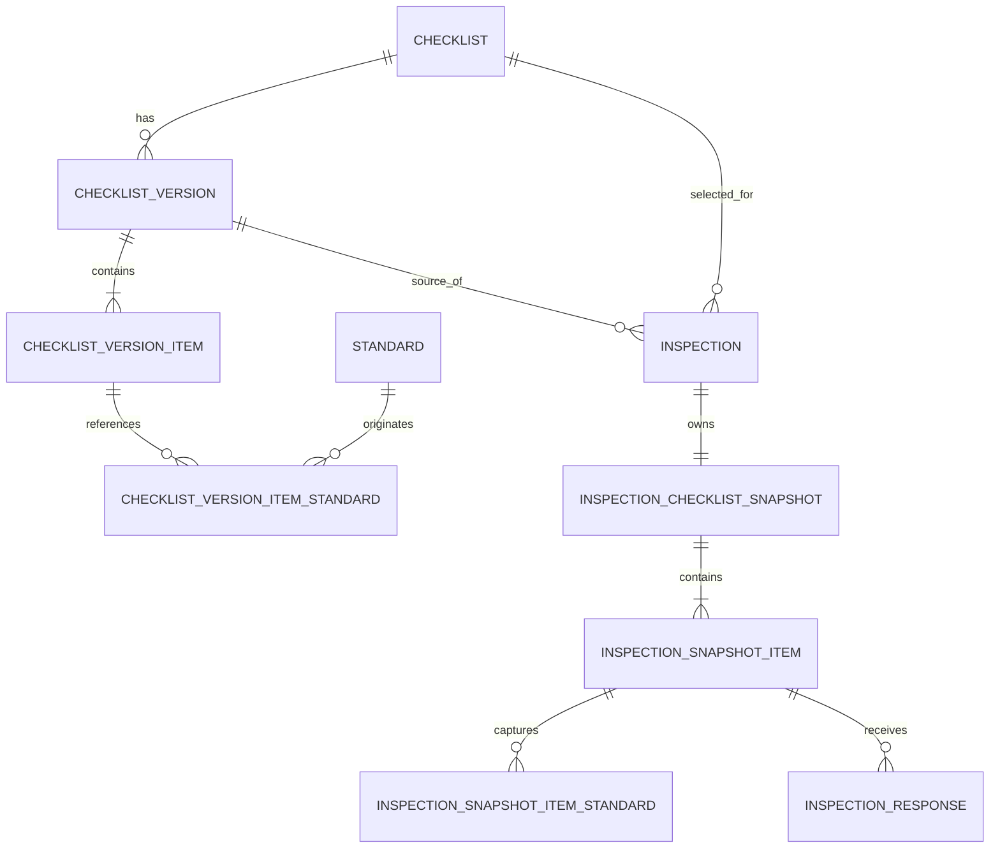

# Estudo arquitetural — versionamento e integridade histórica de checklists

**Projeto:** Safe Watch Insight  
**Data do estudo:** 30 de julho de 2026  
**Status:** Opção C aprovada e implementada em 3 de agosto de 2026

> Nota de leitura: as seções de “arquitetura atual” e de alternativas registram
> o diagnóstico existente na data do estudo. A implementação posterior adotou a
> recomendação híbrida enxuta, com migration expansiva, versões publicadas e
> snapshot relacional por inspeção. O modelo operacional vigente está descrito
> em `AI/Architecture.md`, `AI/Database.md`, `AI/Entities.md`,
> `AI/BusinessRules.md` e `AI/API.md`.

## 1. Resumo executivo

O modelo atual preserva o valor das respostas de uma inspeção concluída, mas não
preserva o contexto no qual essas respostas foram dadas. `Inspection` referencia
diretamente um `Checklist` mutável, e `InspectionResponse` referencia diretamente
um `ChecklistItem` mutável. As associações com `Standard` também são resolvidas em
tempo de leitura a partir dos registros atuais.

Como consequência, uma alteração posterior no título do checklist, na descrição,
ordem ou obrigatoriedade de um item, nas normas associadas ou nos dados da própria
norma altera a representação de inspeções antigas. O status `COMPLETED` bloqueia
novas respostas, mas não congela as perguntas nem a fundamentação normativa da
inspeção.

Este estudo recomenda a **Opção C: abordagem híbrida enxuta**, com dois limites
claros:

1. **Versões publicadas e imutáveis do checklist** organizam a evolução do
   template e permitem reutilização, comparação e publicação controlada.
2. **Um snapshot relacional e imutável por inspeção**, gerado atomicamente quando
   a inspeção é criada, torna cada inspeção autossuficiente para execução,
   auditoria, relatórios, assinatura e sincronização.

A duplicação introduzida pela solução é intencional e limitada aos campos que
fazem parte do registro probatório. A regra de autoridade deve ser inequívoca:

| Contexto | Fonte de verdade |
| --- | --- |
| Catálogo e autoria de checklists | `Checklist` e versão `DRAFT` |
| Seleção para nova inspeção | `ChecklistVersion` com status `PUBLISHED` |
| Execução, conclusão, histórico e PDF | snapshot pertencente à inspeção |
| Comparação entre modelos | versões publicadas |
| Consulta atual de normas | `Standard` |
| Norma exibida em inspeção histórica | cópia normativa do snapshot |

Os dados históricos existentes não podem ser reconstruídos com certeza. A
migração deve estabilizar o melhor estado disponível, mas identificá-lo
explicitamente como **backfill legado não verificável**, sem alegar que representa
o checklist original.

## 2. Escopo e premissas

### 2.1 Documentos e implementação estudados

Foram considerados os documentos obrigatórios:

- `AGENTS.md`;
- `PROJECT_CONTEXT.md`;
- `IMPLEMENTATION_PLAN.md`;
- `TASKS.md`;
- `TECH_DECISIONS.md`;
- `AI/Architecture.md`;
- `AI/Database.md`;
- `AI/BusinessRules.md`;
- `AI/API.md`;
- `AI/Entities.md`;
- `AI/Offline.md`.

Também foram inspecionados o schema Prisma, a migration inicial, o seed e as
camadas atuais de schema Zod, Repository, Service, Server Functions, React Query
e telas relacionadas a checklists, itens, normas, inspeções, respostas e não
conformidades.

### 2.2 Regras arquiteturais preservadas

A proposta mantém o fluxo obrigatório:

```text
Tela
  -> React Query
  -> Server Function
  -> Service
  -> Repository
  -> Prisma
  -> PostgreSQL
```

As regras de negócio permanecem nos Services; os Repositories continuam
responsáveis apenas pela persistência; toda entrada externa continua validada com
Zod; e o frontend não acessa Prisma.

### 2.3 Não objetivos deste documento

Este estudo não:

- implementa o modelo sugerido;
- altera o schema Prisma;
- cria migrations;
- define o layout final das telas de publicação;
- implementa offline, upload, assinatura, PDF ou audit log;
- altera os documentos oficiais do TCC.

## 3. Arquitetura atual

### 3.1 Modelo relacional atual

O relacionamento relevante no `prisma/schema.prisma` é:

```text
Checklist 1 --- N ChecklistItem
Checklist 1 --- N Inspection

ChecklistItem N --- N Standard
             por ChecklistItemStandard

Inspection 1 --- N InspectionResponse

ChecklistItem 1 --- N InspectionResponse
```

Em termos de chaves:

- `Inspection.checklistId` referencia `Checklist.id`;
- `ChecklistItem.checklistId` referencia `Checklist.id`;
- `ChecklistItemStandard` associa `ChecklistItem.id` a `Standard.id`;
- `InspectionResponse.inspectionId` referencia `Inspection.id`;
- `InspectionResponse.checklistItemId` referencia `ChecklistItem.id`;
- `@@unique([inspectionId, checklistItemId])` garante uma resposta por item
  atual e por inspeção.

Não existe hoje:

- entidade de versão de checklist;
- status de rascunho/publicação;
- snapshot pertencente à inspeção;
- cópia histórica dos itens;
- cópia histórica das normas;
- hash de conteúdo;
- indicação de origem ou confiabilidade de um snapshot legado.

### 3.2 Relação de `Inspection` com `Checklist`

Na criação, `InspectionService.createInspection`:

1. confirma que a empresa existe;
2. confirma que o checklist existe e não está logicamente excluído;
3. cria `Inspection` conectando apenas `checklistId`.

Nenhum conteúdo do checklist é copiado. O serviço também não fixa uma revisão ou
versão. O método `findActiveById` usado nessa validação considera `deletedAt`, mas
não exige `isActive`; a interface normalmente lista apenas checklists ativos,
porém essa condição não é uma garantia de domínio da criação.

Em leituras, `InspectionRepository` inclui novamente o `Checklist` atual, seus
itens atuais e as normas atuais. O título mostrado na listagem e no detalhe da
inspeção também vem desse relacionamento vivo.

### 3.3 Relação de `Inspection` com `ChecklistItem`

`InspectionResponse` não armazena a pergunta respondida. Ele contém somente:

- `inspectionId`;
- `checklistItemId`;
- `status`;
- `observation`.

O texto, a ordem e a obrigatoriedade são lidos posteriormente do
`ChecklistItem` referenciado.

Ao salvar uma resposta, `InspectionResponseService` procura o item dentro de
`inspection.checklist.items`. Logo, a autorização para responder depende do
estado **atual** do checklist, não do estado existente quando a inspeção foi
criada.

Ao concluir, o mesmo serviço verifica itens obrigatórios lendo
`inspection.checklist.items`. Portanto, uma alteração de `isRequired`, a criação
de um novo item ou a remoção de um item ainda sem resposta pode alterar o
resultado da validação de uma inspeção já em andamento.

### 3.4 Relação com `Standard`

`ChecklistItem` se relaciona com `Standard` pela tabela
`ChecklistItemStandard`. Tanto `InspectionRepository` quanto
`InspectionResponseRepository` e `NonConformityRepository` incluem os registros
atuais de `Standard`.

O histórico pode mudar de duas formas:

1. a associação entre item e norma pode ser substituída por
   `ChecklistItemRepository.updateWithStandards`;
2. os atributos da norma — código, título, resumo, URL oficial ou situação —
   pertencem a um registro mestre mutável.

Embora a API atual de normas seja de consulta, o seed já executa `upsert` e pode
atualizar os dados dos registros. Uma futura manutenção cadastral também
afetaria todas as inspeções que resolvem a norma por referência viva.

### 3.5 Relação com `InspectionResponse` e não conformidades

O valor da resposta fica persistido e o Service impede alterações quando a
inspeção está `COMPLETED` ou `CANCELLED`. Essa proteção é correta, porém parcial.

Uma resposta `NON_COMPLIANT` cria uma `NonConformity`. A descrição inicial da não
conformidade copia a observação ou, na ausência dela, a descrição atual do item.
Isso preserva apenas esse texto inicial. A tela e as consultas de não
conformidade continuam carregando o `ChecklistItem`, as associações normativas e
o `Checklist` atuais.

Consequentemente, filtros por norma, textos exibidos e relatórios futuros podem
ser reinterpretados por edições posteriores.

### 3.6 Mutabilidade permitida hoje

| Operação posterior | Proteção atual | Efeito histórico |
| --- | --- | --- |
| Alterar título ou descrição do checklist | Nenhuma ligada a inspeções | Inspeções antigas passam a exibir os novos textos |
| Ativar/desativar ou alterar `isTemplate` | Nenhuma ligada a inspeções | Metadados históricos deixam de representar a seleção original |
| Adicionar item | Permitido | O item aparece em inspeções antigas e altera total/progresso |
| Alterar descrição do item | Permitido, mesmo com respostas | A pergunta histórica é reescrita |
| Alterar `isRequired` | Permitido | A regra histórica de conclusão é reescrita |
| Alterar `orderIndex` | Permitido | A ordem histórica é reescrita |
| Trocar normas do item | Permitido e atômico | A fundamentação normativa histórica é reescrita |
| Excluir item sem resposta | Permitido | O item desaparece de inspeções já criadas |
| Excluir item com alguma resposta | Bloqueado | Evita órfão, mas não evita atualização do conteúdo |
| Alterar dados de `Standard` | Modelo permite; seed atualiza | Todas as referências vivas passam a mostrar os novos dados |
| Alterar resposta após conclusão | Bloqueado | Preserva o valor da resposta, mas não o contexto |

### 3.7 Efeito no frontend e no cache

A tela `src/routes/_app.inspecoes.$id.tsx` usa diretamente:

- `inspection.checklist.title`;
- `inspection.checklist.items`;
- `item.description`;
- `item.orderIndex`;
- `item.isRequired`;
- `item.standards`.

O progresso é calculado por `responses.length / checklist.items.length`.
Adicionar um item ao template pode, portanto, diminuir retroativamente o
progresso mostrado para uma inspeção concluída.

As mutations de checklist e itens invalidam caches de checklist, mas não os
caches de inspeção ou não conformidade. Isso pode ocultar temporariamente a
mudança em uma aba já aberta. Quando a inspeção for consultada novamente,
entretanto, o banco retornará o novo conteúdo. React Query não é uma barreira de
integridade histórica.

### 3.8 Causa raiz

A causa raiz não é a ausência de uma invalidação de cache nem apenas a
possibilidade de excluir itens. É a falta de uma fronteira entre:

- o **modelo reutilizável e editável**; e
- o **registro probatório da inspeção**.

Hoje ambos compartilham as mesmas linhas mutáveis. FKs garantem integridade
referencial, mas não integridade temporal.

## 4. Invariantes que a solução deve garantir

Independentemente da alternativa escolhida, a solução correta deve estabelecer:

1. Uma inspeção deve identificar sem ambiguidade qual conteúdo foi selecionado.
2. Perguntas, ordem, obrigatoriedade e fundamentação normativa usadas em uma
   inspeção não podem mudar por edição do template.
3. A validação de conclusão deve usar o conteúdo fixado para a inspeção.
4. Respostas devem apontar para itens pertencentes ao conteúdo fixado daquela
   inspeção.
5. Leituras históricas, não conformidades e relatórios nunca devem depender do
   checklist mestre atual.
6. Versões publicadas e snapshots não devem ser atualizados nem excluídos
   fisicamente.
7. IDs devem ser estáveis e geráveis no cliente para suportar o futuro offline.
8. Criação da inspeção e captura do conteúdo devem ser atômicas ou
   idempotentemente recuperáveis.
9. Dados legados cuja origem exata seja desconhecida não devem ser rotulados
   como historicamente verificados.
10. A API deve ter uma transição compatível, sem exigir reconstrução das telas
    existentes.

## 5. Alternativas arquiteturais

## 5.1 Opção A — versionamento imutável de checklist

### Conceito

`Checklist` passa a representar a identidade do modelo, enquanto
`ChecklistVersion` representa seu conteúdo em um número de versão. Os itens
pertencem à versão. Apenas rascunhos podem ser editados; uma versão publicada é
imutável.

```text
Checklist
  -> ChecklistVersion v1 (PUBLISHED)
       -> ChecklistVersionItem
            -> referência normativa imutável
  -> ChecklistVersion v2 (DRAFT)

Inspection -> ChecklistVersion v1
InspectionResponse -> ChecklistVersionItem de v1
```

Editar um checklist publicado cria ou atualiza um novo `DRAFT`. Publicar gera a
próxima versão. Novas inspeções selecionam uma versão publicada; inspeções
existentes continuam ligadas à versão anterior.

Para esta opção realmente preservar a fundamentação normativa, não basta manter
um FK para o `Standard` mutável. Seria necessário:

- versionar também as normas com `StandardRevision`; ou
- copiar os campos normativos para a associação da versão publicada.

### Avaliação

| Critério | Avaliação |
| --- | --- |
| Integridade histórica | Alta, desde que itens e dados normativos da versão sejam realmente imutáveis |
| Complexidade de implementação | Média/alta: exige ciclo `DRAFT`/`PUBLISHED`/`RETIRED` e reendereçamento dos itens |
| Complexidade de migration | Alta: inspeções e respostas existentes precisam ser ligadas a versões importadas sem inventar histórico |
| Impacto no Prisma | Novos modelos de versão, item versionado e associação normativa; novas FKs em inspeção e resposta |
| Impacto nos Repositories | Novos repositórios de versão; leituras de inspeção passam a incluir a versão, não o checklist vivo |
| Impacto nos Services | Regras de publicação, clonagem de draft, imutabilidade e seleção de versão |
| Impacto no React Query | Novas query keys para versões/draft/publicação e invalidações específicas |
| Impacto no frontend existente | Moderado: editor precisa distinguir draft e publicada; execução pode manter DTO parecido |
| Offline futuro | Bom: versões publicadas podem ser cacheadas uma vez e reutilizadas por várias inspeções |
| Relatórios | Bom: uma versão publicada fornece conteúdo estável |
| Audit trail | Bom para estado; ainda requer audit log para registrar quem publicou ou tentou alterar |
| Escalabilidade | Muito boa: uma versão é compartilhada por muitas inspeções |
| Manutenibilidade | Boa se a imutabilidade e a versão normativa forem centralizadas; ruim se houver exceções para editar versões publicadas |

### Vantagens

- Evita duplicar todos os itens por inspeção.
- Modela adequadamente autoria, publicação, duplicação e evolução de templates.
- Permite comparar inspeções pelo mesmo número de versão.
- É eficiente para cache e sincronização.
- Corrige a causa central se toda a árvore publicada for imutável.

### Desvantagens

- A inspeção continua dependente da existência correta de um agregado
  compartilhado.
- Um bug administrativo que altere uma versão publicada afetaria várias
  inspeções simultaneamente.
- Exige resolver também a mutabilidade das normas.
- O registro da inspeção não é autossuficiente para exportação ou sincronização.
- Uma assinatura precisa incluir e validar conteúdo externo à própria inspeção.

## 5.2 Opção B — snapshot do checklist na criação da inspeção

### Conceito

O checklist mestre continua mutável. Quando uma inspeção é criada, seu estado é
copiado para tabelas pertencentes à inspeção:

```text
Inspection
  -> InspectionChecklistSnapshot
       -> InspectionChecklistSnapshotItem
            -> InspectionChecklistSnapshotItemStandard

InspectionResponse -> InspectionChecklistSnapshotItem
```

O snapshot contém título, descrição, ordem, obrigatoriedade e os dados normativos
necessários. Depois de criado, ele não é alterado. A execução e os relatórios
usam exclusivamente esse snapshot.

Um snapshot relacional é preferível a um único campo JSON para este projeto. JSON
seria mais simples para gravar, mas dificultaria FKs, filtros por norma,
relatórios, índices, validação de respostas e evolução tipada com Prisma.

### Avaliação

| Critério | Avaliação |
| --- | --- |
| Integridade histórica | Alta para inspeções criadas após a adoção; o snapshot contém exatamente o formulário capturado |
| Complexidade de implementação | Média: criação transacional e novo caminho de leitura/resposta |
| Complexidade de migration | Média: modelo é aditivo, mas o backfill legado continua sem certeza histórica |
| Impacto no Prisma | Três modelos de snapshot e FK da resposta para item do snapshot |
| Impacto nos Repositories | Criação atômica de inspeção + snapshot; consultas passam a projetar snapshot |
| Impacto nos Services | Regra de captura, imutabilidade e validação de pertencimento do item |
| Impacto no React Query | Baixo/moderado; chaves de inspeção podem continuar, com mudança no DTO |
| Impacto no frontend existente | Baixo/moderado por meio de adapter compatível |
| Offline futuro | Muito bom para autonomia; cada inspeção leva seu formulário, mas o payload é maior |
| Relatórios | Muito bom: os dados necessários pertencem à inspeção |
| Audit trail | Bom para estado capturado; não organiza o histórico editorial do template |
| Escalabilidade | Boa, com crescimento proporcional a inspeções × itens × normas |
| Manutenibilidade | Boa para inspeções, mas fraca para publicação, comparação e governança de templates |

### Vantagens

- Isola completamente a inspeção de futuras edições do checklist.
- Mantém o fluxo de edição atual do template praticamente intacto.
- Simplifica PDF, assinatura e execução offline por tornar a inspeção
  autossuficiente.
- É uma alteração predominantemente aditiva.

### Desvantagens

- Duplica o conteúdo para cada inspeção.
- Não oferece publicação, números de versão ou comparação editorial.
- Duas inspeções criadas em momentos próximos podem ter conteúdo diferente sem
  uma versão explícita para explicar a diferença.
- O snapshot registra o estado, mas não o processo que produziu esse estado.
- Futuramente ainda seria necessário introduzir versionamento de template,
  provocando uma segunda mudança estrutural.

## 5.3 Opção C — híbrida: versão publicada + snapshot da inspeção

### Conceito

A versão publicada organiza o ciclo de vida do template. Na criação da
inspeção, a versão selecionada é materializada em um snapshot próprio e
imutável:

```text
Checklist
  -> ChecklistVersion (PUBLISHED)
       -> ChecklistVersionItem
            -> dados normativos imutáveis

Inspection
  -> source ChecklistVersion
  -> InspectionChecklistSnapshot
       -> InspectionChecklistSnapshotItem
            -> dados normativos copiados

InspectionResponse -> InspectionChecklistSnapshotItem
```

As duas estruturas não competem:

- a versão é a fonte de autoria, publicação, reutilização e comparação;
- o snapshot é a fonte de execução e prova da inspeção;
- o vínculo de origem permite demonstrar de qual versão o snapshot foi gerado.

### Avaliação

| Critério | Avaliação |
| --- | --- |
| Integridade histórica | Muito alta: há imutabilidade compartilhada e isolamento por inspeção |
| Complexidade de implementação | Alta: dois agregados e regras claras de autoridade |
| Complexidade de migration | Alta: mudança aditiva, publicação inicial, snapshots e compatibilidade legada |
| Impacto no Prisma | Maior entre A–C: modelos de versão e snapshot, novas FKs, enums, hashes e metadados de proveniência |
| Impacto nos Repositories | Repositórios de versão/snapshot e transação de materialização; consultas históricas mudam de fonte |
| Impacto nos Services | Publicação, clonagem, captura, imutabilidade, verificação de hash e compatibilidade legada |
| Impacto no React Query | Moderado: versões no editor/seleção; snapshot permanece dentro do domínio da inspeção |
| Impacto no frontend existente | Moderado, mas incremental; layout pode ser preservado com DTO de compatibilidade |
| Offline futuro | Excelente: versão identificável/cacheável e inspeção autossuficiente com hash verificável |
| Relatórios | Excelente: snapshot fixo, versão e hash podem constar no PDF |
| Audit trail | Muito bom para estado e proveniência; audit log de eventos continua necessário |
| Escalabilidade | Boa: maior armazenamento, porém consultas previsíveis e indexáveis |
| Manutenibilidade | Muito boa no longo prazo se as fontes de verdade forem rigidamente separadas |

### Vantagens

- Atende simultaneamente governança de templates e integridade probatória.
- Evita uma futura migração disruptiva de resposta de item versionado para item
  de snapshot.
- Facilita assinatura de um agregado autossuficiente.
- Oferece rastreabilidade da versão de origem e defesa contra alterações
  acidentais em dados compartilhados.
- É compatível com templates, duplicação, publicação e histórico regulatório.

### Desvantagens

- Maior custo inicial e mais tabelas.
- Duplica conteúdo já imutável na versão publicada.
- Exige disciplina para nunca consultar a versão ou o checklist vivo ao renderizar
  uma inspeção.
- A sincronização transmite mais dados.
- Sem nomes e contratos claros, pode surgir confusão entre item do draft, item
  da versão e item do snapshot.

## 5.4 Opção D — event sourcing e projeções imutáveis

### Conceito

Toda mudança seria registrada como evento append-only, por exemplo:

- `ChecklistDraftCreated`;
- `ChecklistVersionPublished`;
- `InspectionCreated`;
- `InspectionResponseRecorded`;
- `InspectionCompleted`.

O estado de checklist e inspeção seria reconstruído ou projetado a partir desses
eventos. Projeções relacionais atenderiam as telas e relatórios.

### Avaliação

| Critério | Avaliação |
| --- | --- |
| Integridade histórica | Muito alta quando eventos são append-only e corretamente versionados |
| Complexidade de implementação | Muito alta |
| Complexidade de migration | Muito alta; o histórico anterior não possui eventos para reconstrução |
| Impacto no Prisma | Event store, sequência, idempotência e várias projeções |
| Impacto nos Repositories | Escrita de eventos e manutenção/rebuild de projeções |
| Impacto nos Services | Comandos, handlers, versionamento de eventos e concorrência otimista |
| Impacto no React Query | Pode consumir projeções estáveis, mas consistência eventual precisa ser tratada |
| Impacto no frontend existente | Alto em erros, estados intermediários e expectativas de consistência |
| Offline futuro | Potencialmente excelente para operações append-only, mas conflitos e ordenação são difíceis |
| Relatórios | Exige projeções específicas e política de reprocessamento |
| Audit trail | Excelente e intrínseco |
| Escalabilidade | Boa com infraestrutura apropriada; excessiva para a escala e equipe atuais |
| Manutenibilidade | Baixa para o contexto do TCC devido à carga conceitual e operacional |

### Vantagens

- Fornece histórico completo de comandos e alterações.
- Facilita reconstrução temporal e auditorias avançadas.
- Eventos podem se alinhar a filas de sincronização offline.

### Desvantagens

- É desproporcional ao escopo atual.
- Torna consultas, migrations, testes e depuração muito mais complexos.
- Exige versionamento de eventos e manutenção de projeções.
- Não recupera os eventos históricos que nunca foram registrados.

## 6. Comparação consolidada

Escala: **1 = desfavorável**, **3 = aceitável**, **5 = melhor aderência**. Para
complexidade e impacto, uma nota maior significa menor custo/impacto.

| Critério | A — Versões | B — Snapshot | C — Híbrida | D — Eventos |
| --- | :---: | :---: | :---: | :---: |
| Integridade histórica | 4 | 4 | 5 | 5 |
| Simplicidade de implementação | 3 | 4 | 2 | 1 |
| Simplicidade de migration | 2 | 3 | 2 | 1 |
| Baixo impacto no Prisma | 3 | 3 | 2 | 1 |
| Baixo impacto em Repositories | 3 | 3 | 2 | 1 |
| Baixo impacto em Services | 3 | 3 | 2 | 1 |
| Baixo impacto no React Query | 3 | 4 | 3 | 2 |
| Compatibilidade com frontend | 3 | 4 | 3 | 2 |
| Offline futuro | 4 | 4 | 5 | 3 |
| Relatórios | 4 | 5 | 5 | 3 |
| Audit trail | 4 | 4 | 5 | 5 |
| Escalabilidade | 5 | 4 | 4 | 4 |
| Manutenibilidade no contexto atual | 4 | 4 | 4 | 1 |

### Síntese

- **A** é a solução mais eficiente quando a versão compartilhada é suficiente e
  todas as suas dependências são imutáveis.
- **B** é o menor caminho seguro para estabilizar inspeções, mas não resolve a
  governança futura dos templates.
- **C** custa mais agora, porém evita duas migrações sucessivas e atende melhor ao
  conjunto explícito de evoluções do projeto.
- **D** tem excelente auditabilidade, mas não é justificável para o TCC nem para
  a implementação atual.

## 7. Recomendação: abordagem híbrida enxuta

### 7.1 Decisão

Recomenda-se a **Opção C**, implementada de forma incremental e relacional.

A escolha não se baseia apenas em defesa em profundidade. Versionamento e
snapshot possuem responsabilidades diferentes:

- **Versionamento** responde: “qual edição do template foi aprovada e
  disponibilizada?”.
- **Snapshot** responde: “qual conteúdo pertence a esta inspeção e foi
  efetivamente executado?”.

Essa separação é especialmente útil no Safe Watch Insight porque uma inspeção
pode ser criada online, executada depois sem conexão, receber evidências,
sincronizar posteriormente, gerar PDF e ser assinada. O registro da inspeção não
deve depender de uma nova consulta ao catálogo.

### 7.2 Por que é adequada ao TCC

A solução é maior que um snapshot simples, mas ainda utiliza conceitos
convencionais de PostgreSQL e Prisma:

- tabelas relacionais;
- FKs;
- índices;
- transações;
- Services e Repositories já adotados;
- DTOs compatíveis com o frontend.

Ela não exige event store, mensageria, CQRS, banco adicional ou sincronização
completa na entrega atual. Pode ser dividida em pequenas etapas e demonstrada no
TCC com um cenário objetivo:

1. publicar v1;
2. criar inspeção A;
3. editar e publicar v2;
4. criar inspeção B;
5. provar que A continua com v1 e B usa v2.

### 7.3 Modelo conceitual recomendado



### 7.4 Entidades e campos sugeridos

Os nomes abaixo são uma proposta de design, não uma alteração já aprovada no
schema.

#### `Checklist`

Representa a identidade do modelo no catálogo:

- `id`;
- autoria e timestamps;
- disponibilidade (`isActive`);
- natureza de template;
- soft delete.

Durante a transição, `title` e `description` podem permanecer para
compatibilidade. O conteúdo histórico, porém, deve vir da versão e do snapshot.

#### `ChecklistVersion`

- `id` UUID estável;
- `checklistId`;
- `versionNumber`;
- `status`: `DRAFT`, `PUBLISHED` ou `RETIRED`;
- `title`;
- `description`;
- `contentHash`;
- `createdById`;
- `publishedById`;
- `publishedAt`;
- `createdAt`;
- `updatedAt` somente relevante enquanto `DRAFT`.

Restrições principais:

- `@@unique([checklistId, versionNumber])`;
- apenas uma política explícita de draft ativo por checklist;
- versão `PUBLISHED` ou `RETIRED` não pode ser editada;
- versão usada por inspeção não pode ser excluída;
- `RETIRED` impede novas seleções, mas nunca invalida inspeções existentes.

#### `ChecklistVersionItem`

- `id`;
- `checklistVersionId`;
- `description`;
- `orderIndex`;
- `isRequired`;
- `sourceVersionItemId` opcional para linhagem entre versões;
- timestamps de criação quando necessários.

Restrição:

- `@@unique([checklistVersionId, orderIndex])`.

#### `ChecklistVersionItemStandard`

Deve preservar a referência e a apresentação normativa existente na publicação:

- `checklistVersionItemId`;
- `sourceStandardId`;
- futuramente `sourceStandardRevisionId`;
- `type`;
- `code`;
- `title`;
- `summary`;
- `officialUrl`.

Copiar esses campos é necessário enquanto `Standard` não possuir revisões
imutáveis. Somente manter `standardId` reproduziria o defeito atual.

#### `InspectionChecklistSnapshot`

- `id`;
- `inspectionId` único;
- `sourceChecklistId`;
- `sourceChecklistVersionId`;
- `sourceVersionNumber`;
- `title`;
- `description`;
- `isTemplate`;
- `snapshotSchemaVersion`;
- `contentHash`;
- `origin`: `INSPECTION_CREATION` ou `LEGACY_BACKFILL`;
- `integrityStatus`: `VERIFIED` ou `UNVERIFIED_LEGACY`;
- `capturedAt`.

`snapshotSchemaVersion` versiona o formato canônico usado para hash, offline e
assinaturas sem confundi-lo com a versão funcional do checklist.

#### `InspectionChecklistSnapshotItem`

- `id`;
- `snapshotId`;
- `sourceVersionItemId`;
- `sourceChecklistItemId` opcional para migração;
- `description`;
- `orderIndex`;
- `isRequired`.

Restrição:

- `@@unique([snapshotId, orderIndex])`.

#### `InspectionChecklistSnapshotItemStandard`

- `snapshotItemId`;
- IDs de origem opcionais;
- `type`;
- `code`;
- `title`;
- `summary`;
- `officialUrl`.

Os campos copiados são a fonte histórica. IDs de origem servem para navegação e
análise, nunca como fallback de apresentação.

#### Alterações conceituais em `Inspection`

Manter durante a transição:

- `checklistId`, agora interpretado como identidade de catálogo e filtro de
  origem.

Adicionar:

- `checklistVersionId` para proveniência;
- relação 1:1 com o snapshot.

Uma inspeção nova deve possuir versão e snapshot. As FKs podem começar
opcionais apenas para permitir migração aditiva dos registros legados.

#### Alterações conceituais em `InspectionResponse`

Adicionar:

- `snapshotItemId`;
- `createdAt`;
- `updatedAt`.

Durante a migração, `checklistItemId` pode ficar opcional e restrito a registros
legados. Novas respostas devem usar exclusivamente `snapshotItemId`, com
unicidade por inspeção e item de snapshot.

O Service deve verificar que o item pertence ao snapshot da mesma inspeção. A
FK evita órfãos; a regra de pertencimento continua sendo uma regra de negócio.

### 7.5 Ciclo de vida

```text
Criar checklist
  -> criar versão DRAFT
  -> editar itens e normas no DRAFT
  -> validar
  -> publicar como v1 (imutável)
  -> selecionar v1 para inspeção
  -> criar inspeção + snapshot de v1 na mesma transação
  -> responder somente itens do snapshot
  -> concluir usando obrigatoriedade do snapshot

Editar o template depois
  -> clonar v1 em novo DRAFT
  -> editar
  -> publicar como v2
  -> novas inspeções usam v2
  -> inspeções existentes continuam em seus snapshots
```

Não deve existir “editar versão publicada”. Correções são novas versões.

### 7.6 Momento de captura

O snapshot deve ser gerado na **criação da inspeção**, conforme o fluxo atual e
a alternativa solicitada. A partir desse momento, o formulário selecionado
pertence à inspeção.

Isso também define o comportamento de uma inspeção agendada: ela executará a
versão escolhida quando foi criada. Uma atualização automática posterior seria
perigosa e incompatível com offline. Se no futuro houver necessidade de usar uma
versão mais nova, a troca deve ser uma operação explícita, permitida somente
antes de qualquer resposta, evidência ou assinatura, e deve criar um novo
snapshot em vez de editar o anterior. Para o MVP, cancelar e recriar a inspeção
é a regra mais simples e segura.

### 7.7 Atomicidade e hash

A criação deve persistir em uma única transação:

1. inspeção;
2. cabeçalho do snapshot;
3. itens;
4. dados normativos;
5. hash do conteúdo canônico.

O Service decide qual versão é válida e solicita ao Repository a persistência
atômica. O Repository não decide regras de publicação.

O `contentHash`, preferencialmente SHA-256 sobre serialização canônica e
versionada, não substitui os dados relacionais. Ele serve para:

- detectar corrupção ou materialização divergente;
- confirmar que snapshot e versão tinham o mesmo conteúdo na captura;
- validar payloads offline;
- compor futuramente a assinatura da inspeção;
- imprimir uma referência verificável em relatório.

Datas, ordem de campos, `null`, Unicode e ordenação de itens/normas precisam ser
definidos pelo `snapshotSchemaVersion`; não se deve aplicar hash sobre
`JSON.stringify` arbitrário.

### 7.8 Imutabilidade

No modelo arquitetural atual do projeto, a regra deve ser aplicada nos Services:

- Service de checklist só atualiza `DRAFT`;
- publicação é transacional e muda o estado uma única vez;
- Repositories de versão publicada e snapshot não expõem operações genéricas de
  update/delete;
- Services históricos nunca fazem fallback para os registros mestres;
- FKs usam comportamento restritivo para versões/snapshots referenciados;
- testes de integração verificam que os caminhos públicos não alteram esses
  registros.

Uma trigger de banco poderia oferecer proteção adicional, mas colocaria regra de
negócio no banco e exigiria uma decisão técnica explícita que não existe hoje.
Não é necessária para a primeira implementação desta proposta.

### 7.9 Normas e histórico regulatório

Para a primeira etapa, a versão e o snapshot devem copiar os campos normativos
usados na apresentação. Em evolução posterior, recomenda-se:

```text
Standard
  -> StandardRevision
       code
       title
       summary
       officialUrl
       effectiveFrom
       effectiveTo
       publishedAt
       contentHash
```

Uma versão de checklist passaria a referenciar `StandardRevision`, e o snapshot
continuaria guardando a cópia que efetivamente integrou a inspeção. Assim, a
introdução de histórico regulatório não exige reescrever snapshots antigos.

## 8. Impacto por camada da arquitetura recomendada

### 8.1 Prisma e PostgreSQL

- Adição de tabelas de versão e snapshot.
- Adição de enums de estado, origem e integridade.
- Novas FKs opcionais durante a transição.
- Índices em:
  - `(checklistId, versionNumber)`;
  - `ChecklistVersion.status`;
  - `Inspection.checklistVersionId`;
  - `InspectionChecklistSnapshot.inspectionId`;
  - `InspectionChecklistSnapshot.sourceChecklistVersionId`;
  - `InspectionChecklistSnapshotItem.snapshotId`;
  - `InspectionResponse.snapshotItemId`;
  - códigos/tipos normativos do snapshot quando usados em relatórios.
- Restrições `RESTRICT` para conteúdo probatório.
- Nenhuma coluna JSON como fonte principal de consulta.

### 8.2 Repositories

Responsabilidades sugeridas:

- `ChecklistRepository`: identidade e catálogo.
- `ChecklistVersionRepository`: persistência de draft, leitura de publicada,
  clonagem e transição persistente solicitada pelo Service.
- `InspectionSnapshotRepository`: criação e leitura imutáveis.
- `InspectionRepository.createWithSnapshot`: transação de criação do agregado ou
  uso de uma abstração Unit of Work restrita a esse caso.
- `InspectionRepository.findActiveById`: carregar snapshot para execução e
  histórico.
- `InspectionResponseRepository`: salvar por `snapshotItemId`.
- `NonConformityRepository`: filtrar e exibir normas do snapshot.

Repositories não devem escolher versão, autorizar publicação ou definir
imutabilidade; apenas materializam decisões do Service.

### 8.3 Services

- `ChecklistService`: cria a identidade e o draft inicial.
- `ChecklistVersionService`: edita draft, duplica e publica.
- `InspectionService`: valida empresa, checklist ativo e versão publicada;
  solicita captura atômica.
- `InspectionResponseService`: valida item do snapshot, usa descrição do
  snapshot para a NC e conclui usando itens obrigatórios do snapshot.
- Services de relatório e não conformidade: usam snapshot, nunca o template
  atual.
- Serviço de sincronização futuro: valida IDs, origem, versão do formato, hash e
  idempotência.

### 8.4 Server Functions

Evolução sugerida:

- manter as funções atuais durante a transição;
- adicionar funções de listar versões, obter draft, publicar e duplicar;
- permitir que `createInspection` receba `checklistVersionId`;
- temporariamente aceitar apenas `checklistId` e resolver a última versão
  publicada no servidor para clientes antigos;
- evoluir `saveInspectionResponse` para `snapshotItemId`;
- durante uma janela compatível, aceitar `checklistItemId` somente no modo
  legado;
- devolver DTO explícito de snapshot no detalhe da inspeção.

O servidor nunca deve confiar em título, itens ou normas enviados pelo cliente
online. Para criação offline, o payload deve ser validado contra a versão e o
hash conhecidos pelo servidor.

### 8.5 React Query

- Manter `inspectionQueryKeys.detail(id)` e as listas atuais.
- Criar famílias de keys para:
  - checklist;
  - versões;
  - draft;
  - versão publicada atual.
- Publicação invalida catálogo, versões e opções de “nova inspeção”.
- Publicação ou edição de draft **não** invalida o snapshot de inspeções
  concluídas.
- A parte imutável do snapshot pode usar cache longo, mas o agregado completo da
  inspeção não deve ser tratado como totalmente imutável enquanto evidências,
  não conformidades e ações corretivas puderem evoluir.
- Mutations de resposta continuam invalidando a inspeção, respostas, listas e
  não conformidades.

### 8.6 Frontend existente

Não é necessária reconstrução do layout:

- a biblioteca pode continuar exibindo cards;
- o editor recebe indicador “Rascunho”, “Publicada vN” e ação “Publicar”;
- a nova inspeção seleciona a versão publicada, idealmente mostrando `vN`;
- a execução mantém a lista atual, mas usa `inspection.snapshot.items`;
- inspeções legadas podem exibir um aviso de integridade não verificável;
- inspeções concluídas continuam desabilitando alterações.

Um adapter de DTO no backend pode manter temporariamente
`inspection.checklist.title/items` enquanto a tela migra. Esse adapter deve ler
do snapshot; não deve ser um fallback permanente para o checklist vivo.

## 9. Estratégia segura de migration

As fases abaixo são uma recomendação futura. Nenhuma delas foi executada por
este estudo.

### Fase 1 — alterações de banco

1. Criar backup e registrar contagens por status de inspeção.
2. Estabelecer uma janela curta sem edição de checklists durante o backfill.
3. Adicionar enums e tabelas de versão/snapshot.
4. Adicionar `checklistVersionId` e `snapshotItemId` como campos opcionais.
5. Não remover nem renomear as relações atuais.
6. Criar índices e constraints aditivos.
7. Materializar uma versão inicial importada para cada checklist atual.
8. Gerar snapshots legados com o melhor estado disponível e marcá-los como
   `LEGACY_BACKFILL` + `UNVERIFIED_LEGACY`.
9. Validar contagens, itens, respostas e FKs antes de liberar escrita.
10. Exigir campos novos para novos registros na camada de Service; tornar
    colunas obrigatórias no banco somente em migration posterior, após eliminar
    o modo legado.

O backfill deve ser idempotente, paginado e reiniciável. Nenhuma linha antiga
deve ser sobrescrita ou excluída.

### Fase 2 — Repositories

1. Adicionar repositórios de versão e snapshot.
2. Implementar leitura dual:
   - snapshot quando presente;
   - caminho legado controlado enquanto necessário.
3. Implementar transação de criação de inspeção + snapshot.
4. Adicionar persistência de resposta por item de snapshot.
5. Migrar consultas de não conformidade e filtros normativos para o snapshot.
6. Manter assinaturas atuais dos métodos quando possível por adapters.

### Fase 3 — Services

1. Implementar ciclo de draft/publicação.
2. Impedir mutação de versões publicadas.
3. Criar inspeção somente com versão publicada válida.
4. Capturar snapshot no mesmo caso de uso.
5. Validar respostas contra o snapshot.
6. Concluir pela obrigatoriedade do snapshot.
7. Separar explicitamente o comportamento legado.
8. Calcular e verificar hashes canônicos.

### Fase 4 — Server Functions

1. Expor consulta e publicação de versões.
2. Evoluir `createInspection` com `checklistVersionId`.
3. Expor snapshot no DTO de detalhe.
4. Evoluir `saveInspectionResponse` com `snapshotItemId`.
5. Preservar payloads antigos por uma janela de compatibilidade.
6. Retornar códigos específicos para versão não publicada, hash divergente e
   item fora do snapshot.

### Fase 5 — frontend

1. Consumir o DTO do snapshot no detalhe.
2. Enviar `snapshotItemId` nas respostas.
3. Exibir versão selecionada na criação e no histórico.
4. Adicionar estados de draft/publicada/retirada sem mudar o layout base.
5. Exibir aviso para snapshots legados não verificáveis.
6. Remover o adapter antigo somente após telemetria/testes confirmarem que não
   há consumidores legados.

### Fase 6 — validação

Criar ou evoluir schemas Zod para:

- IDs de versão e snapshot;
- estados de versão;
- payload de publicação;
- número máximo de itens e normas;
- `snapshotSchemaVersion`;
- hash no formato esperado;
- exatamente um identificador de item durante a transição;
- rejeição de conteúdo arbitrário enviado pelo cliente;
- regras de criação offline e idempotência.

As validações sintáticas ficam em Zod; existência, pertencimento, publicação e
imutabilidade ficam nos Services.

### Fase 7 — testes

Testes mínimos:

1. **Unidade**
   - versão publicada não pode ser editada;
   - editar gera novo draft;
   - resposta só aceita item do snapshot;
   - conclusão usa obrigatoriedade do snapshot;
   - NC usa descrição e norma históricas.
2. **Integração com PostgreSQL**
   - criação transacional;
   - rollback completo em falha;
   - unicidade de versão;
   - FKs e índices;
   - concorrência de duas publicações.
3. **Regressão**
   - criar inspeção com v1;
   - publicar v2;
   - confirmar que a inspeção antiga não muda;
   - confirmar que a nova recebe v2.
4. **Migration**
   - executar em cópia de dados reais;
   - comparar contagens antes/depois;
   - confirmar que nenhuma resposta fica órfã;
   - repetir o backfill e confirmar idempotência.
5. **Frontend/E2E**
   - seleção, execução, conclusão e consulta histórica;
   - aviso legado;
   - cache após publicação.
6. **Offline futuro**
   - reenvio idempotente;
   - hash divergente;
   - versão retirada após cache;
   - ordem de sincronização.
7. **Performance**
   - detalhe de inspeção sem N+1;
   - filtros de relatório por norma;
   - volume representativo de snapshots.

## 10. Compatibilidade retroativa

### 10.1 Como inspeções existentes devem se comportar

O sistema não possui dados suficientes para saber com certeza como era um
checklist no momento de uma inspeção antiga. `updatedAt` no checklist não guarda
as versões anteriores, e os itens nem possuem timestamps. Portanto, qualquer
“reconstrução exata” seria tecnicamente falsa.

Recomendação:

- estabilizar o estado atualmente recuperável em snapshot;
- preservar IDs de origem;
- marcar `origin = LEGACY_BACKFILL`;
- marcar `integrityStatus = UNVERIFIED_LEGACY`;
- registrar `capturedAt` como data do backfill, nunca como data da inspeção;
- incluir essa condição nos relatórios históricos quando relevante.

Para inspeções `COMPLETED` ou `CANCELLED`, o snapshot de backfill deve impedir
novas mudanças visuais, mas não deve receber selo de verificação.

Para inspeções `PLANNED` ou `IN_PROGRESS`, o cutover deve congelar o melhor
estado atual e a execução deve continuar sobre esse snapshot. Se houver
divergência detectada manualmente, a decisão deve ser explícita; nunca atualizar
automaticamente o snapshot.

### 10.2 Como novas inspeções devem se comportar

Toda nova inspeção deve:

1. selecionar uma versão publicada;
2. criar snapshot verificado na mesma transação;
3. responder apenas itens do snapshot;
4. concluir pela estrutura do snapshot;
5. renderizar histórico e relatório somente pelo snapshot.

### 10.3 Dados antigos precisam de migration?

Sim, ao menos uma migration aditiva e um backfill são recomendados. Deixar os
dados antigos exclusivamente no caminho atual mantém a vulnerabilidade:
checklists continuariam alterando sua apresentação.

O backfill não recupera a verdade passada, mas impede degradação adicional e
permite um único caminho de leitura no futuro.

### 10.4 Snapshots somente para inspeções futuras?

Não é a opção recomendada. Snapshots verificados devem existir apenas para
inspeções futuras, mas snapshots **não verificáveis** devem ser gerados para as
antigas. Assim:

- não se inventa integridade retroativa;
- interrompe-se a mutação histórica daqui em diante;
- reduz-se a duração do código de leitura legado.

## 11. Riscos e mitigação

| Risco | Efeito | Mitigação |
| --- | --- | --- |
| Backfill aparentar exatidão inexistente | Falsa evidência em auditoria | Campos explícitos de origem/integridade e aviso em relatório |
| Edição concorrente durante captura | Snapshot híbrido ou inconsistente | Transação, versão publicada imutável e janela de cutover |
| Duas publicações com o mesmo número | Conflito e versão ambígua | Unique constraint e tratamento de concorrência no Service |
| Código consultar checklist vivo por engano | Reintrodução do defeito | DTOs distintos, repositories específicos, testes arquiteturais e remoção gradual do fallback |
| Duas fontes de verdade mal definidas | Bugs de manutenção | Tabela de autoridade deste documento e nomes explícitos (`Version`, `Snapshot`) |
| Duplicação de dados | Crescimento de armazenamento | Copiar apenas campos probatórios, índices seletivos e retenção permanente consciente |
| Crescimento de snapshots | Mais linhas e backups maiores | Paginação, includes seletivos, compressão apenas no transporte e monitoramento |
| Consulta profunda com muitos `include` | Latência e payload alto | DTOs com `select`, consultas especializadas e evitar N+1 |
| Hash não determinístico | Falhas falsas de integridade | Serialização canônica versionada e testes com vetores fixos |
| Payload offline grande | Sincronização mais lenta | Cache da versão, envio em lote, compressão de transporte e idempotência |
| Last Write Wins em conteúdo imutável | Sobrescrita indevida | Não aplicar LWW a versão publicada/snapshot; conflito deve falhar |
| Retirada ou exclusão de versão | Inspeção sem origem | `RETIRED` em vez de delete e FKs restritivas |
| Alteração futura de normas | Divergência normativa | Cópia normativa agora e `StandardRevision` depois |
| Custo de manutenção inicial | Mais Services/Repositories/testes | Implementação em sprints pequenas e sem reescrever o frontend |

### 11.1 Limitações que permanecem

Resolver checklist não congela automaticamente outros dados mutáveis:

- razão social/endereço da empresa;
- nome ou registro profissional do inspetor;
- conteúdo de evidências externas;
- ações corretivas alteradas após a inspeção;
- metadados de relatório.

Para uma assinatura digital juridicamente forte, um futuro “pacote de
assinatura” deverá capturar ou referenciar imutavelmente também esses elementos.
O padrão de snapshot proposto pode ser estendido para esse contexto sem mudar a
estrutura de checklist novamente.

## 12. Evolução futura

### 12.1 Audit log

Snapshot preserva estado, não a sequência de ações. Um audit log append-only pode
registrar:

- criação e publicação de versão;
- duplicação de checklist;
- criação da inspeção e hash do snapshot;
- registro/alteração de resposta antes da conclusão;
- conclusão, assinatura e reabertura excepcional;
- anexação/remoção lógica de evidência.

Os eventos referenciam IDs de versão, snapshot, resposta e usuário. Não é
necessário adotar event sourcing completo.

### 12.2 Assinatura digital

Na conclusão, um manifesto canônico pode incluir:

- hash do snapshot;
- metadados imutáveis da inspeção;
- respostas e observações;
- hashes das evidências presentes;
- data e identidade do signatário;
- versão do formato da assinatura.

A assinatura referencia o manifesto, não o checklist mestre. Evidências anexadas
depois exigem novo evento ou nova versão assinada do manifesto; não se altera a
assinatura anterior.

### 12.3 Relatórios PDF

O PDF deve ser gerado exclusivamente de:

- snapshot;
- respostas;
- não conformidades;
- evidências e ações no estado definido pelo relatório.

Ele pode mostrar checklist `vN`, data de captura, hash e situação de integridade
legada. Uma reemissão posterior continua reproduzindo as perguntas e normas
originais.

### 12.4 Evidências

O item de snapshot oferece um destino estável para contextualizar evidência.
Uma evolução recomendada é permitir associação de `Evidence` também a
`InspectionResponse`, além de inspeção e não conformidade. Metadados e hash do
arquivo ficam no banco; o binário continua no Cloudinary.

### 12.5 Offline

O cliente armazena:

- versões publicadas disponíveis;
- snapshots de inspeções locais;
- respostas;
- evidências pendentes;
- fila de operações.

IDs são gerados no cliente. O snapshot leva `sourceChecklistVersionId`,
`snapshotSchemaVersion` e `contentHash`. Ao sincronizar, o servidor:

1. verifica a versão;
2. valida ou recria a serialização canônica;
3. rejeita hash divergente;
4. persiste de forma idempotente;
5. nunca aplica LWW sobre conteúdo imutável.

Ordem sugerida:

```text
Verificar/sincronizar versão publicada
  -> inspeção + snapshot
  -> respostas
  -> não conformidades
  -> ações corretivas
  -> evidências
  -> relatório
```

### 12.6 Sincronização

Versão e snapshot permitem distinguir três tipos de conflito:

- mesmo ID e mesmo hash: repetição idempotente;
- mesmo ID e hash diferente: corrupção ou conflito, deve falhar;
- versão de origem retirada: inspeção continua válida se a versão existia e o
  hash confere, mas novas inspeções não podem selecioná-la.

### 12.7 Templates, duplicação e publicação

- Duplicar checklist cria nova identidade e draft, mantendo referência opcional
  de origem.
- Criar nova versão clona a última publicada na mesma identidade.
- Publicar fixa número, conteúdo, autor, data e hash.
- Retirar versão impede uso futuro sem apagar histórico.
- A listagem pode mostrar apenas a versão publicada atual, preservando a
  experiência simples.

### 12.8 Dashboard

Indicadores históricos devem agregar snapshots e respostas, não o checklist
atual. Isso evita que uma troca de norma ou descrição reclassifique resultados
passados. Índices por `sourceChecklistId`, `sourceChecklistVersionId`, norma
capturada e data da inspeção suportam os principais agrupamentos.

### 12.9 Histórico regulatório

`StandardRevision` pode representar edições oficiais, períodos de vigência e
fontes. Versões publicadas selecionam uma revisão; snapshots copiam a revisão
usada. Relatórios conseguem então responder tanto:

- “qual norma estava associada à inspeção?”; quanto
- “qual é a revisão atualmente vigente?”.

Essas consultas devem permanecer distintas.

## 13. Roadmap sugerido de implementação

Cada item abaixo deve ser uma entrega pequena, testável e separada. Este
documento não autoriza sua execução.

1. **Fechar a decisão de modelo**
   - revisar nomes, campos probatórios e política de publicação;
   - decidir representação de integridade legada;
   - aprovar contrato canônico de hash.
2. **Criar testes de caracterização**
   - registrar o comportamento atual de criação, resposta e conclusão;
   - criar o teste atualmente falho: editar checklist não pode alterar inspeção.
3. **Introduzir versionamento de forma aditiva**
   - modelos de versão;
   - importação da versão inicial;
   - Service de draft/publicação;
   - nenhuma remoção de campo atual.
4. **Introduzir snapshot de forma aditiva**
   - modelos e transação de captura;
   - hash e proveniência;
   - caminho de leitura dual.
5. **Migrar execução e respostas**
   - resposta por item de snapshot;
   - conclusão pelo snapshot;
   - NC e normas pelo snapshot.
6. **Migrar Server Functions e React Query**
   - DTO novo;
   - compatibilidade temporária;
   - invalidações específicas.
7. **Adaptar as telas existentes**
   - indicadores de versão/publicação;
   - seleção da versão;
   - aviso legado;
   - sem reconstrução do layout.
8. **Executar backfill controlado**
   - backup;
   - janela sem edição;
   - script idempotente;
   - reconciliação de contagens.
9. **Remover dependência histórica do modelo vivo**
   - proibir fallbacks para novas inspeções;
   - observar e depois remover o caminho legado.
10. **Preparar integrações futuras**
    - audit log;
    - manifesto de assinatura;
    - relatório por snapshot;
    - protocolo offline/idempotente.
11. **Atualizar documentação oficial em tarefa própria**
    - somente após schema e contratos aprovados;
    - alinhar diagrama de classes, modelos lógico/físico, dicionário e API.

## 14. Critérios de aceite arquitetural

A futura implementação só deve ser considerada concluída quando:

1. editar checklist ou norma não altera nenhuma inspeção já criada;
2. v1 e v2 podem coexistir e gerar inspeções diferentes;
3. uma resposta só referencia item do snapshot da própria inspeção;
4. conclusão usa exatamente os itens obrigatórios capturados;
5. não conformidades e filtros normativos usam dados históricos;
6. snapshot e versão publicada não possuem caminho público de atualização;
7. criação parcial não deixa inspeção sem snapshot;
8. reenvio offline é idempotente;
9. relatórios distinguem snapshot verificado de backfill legado;
10. o frontend mantém o fluxo atual sem depender do checklist vivo para
    histórico.

## 15. Conclusão

O problema atual é uma violação de integridade temporal: relações válidas no
presente são usadas como se fossem um registro do passado. Bloquear a edição de
respostas não resolve essa violação.

Para o Safe Watch Insight, a abordagem híbrida oferece o melhor equilíbrio entre
qualidade arquitetural e evolução futura. Versões imutáveis dão governança ao
template; snapshots relacionais dão autonomia e força probatória à inspeção. O
custo adicional é controlável no contexto de PostgreSQL/Prisma e evita que
offline, relatórios ou assinatura digital exijam uma nova reconstrução do núcleo
do domínio.

A principal cautela é histórica: dados antigos podem ser estabilizados, mas não
retroativamente comprovados. Essa incerteza deve permanecer explícita no modelo
e na interface.
