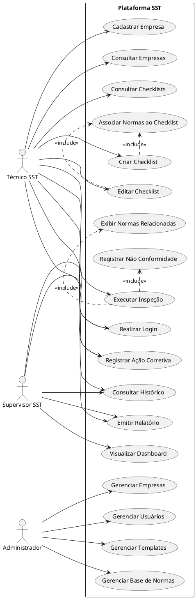

# Diagrama de Casos de Uso

O Diagrama de Casos de Uso representa as principais interações entre os usuários da plataforma e as funcionalidades disponibilizadas pelo sistema.

Foram identificados três atores principais:

* **Técnico de SST**: responsável pela realização de inspeções, preenchimento de checklists, registro de não conformidades e emissão de relatórios.
* **Supervisor SST**: responsável pelo acompanhamento das inspeções realizadas, análise de indicadores e monitoramento de ações corretivas.
* **Administrador**: responsável pela manutenção dos dados e configurações gerais da plataforma.

O diagrama contempla as funcionalidades previstas para o escopo atual da solução.

## Descrição dos Casos de Uso

### Técnico de SST

O Técnico de SST é o principal usuário da plataforma, sendo responsável pela execução das inspeções e registro das informações coletadas em campo. Entre suas atribuições estão:

* Realizar login no sistema;
* Cadastrar empresas;
* Consultar empresas cadastradas;
* Criar e editar checklists;
* Consultar checklists existentes;
* Executar inspeções;
* Registrar não conformidades;
* Registrar ações corretivas;
* Consultar histórico de inspeções;
* Emitir relatórios.

Durante a criação ou edição de checklists, o sistema permite associar Normas Regulamentadoras (NRs) aos itens cadastrados. Durante a execução da inspeção, essas normas são apresentadas ao usuário como apoio à tomada de decisão.

### Supervisor SST

O Supervisor SST possui papel gerencial e de acompanhamento, podendo:

* Realizar login;
* Consultar histórico de inspeções;
* Acompanhar ações corretivas;
* Emitir relatórios;
* Visualizar indicadores por meio do dashboard.

### Administrador

O Administrador é responsável pela gestão e manutenção da plataforma, podendo:

* Gerenciar usuários;
* Gerenciar templates de checklist;
* Gerenciar a base de normas cadastradas;
* Gerenciar empresas cadastradas.

## Relacionamentos de Inclusão

Alguns casos de uso possuem dependência direta de funcionalidades auxiliares:

* **Criar Checklist** inclui **Associar Normas ao Checklist**;
* **Editar Checklist** inclui **Associar Normas ao Checklist**;
* **Executar Inspeção** inclui **Registrar Não Conformidade**;
* **Executar Inspeção** inclui **Exibir Normas Relacionadas**.

Esses relacionamentos representam funcionalidades que são executadas como parte integrante do fluxo principal da atividade realizada pelo usuário.
