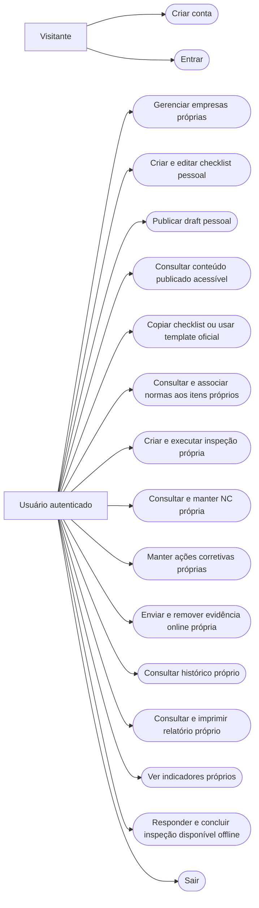

# Casos de uso implementados

Conferência documental em 3 de outubro de 2026. Representa funções disponíveis
nas telas, não atribuições gerenciais desejadas. Técnico/supervisor/auditor são
personas de análise; persona ≠ role técnico ≠ permissão implementada. ADMIN,
TECHNICIAN, SUPERVISOR e AUDITOR armazenados não constituem RBAC. Usuário
autenticado atua sobre recursos próprios; leitura/cópia/reutilização de conteúdo
publicado segue a [matriz de autorização](../AI/BusinessRules.md#matriz-de-autorização).

Não há administração de usuários, normas ou templates oficiais na UI/API.
Bootstrap institucional é operação de implantação fora dos casos de uso da
sessão. A versão anterior do diagrama de personas/permissões pode ser consultada
no histórico Git, sem ser tomada como estado implementado.

## Visão de funcionalidades

Mermaid usa flowchart para representar ator e casos de uso (não dispõe de uma
notação UML de casos de uso nativa aqui). PlantUML UML correspondente:
[use-cases.puml](./diagrams/flows/use-cases.puml).

```mermaid
flowchart LR
    V[Visitante] --> REG([Criar conta])
    V --> LOG([Entrar])
    U[Usuário autenticado] --> EMP([Gerenciar empresas próprias])
    U --> CHK([Criar e editar checklist pessoal])
    U --> PUB([Publicar draft pessoal])
    U --> CAT([Consultar conteúdo publicado acessível])
    U --> COPY([Copiar checklist ou usar template oficial])
    U --> NOR([Consultar e associar normas aos itens próprios])
    U --> INS([Criar e executar inspeção própria])
    U --> NC([Consultar e manter NC própria])
    U --> AC([Manter ações corretivas próprias])
    U --> EV([Enviar e remover evidência online própria])
    U --> HIS([Consultar histórico próprio])
    U --> REP([Consultar e imprimir relatório próprio])
    U --> DASH([Ver indicadores próprios])
    U --> OFF([Responder e concluir inspeção disponível offline])
    U --> OUT([Sair])
```

## Comportamento e limites

| Caso                        | Fluxo entregue e delimitação                                                                                      |
| --------------------------- | ----------------------------------------------------------------------------------------------------------------- |
| Criar conta / entrar / sair | Cadastro público sem auto-login; bcrypt e sessão de oito horas; logout também limpa dados locais                  |
| Empresas                    | Cadastro/listagem/edição/exclusão lógica próprias; empresa excluída não inicia inspeção                           |
| Checklist pessoal           | Identidade/DRAFT v1, edição de itens/normas e metadados; dono pode publicar; publicação não é editada diretamente |
| Conteúdo publicado          | Oficial ou de terceiro ativo não excluído com PUBLISHED; não expõe drafts privados                                |
| Cópia / usar template       | Nova identidade pessoal com DRAFT v1 e itens independentes; fonte própria elegível ou publicação acessível        |
| Normas                      | Consulta do catálogo e associação aos itens do draft pessoal; não administração do catálogo                       |
| Inspeção                    | Empresa própria e versão publicada elegível; snapshot criado com inspeção; respostas e conclusão próprias         |
| Não conformidade            | Resposta NON_COMPLIANT cria/restaura NC automaticamente; nem toda resposta gera NC; detalhe permite manutenção    |
| Ações corretivas            | Plano 5W2H sobre NC própria; nome de responsável não concede acesso                                               |
| Evidência                   | JPEG/PNG/WebP online em inspeção ou NC própria histórica; sem upload binário offline                              |
| Histórico / relatório       | Checklist pelo snapshot; dados cadastrais/operacionais atuais; impressão/PDF via navegador; sem PDF customizado   |
| Dashboard                   | Agregados da sessão, sem visão de equipe ou acesso gerencial de terceiro                                          |
| Offline                     | Responder/concluir inspeção já disponibilizada, com fila e reconexão; sem criação integral de inspeção offline    |

Associação normativa é opcional; NC automática depende da resposta. Por isso,
essas atividades não são representadas como includes obrigatórios de toda
criação/execução. Publicar não exige mínimo de itens no Service.

Retirada de publicação existe em Server Function/hook, mas **não tem ação nas
telas atuais** e não é caso de uso entregue na UI. Interface completa de histórico
de versões, edição de perfil persistida, recuperação de senha, confirmação de
e-mail e gestão de usuários são futuras. Equipe/configurações demonstrativas
não são administração real. RF12/RN07 (solicitante) continuam não entregues.

## Evidências

- [Auth](../src/lib/api/auth.functions.ts), [login](../src/routes/login.tsx) e
  [cadastro](../src/routes/register.tsx).
- [Biblioteca](../src/routes/_app.checklists.index.tsx),
  [detalhe](../src/routes/_app.checklists.$id.tsx) e
  [nova inspeção](../src/routes/_app.inspecoes.nova.tsx).
- [Services](../src/server/services/) e [Server Functions](../src/lib/api/).
- [Regras](../AI/BusinessRules.md), [cópia](../AI/ChecklistCopy.md),
  [templates](../AI/OfficialTemplates.md) e [relatório da fase](./RelatorioFase3.md).
