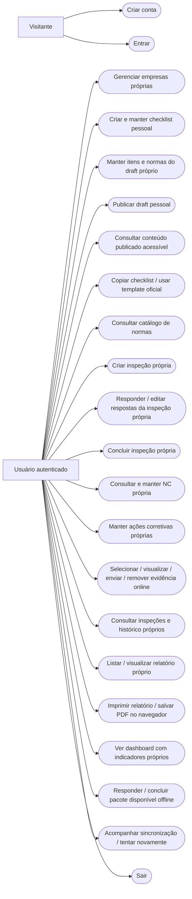

# Casos de uso implementados — Safe Watch Insight

Revisão da Fase 7 em **4 de outubro de 2026**, sobre `da43f71`. O modelo oficial
representa comportamento disponível nas telas e seus limites, conferido contra
[rotas](../src/routes/), [Server Functions](../src/lib/api/),
[Services](../src/server/services/) e documentação das Fases 2–6.
Operação interna/de backend sem ação na UI é identificada separadamente.

## Atores e autorização

**Visitante** pode cadastrar conta e entrar. **Usuário autenticado** (incluindo
quem atua como técnico de SST) usa recursos próprios e conteúdo publicado
elegível. Não se atribui permissão diferente a personas técnicas/gerenciais.
ADMIN, TECHNICIAN, SUPERVISOR e AUDITOR são valores de UserRole, **sem RBAC ou
interface administrativa completos**. Ownership é definido pela sessão:
empresas/checklists pessoais por createdById; inspeções por Inspection.userId;
NCs/ações/evidências seguem a inspeção. Nome textual do responsável da ação não
concede acesso. Reutilizar publicação não compartilha inspeções com seu autor.

[Personas](./Personas.md) são pesquisa/design, não autorização implementada.
A [matriz de acesso](../AI/BusinessRules.md#matriz-de-autorização) detalha leitura,
mutação, atividade/exclusão e conteúdo institucional. Bootstrap de templates é
operação de implantação, fora da sessão e dos casos de uso web.

## Diagrama oficial atual

Mermaid usa flowchart como representação de atores/funcionalidades, sem notação
UML nativa de casos de uso. PlantUML UML oficial equivalente:
[use-cases.puml](./diagrams/domain/use-cases.puml). As associações indicam
participação, sem impor sequência ou includes obrigatórios de norma, foto ou NC.

```mermaid
flowchart LR
    V[Visitante]
    U[Usuário autenticado]
    V --> REG(["Criar conta"])
    V --> LOG(["Entrar"])
    U --> EMP(["Gerenciar empresas próprias"])
    U --> CHK(["Criar e manter checklist pessoal"])
    U --> ITEM(["Manter itens e normas do draft próprio"])
    U --> PUB(["Publicar draft pessoal"])
    U --> CAT(["Consultar conteúdo publicado acessível"])
    U --> COPY(["Copiar checklist / usar template oficial"])
    U --> NOR(["Consultar catálogo de normas"])
    U --> CREATE(["Criar inspeção própria"])
    U --> ANSWER(["Responder / editar respostas da inspeção própria"])
    U --> FINISH(["Concluir inspeção própria"])
    U --> NC(["Consultar e manter NC própria"])
    U --> AC(["Manter ações corretivas próprias"])
    U --> EV(["Selecionar / visualizar / enviar / remover evidência online"])
    U --> HIS(["Consultar inspeções e histórico próprios"])
    U --> REP(["Listar / visualizar relatório próprio"])
    U --> PRINT(["Imprimir relatório / salvar PDF no navegador"])
    U --> DASH(["Ver dashboard com indicadores próprios"])
    U --> OFF(["Responder / concluir pacote disponível offline"])
    U --> SYNC(["Acompanhar sincronização / tentar novamente"])
    U --> OUT(["Sair"])
```

## Casos, regras e superfície entregue

| Caso                         | Entrega atual e delimitação                                                                                                                          | Superfície                                                          |
| ---------------------------- | ---------------------------------------------------------------------------------------------------------------------------------------------------- | ------------------------------------------------------------------- |
| Criar conta / entrar / sair  | Cadastro público sem auto-login; sessão após login; logout tenta encerrar sessão e limpa dados locais                                                | /register, /login, menu lateral                                     |
| Empresas próprias            | Criar/listar/editar/excluir logicamente; empresa excluída não inicia inspeção                                                                        | /empresas, diálogos                                                 |
| Checklist pessoal            | Criar identidade/DRAFT v1, editar metadados, excluir logicamente; publicação não é editada diretamente                                               | /checklists, diálogos                                               |
| Itens/normas próprios        | Criar/editar/remover itens; ordem/obrigatoriedade e associação normativa opcional no draft, derivado quando necessário                               | /checklists/$id                                                     |
| Publicar                     | Proprietário publica draft com autoria/data/hash; não exige mínimo de itens no Service                                                               | /checklists/$id                                                     |
| Conteúdo publicado           | Consultar/usar PUBLISHED de identidade ativa não excluída própria, de terceiro ou oficial; sem mutação de draft alheio                               | /checklists, /checklists/$id, /inspecoes/nova                       |
| Copiar / usar template       | Nova identidade pessoal ativa, DRAFT v1 e itens/associações independentes; fonte própria prefere draft, terceiro/oficial somente publicação elegível | Detalhe; Usar template também na Biblioteca                         |
| Normas                       | Consultar/pesquisar/filtrar catálogo autenticado; não administrar catálogo                                                                           | /normas e detalhes históricos                                       |
| Criar inspeção               | Empresa própria + publicação elegível; PLANNED/SYNCED e snapshot gravados juntos                                                                     | /inspecoes/nova                                                     |
| Responder / editar respostas | COMPLIANT/NON_COMPLIANT/NOT_APPLICABLE e observação; item do snapshot próprio, em PLANNED/IN_PROGRESS                                                | /inspecoes/$id; gravação local antes do envio inclusive online      |
| Concluir                     | Obrigatórios respondidos, N/A atende, opcionais podem ficar pendentes; não exige NC resolvida, foto ou ação concluída                                | /inspecoes/$id; conclusão local pendente precede confirmação remota |
| NC própria                   | NON_COMPLIANT cria/restaura automaticamente; conforme/N/A arquiva; detalhe edita descrição/severidade/prazo/status e arquiva                         | /nao-conformidades, /nao-conformidades/$id                          |
| Ação corretiva               | Criar/editar/concluir/arquivar por NC própria ativa; descrição obrigatória, demais campos 5W2H opcionais; concluir ação não resolve NC               | Painel do detalhe da NC                                             |
| Evidência online             | Selecionar/pré-visualizar/enviar/listar/abrir/remover JPEG/PNG/WebP até 4 MB em inspeção **ou** NC própria                                           | Painéis da inspeção e NC                                            |
| Histórico                    | Lista/detalhe próprios, checklist pelo snapshot e dados cadastrais/operacionais atuais                                                               | /inspecoes, /inspecoes/$id                                          |
| Relatório                    | Lista de concluídas próprias; DTO/HTML por ID próprio com snapshot, sem exigir COMPLETED no detalhe; não insere Report                               | /relatorios?inspectionId=UUID                                       |
| Imprimir / salvar PDF        | window.print e CSS A4; PDF depende do diálogo nativo do navegador, sem serviço dedicado de geração/download                                          | Botão Imprimir em /relatorios                                       |
| Dashboard                    | Inspeções por estado, NCs/pendências, atrasos, conformidade e até cinco recentes, com dados reais da sessão                                          | /dashboard                                                          |
| Execução offline             | Pacote/contexto de inspeção previamente disponível, respostas e conclusão locais; fila durável e revalidação remota                                  | /inspecoes, /inspecoes/$id                                          |
| Sincronização / retry        | Automática ao reconectar/sondar; indicador/fila/falhas/conflitos; Sincronizar agora repõe ERROR, sem resolver CONFLICT                               | Barra superior e /configuracoes                                     |

### Cadastro público

Visitante → `/register` → Server Function `register` → **UserService →
UserRepository** → PostgreSQL. Nome após trim, e-mail validado/aparado/minúsculo,
senha de no mínimo oito caracteres e confirmação idêntica; schema estrito sem
papel selecionável. Service normaliza e-mail novamente, verifica duplicidade
case-insensitive inclusive em contas excluídas, gera **bcrypt custo 12** e define
**TECHNICIAN**. Duplicidade/P2002 retorna CONFLICT (409 lógico); validação Zod pode
lançar antes do handler. Resposta id/name/email, sem sessão, encaminha a `/login`.
Não há confirmação de e-mail nem recuperação de senha. Fluxo já consolidado em
[Architecture.md](../AI/Architecture.md) e
[authentication.puml](./diagrams/architecture/authentication.puml).

### Checklists: próprio, publicado e oficial

Só o dono gerencia o checklist pessoal/draft. Conteúdo publicado de terceiro
ativo é consultável/reutilizável, sem expor seu draft nem permitir alterá-lo.
Template oficial pertence institucionalmente à Safe Watch Insight, sem dono
usuário; é utilizável diretamente em inspeção ou por cópia pessoal, sem edição
oficial por ADMIN ou demais papéis.

**Copiar checklist** e **Usar template** criam uma identidade independente com
DRAFT v1; Standard é reutilizado, itens e associações são novos. Cópia de
publicação exige formato 1/hash íntegro; draft próprio conserva linhagem anterior
sem referenciar item mutável da origem. Não copia inspeções/snapshots/NCs/ações/
evidências/Report. Cópia não equivale a derivar próximo draft dentro da mesma
identidade. Regras/fluxo: [ChecklistCopy.md](../AI/ChecklistCopy.md) e
[checklist-copy.puml](./diagrams/flows/checklist-copy.puml).

### Inspeção e tratativas

Ciclo usual **PLANNED → IN_PROGRESS → COMPLETED**; responder inicia IN_PROGRESS,
sem operação startInspection separada. Também pode concluir de PLANNED sem
obrigatórios pendentes. CANCELLED é enum/estado consultável, **sem ação pública**.
Editar resposta/observação durante execução é entregue; editar empresa/checklist/
versão/data/notas da inspeção, cancelar ou reabrir não possui operação pública.
`deleteInspection` existe em API/hook, sem botão nas telas. Portanto, não se
descreve gestão de inspeções como CRUD completo.

NC nasce da resposta e é mantida pelo dono da inspeção; criação explícita existe
no backend, sem formulário autônomo de criação na UI. NC ativa mantém dados;
restaurada volta a OPEN conservando prazo/filhos. Ações concluídas não mudam NC
para RESOLVED automaticamente. NCs, ações e evidências permanecem tratáveis nos
contextos ativos após COMPLETED; respostas ficam bloqueadas. Consulte o
[modelo de domínio](./DiagramaDeClasses_VersaoTecnica.md).

### Evidências, relatório e dashboard

Evidência é **online** em contexto exclusivo Inspection XOR NonConformity,
sem relação direta à resposta/ação. File/MIME/assinatura/tamanho/contexto são
validados no servidor; limite inclusivo **4.194.304 bytes**. Cloudinary guarda
binário, PostgreSQL metadados. Remoção lógica e destroy usam compensações,
sem atomicidade distribuída. Sem fila binária/compressão/quota offline.

Relatório sob demanda combina checklist congelado com dados atuais; HTML/DTO
não é `Report` persistido. Seletor só lista COMPLETED, mas inspectionId direto
pode consultar inspeção própria aberta/cancelada com snapshot. Política deve ser
avaliada em Final QA (IC-P6-01), sem anunciar bloqueio inexistente. Imprimir/
salvar PDF não gera arquivo no servidor; um único componente padronizado,
sem catálogo de modelos editáveis.

Dashboard usa agregações reais por Inspection.userId, sem visão global por
perfil ou BI avançado. Conformidade = round(100 × COMPLIANT / (COMPLIANT +
NON_COMPLIANT)), respostas com snapshotItemId em COMPLETED; N/A/pendentes são
excluídos. Sem aplicáveis: NULL/UI “—”. Atrasos são calculados sem escrita;
recentes limitadas a cinco. Enum CANCELLED contado não cria ação de cancelar.

### Offline suportado

Pacote já disponibilizado por usuário em IndexedDB/Dexie contém snapshot,
itens/normas e respostas. Gravação local de resposta/conclusão e fila são
atômicas; conclusão local não confirma o servidor. Fila usa UUID, sequência,
dependências, revisão esperada, retry e deduplicação. A sincronização revalida
sessão, dono, contexto/estado e revisão; CONFLICT bloqueia sem reconciliação
automática/assistida. Retry manual recupera ERROR, não libera CONFLICT.

Não há criação integral de inspeção do zero offline, CRUD offline de empresas/
checklists/ações, binários de evidências ou pacote próprio de relatório/dashboard.
Não se declara suporte offline completo nem garantia global entre abas/dispositivos.
Fluxo de referência: [offline-inspection.puml](./diagrams/flows/offline-inspection.puml)
e [Offline.md](../AI/Offline.md).

## Fluxos e arquitetura de referência

| Tema                           | PlantUML consolidado                                                | Mermaid / regras                           |
| ------------------------------ | ------------------------------------------------------------------- | ------------------------------------------ |
| Criação/respostas/NC/conclusão | [inspection.puml](./diagrams/flows/inspection.puml)                 | [BusinessRules.md](../AI/BusinessRules.md) |
| Evidências online              | [evidence.puml](./diagrams/flows/evidence.puml)                     | [BusinessRules.md](../AI/BusinessRules.md) |
| Relatórios/dashboard           | [reports-dashboard.puml](./diagrams/flows/reports-dashboard.puml)   | [BusinessRules.md](../AI/BusinessRules.md) |
| Offline/sincronização          | [offline-inspection.puml](./diagrams/flows/offline-inspection.puml) | [Offline.md](../AI/Offline.md)             |

Arquitetura de aplicação separada do domínio: [Architecture.md](../AI/Architecture.md),
[application.puml](./diagrams/architecture/application.puml). Os fluxos da Fase 6
permanecem a referência, sem duplicação de diagramas de processo nesta fase.

## Lacunas e artefatos históricos

[Documento de Requisitos](./DocumentoDeRequisitos.md) mantém **RF12/RN07
(solicitante) não entregues**, RF14 parcial (um modelo), RF20/RNF03 offline
amplo parcial e gestão administrativa/RBAC futura. Não há UI/API de administrar
usuários/normas/templates oficiais, edição persistida de perfil, recuperação de
senha ou verificação de e-mail. `/equipe` é demonstrativo; `/configuracoes`
combina controles demonstrativos e estado offline real, sem administração.
Retirada de versão existe em Server Function/hook, sem ação nas telas atuais;
interface completa de histórico de versões permanece futura.

[DiagramTest.puml](./DiagramTest.puml) é **histórico, não vigente**: criado no
commit `a037ac5`, propunha atores/permissões administrativas e includes que não
correspondem à entrega. Foi identificado explicitamente e aponta ao diagrama
oficial em `diagrams/domain/use-cases.puml`. O caminho anterior
`diagrams/flows/use-cases.puml` é somente um redirecionamento documental,
sem segundo modelo conceitual. [Mapa de navegação](./MAPA_DE_NAVEGACAO.md)
registra rotas reais, diálogos e navegação da cópia, sem inventar rotas.

Concerns de implementação já registrados: [RelatorioFase6.md](./RelatorioFase6.md)
e [RelatorioFase7.md](./RelatorioFase7.md). Revisão documental não equivale a
aprovação funcional ou nova homologação.
