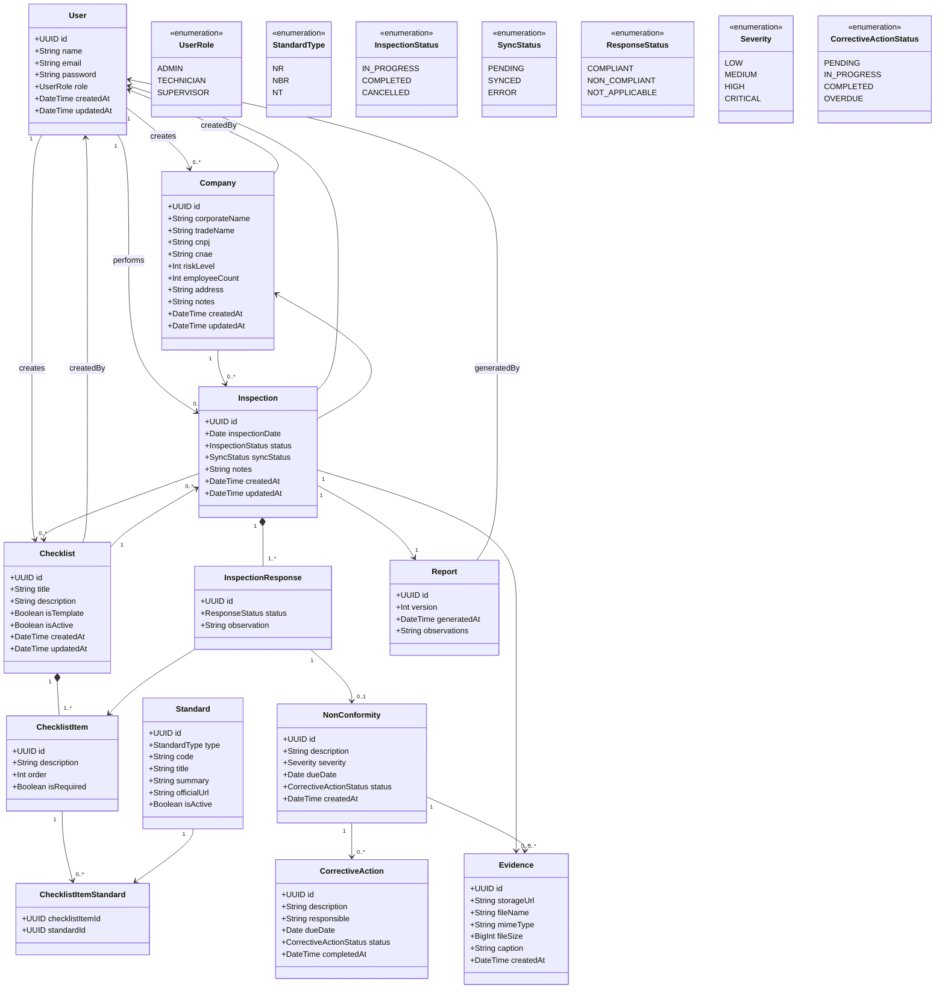

```mermaid
classDiagram

class User{
+UUID id
+String name
+String email
+String password
+UserRole role
+DateTime createdAt
+DateTime updatedAt
}

class Company{
+UUID id
+String corporateName
+String tradeName
+String cnpj
+String cnae
+Int riskLevel
+Int employeeCount
+String address
+String notes
+DateTime createdAt
+DateTime updatedAt
}

class Checklist{
+UUID id
+String title
+String description
+Boolean isTemplate
+Boolean isActive
+DateTime createdAt
+DateTime updatedAt
}

class ChecklistItem{
+UUID id
+String description
+Int order
+Boolean isRequired
}

class Standard{
+UUID id
+StandardType type
+String code
+String title
+String summary
+String officialUrl
+Boolean isActive
}

class ChecklistItemStandard{
+UUID checklistItemId
+UUID standardId
}

class Inspection{
+UUID id
+Date inspectionDate
+InspectionStatus status
+SyncStatus syncStatus
+String notes
+DateTime createdAt
+DateTime updatedAt
}

class InspectionResponse{
+UUID id
+ResponseStatus status
+String observation
}

class NonConformity{
+UUID id
+String description
+Severity severity
+Date dueDate
+CorrectiveActionStatus status
+DateTime createdAt
}

class Evidence{
+UUID id
+String storageUrl
+String fileName
+String mimeType
+BigInt fileSize
+String caption
+DateTime createdAt
}

class CorrectiveAction{
+UUID id
+String description
+String responsible
+Date dueDate
+CorrectiveActionStatus status
+DateTime completedAt
}

class Report{
+UUID id
+Int version
+DateTime generatedAt
+String observations
}

class UserRole{
<<enumeration>>
ADMIN
TECHNICIAN
SUPERVISOR
}

class StandardType{
<<enumeration>>
NR
NBR
NT
}

class InspectionStatus{
<<enumeration>>
IN_PROGRESS
COMPLETED
CANCELLED
}

class SyncStatus{
<<enumeration>>
PENDING
SYNCED
ERROR
}

class ResponseStatus{
<<enumeration>>
COMPLIANT
NON_COMPLIANT
NOT_APPLICABLE
}

class Severity{
<<enumeration>>
LOW
MEDIUM
HIGH
CRITICAL
}

class CorrectiveActionStatus{
<<enumeration>>
PENDING
IN_PROGRESS
COMPLETED
OVERDUE
}

User "1" --> "0..*" Company : creates
User "1" --> "0..*" Checklist : creates
User "1" --> "0..*" Inspection : performs

Company --> User : createdBy

Checklist --> User : createdBy

Company "1" --> "0..*" Inspection

Checklist "1" *-- "1..*" ChecklistItem

Checklist "1" --> "0..*" Inspection

ChecklistItem "1" --> "0..*" ChecklistItemStandard
Standard "1" --> "0..*" ChecklistItemStandard

Inspection --> User
Inspection --> Company
Inspection --> Checklist

Inspection "1" *-- "1..*" InspectionResponse

Inspection "1" --> "0..*" Evidence

Inspection "1" --> "1" Report

Report --> User : generatedBy

InspectionResponse --> ChecklistItem

InspectionResponse "1" --> "0..1" NonConformity

NonConformity "1" --> "0..*" CorrectiveAction

NonConformity "1" --> "0..*" Evidence
```