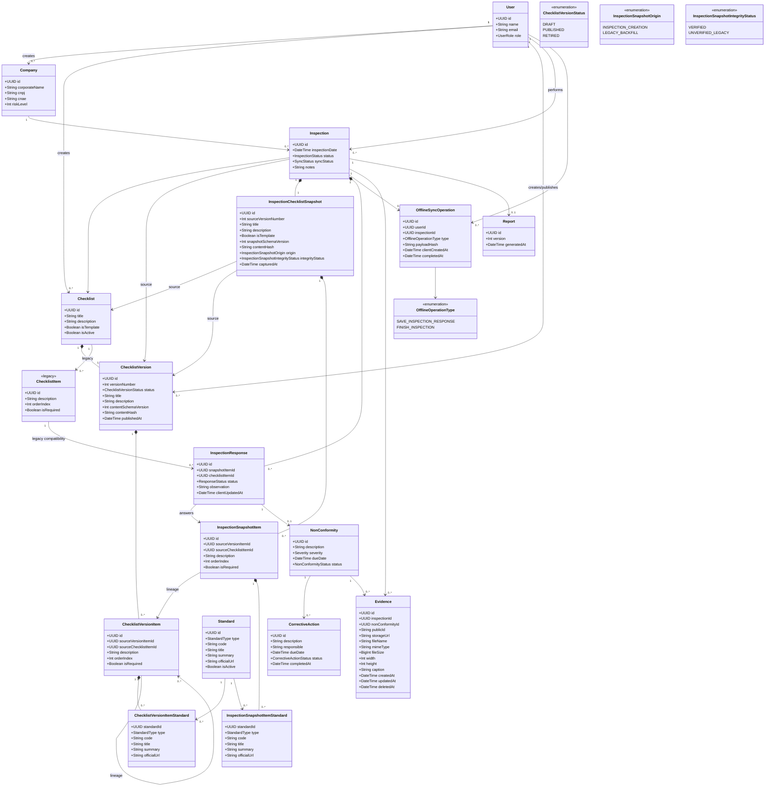

# Diagrama de Classes — versão técnica

O diagrama representa o domínio persistido após a adoção de versões publicadas
e snapshot relacional por inspeção. `ChecklistItem` e
`ChecklistItemStandard` aparecem apenas como estruturas legadas de
compatibilidade; novas inspeções não dependem delas.

