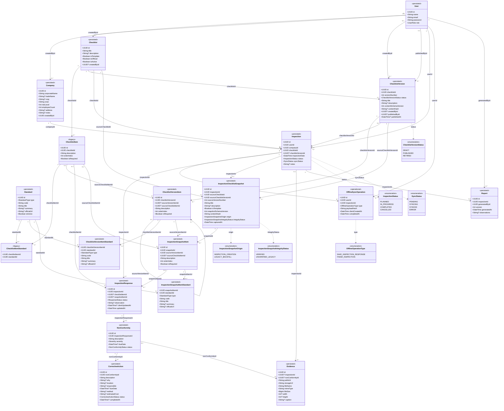

# Diagrama de Classes — versão técnica

Revisão da Fase 7 em **4 de outubro de 2026**, sobre `da43f71`.
O modelo oficial representa os **19 models persistidos** do Safe Watch Insight,
com atributos de domínio selecionados e cardinalidades físicas. Não representa
cada arquivo TypeScript como classe nem descreve operações disponíveis pela
mera existência de uma entidade ou enum.

Fontes: [schema Prisma](../prisma/schema.prisma), [migrations](../prisma/migrations/),
[entidades](../AI/Entities.md), [regras implementadas](../AI/BusinessRules.md) e
[Services](../src/server/services/). Campos completos, índices, defaults e ações
referenciais: [Dicionário de Dados](./DicionarioDeDados.md) e
[Database.md](../AI/Database.md).

## Escopo e leitura

- `persisted`: entidade relacional do domínio. `Report` permanece no modelo,
  embora a visualização atual de relatórios não grave essa entidade.
- `legacy`: `ChecklistItem` e `ChecklistItemStandard`, conservados para
  compatibilidade, backfill e linhagem; não são o editor atual de itens.
- `operational`: `OfflineSyncOperation`, confirmação idempotente remota,
  separada da fila do dispositivo.
- `enumeration`: valores persistidos relevantes ao versionamento, ciclo de
  inspeção, snapshot e sincronização. Os demais enums usados como tipos estão
  definidos no dicionário; nenhum enum implica uma operação pública.
- `?` indica atributo nullable; `0..1` e `0..*` descrevem relações no banco,
  incluindo registros arquivados. Setas são associações, sem implicar exclusão
  em cascata ou autoria de toda operação. Timestamp comum/soft delete omitido
  do desenho não significa ausência no schema. `User.password` contém hash bcrypt.

PlantUML oficial equivalente: [classes.puml](./diagrams/domain/classes.puml).

```mermaid
classDiagram

class User {
  <<persisted>>
  +UUID id
  +String name
  +String email
  +String password
  +UserRole role
}

class Company {
  <<persisted>>
  +UUID id
  +String corporateName
  +String? tradeName
  +String? cnpj
  +String cnae
  +Int riskLevel
  +Int employeeCount
  +String? address
  +String? notes
  +UUID createdById
}

class Checklist {
  <<persisted>>
  +UUID id
  +String title
  +String? description
  +Boolean isTemplate
  +Boolean isOfficial
  +Boolean isActive
  +UUID? createdById
}

class ChecklistItem {
  <<legacy>>
  +UUID id
  +UUID checklistId
  +String description
  +Int orderIndex
  +Boolean isRequired
}

class Standard {
  <<persisted>>
  +UUID id
  +StandardType type
  +String code
  +String title
  +String? summary
  +String? officialUrl
  +Boolean isActive
}

class ChecklistItemStandard {
  <<legacy>>
  +UUID checklistItemId
  +UUID standardId
}

class ChecklistVersion {
  <<persisted>>
  +UUID id
  +UUID checklistId
  +Int versionNumber
  +ChecklistVersionStatus status
  +String title
  +String? description
  +Int contentSchemaVersion
  +String? contentHash
  +UUID? createdById
  +UUID? publishedById
  +DateTime? publishedAt
}

class ChecklistVersionItem {
  <<persisted>>
  +UUID id
  +UUID checklistVersionId
  +UUID? sourceVersionItemId
  +UUID? sourceChecklistItemId
  +String description
  +Int orderIndex
  +Boolean isRequired
}

class ChecklistVersionItemStandard {
  <<persisted>>
  +UUID checklistVersionItemId
  +UUID standardId
  +StandardType type
  +String code
  +String title
  +String? summary
  +String? officialUrl
}

class Inspection {
  <<persisted>>
  +UUID id
  +UUID userId
  +UUID companyId
  +UUID checklistId
  +UUID? checklistVersionId
  +DateTime inspectionDate
  +InspectionStatus status
  +SyncStatus syncStatus
  +String? notes
}

class OfflineSyncOperation {
  <<operational>>
  +UUID id
  +UUID userId
  +UUID inspectionId
  +OfflineOperationType type
  +String payloadHash
  +DateTime clientCreatedAt
  +DateTime completedAt
}

class InspectionResponse {
  <<persisted>>
  +UUID id
  +UUID inspectionId
  +UUID? checklistItemId
  +UUID? snapshotItemId
  +ResponseStatus status
  +String? observation
  +DateTime? clientUpdatedAt
  +DateTime updatedAt
}

class InspectionChecklistSnapshot {
  <<persisted>>
  +UUID id
  +UUID inspectionId
  +UUID sourceChecklistId
  +UUID sourceChecklistVersionId
  +Int sourceVersionNumber
  +String title
  +String? description
  +Boolean isTemplate
  +Int snapshotSchemaVersion
  +String contentHash
  +InspectionSnapshotOrigin origin
  +InspectionSnapshotIntegrityStatus integrityStatus
  +DateTime capturedAt
}

class InspectionSnapshotItem {
  <<persisted>>
  +UUID id
  +UUID snapshotId
  +UUID sourceVersionItemId
  +UUID? sourceChecklistItemId
  +String description
  +Int orderIndex
  +Boolean isRequired
}

class InspectionSnapshotItemStandard {
  <<persisted>>
  +UUID snapshotItemId
  +UUID standardId
  +StandardType type
  +String code
  +String title
  +String? summary
  +String? officialUrl
}

class NonConformity {
  <<persisted>>
  +UUID id
  +UUID inspectionResponseId
  +String description
  +Severity severity
  +DateTime? dueDate
  +NonConformityStatus status
}

class CorrectiveAction {
  <<persisted>>
  +UUID id
  +UUID nonConformityId
  +String description
  +String? why
  +String? location
  +String? responsible
  +DateTime? dueDate
  +String? method
  +String? estimatedCost
  +CorrectiveActionStatus status
  +DateTime? completedAt
}

class Evidence {
  <<persisted>>
  +UUID id
  +UUID? inspectionId
  +UUID? nonConformityId
  +String publicId
  +String storageUrl
  +String fileName
  +String mimeType
  +BigInt fileSize
  +Int? width
  +Int? height
  +String? caption
}

class Report {
  <<persisted>>
  +UUID id
  +UUID inspectionId
  +UUID generatedById
  +Int version
  +DateTime generatedAt
  +String? observations
}

class ChecklistVersionStatus {
  <<enumeration>>
  DRAFT
  PUBLISHED
  RETIRED
}

class InspectionStatus {
  <<enumeration>>
  PLANNED
  IN_PROGRESS
  COMPLETED
  CANCELLED
}

class SyncStatus {
  <<enumeration>>
  PENDING
  SYNCING
  SYNCED
  ERROR
}

class OfflineOperationType {
  <<enumeration>>
  SAVE_INSPECTION_RESPONSE
  FINISH_INSPECTION
}

class InspectionSnapshotOrigin {
  <<enumeration>>
  INSPECTION_CREATION
  LEGACY_BACKFILL
}

class InspectionSnapshotIntegrityStatus {
  <<enumeration>>
  VERIFIED
  UNVERIFIED_LEGACY
}

User "1" --> "0..*" Company : createdById
User "0..1" --> "0..*" Checklist : createdById
Checklist "1" --> "0..*" ChecklistItem : checklistId
ChecklistItem "1" --> "0..*" ChecklistItemStandard : checklistItemId
Standard "1" --> "0..*" ChecklistItemStandard : standardId
Checklist "1" --> "0..*" ChecklistVersion : checklistId
User "0..1" --> "0..*" ChecklistVersion : createdById
User "0..1" --> "0..*" ChecklistVersion : publishedById
ChecklistVersion "1" --> "0..*" ChecklistVersionItem : checklistVersionId
ChecklistVersionItem "0..1" --> "0..*" ChecklistVersionItem : sourceVersionItemId
ChecklistItem "0..1" --> "0..*" ChecklistVersionItem : sourceChecklistItemId
ChecklistVersionItem "1" --> "0..*" ChecklistVersionItemStandard : checklistVersionItemId
Standard "1" --> "0..*" ChecklistVersionItemStandard : standardId
User "1" --> "0..*" Inspection : userId
Company "1" --> "0..*" Inspection : companyId
Checklist "1" --> "0..*" Inspection : checklistId
ChecklistVersion "0..1" --> "0..*" Inspection : checklistVersionId
User "1" --> "0..*" OfflineSyncOperation : userId
Inspection "1" --> "0..*" OfflineSyncOperation : inspectionId
Inspection "1" --> "0..*" InspectionResponse : inspectionId
ChecklistItem "0..1" --> "0..*" InspectionResponse : checklistItemId
InspectionSnapshotItem "0..1" --> "0..*" InspectionResponse : snapshotItemId
Inspection "1" --> "0..1" InspectionChecklistSnapshot : inspectionId
Checklist "1" --> "0..*" InspectionChecklistSnapshot : sourceChecklistId
ChecklistVersion "1" --> "0..*" InspectionChecklistSnapshot : sourceChecklistVersionId
InspectionChecklistSnapshot "1" --> "0..*" InspectionSnapshotItem : snapshotId
ChecklistVersionItem "1" --> "0..*" InspectionSnapshotItem : sourceVersionItemId
ChecklistItem "0..1" --> "0..*" InspectionSnapshotItem : sourceChecklistItemId
InspectionSnapshotItem "1" --> "0..*" InspectionSnapshotItemStandard : snapshotItemId
Standard "1" --> "0..*" InspectionSnapshotItemStandard : standardId
InspectionResponse "1" --> "0..1" NonConformity : inspectionResponseId
NonConformity "1" --> "0..*" CorrectiveAction : nonConformityId
Inspection "0..1" --> "0..*" Evidence : inspectionId
NonConformity "0..1" --> "0..*" Evidence : nonConformityId
Inspection "1" --> "0..1" Report : inspectionId
User "1" --> "0..*" Report : generatedById
ChecklistVersion ..> ChecklistVersionStatus : status
Inspection ..> InspectionStatus : status
Inspection ..> SyncStatus : syncStatus
OfflineSyncOperation ..> OfflineOperationType : type
InspectionChecklistSnapshot ..> InspectionSnapshotOrigin : origin
InspectionChecklistSnapshot ..> InspectionSnapshotIntegrityStatus : integrityStatus
```

## Identidade, autoria e publicação

`Checklist` é identidade reutilizável, independente de `Company`; conteúdo
editorial pertence a `ChecklistVersion`. Um checklist pode ter **zero ou mais
versões fisicamente**; criação/cópia atual cria DRAFT v1 com a identidade.
Número é único por checklist e um índice parcial permite no máximo um DRAFT.
Publicar conserva ID/número, registra `publishedById`, data e hash SHA-256;
edição posterior deriva/reutiliza próximo draft. Conteúdo PUBLISHED/RETIRED é
imutável no fluxo da aplicação, sem trigger SQL universal.

`Checklist.createdById` define o dono pessoal; `ChecklistVersion.createdById`
e `publishedById` são relações de criador/publicador distintas. As três aceitam
NULL fisicamente. CHECK de Checklist exige pessoal com dono ou institucional
com `isOfficial=true`, `isTemplate=true` e dono NULL. O bootstrap atribui autores
institucionais NULL; não há usuário fictício nem edição oficial pelo papel ADMIN.
O CHECK de publicação exige hash/data e permite publicador NULL quando o criador
é NULL; coerência de autoria com o checklist pai é regra da aplicação, não FK
composta. [Templates oficiais](../AI/OfficialTemplates.md).

`ChecklistVersionItem` guarda descrição, ordem positiva/única por versão e
obrigatoriedade. `sourceVersionItemId` é ancestral opcional do item; não existe
`sourceVersionId` em Checklist/ChecklistVersion. Próximo draft aponta a item da
publicação/retirada. Cópia independente cria novos IDs/associações; de publicação
aponta ao item estável, de draft conserva ancestral anterior/NULL. Não compartilha
itens mutáveis. [Fluxo e regras da cópia](../AI/ChecklistCopy.md).

As três associações normativas têm PK composta das duas FKs. A legada somente
associa catálogo/item; versão e snapshot também copiam tipo/código/título/resumo/
URL. Standard é compartilhado, mas alteração do catálogo não atualiza cópias
históricas. Linhagem legada e campos nullable estão expressos no diagrama.

## Inspeção e requisitos mais fortes da aplicação

O caminho de execução atual é **Checklist → ChecklistVersion → Inspection →
InspectionChecklistSnapshot → InspectionSnapshotItem → InspectionResponse**.
As setas deste caminho descrevem o fluxo; suas cardinalidades são as do desenho.

| Relação / dado                          | Banco                                                        | Fluxo atual                                                                                           |
| --------------------------------------- | ------------------------------------------------------------ | ----------------------------------------------------------------------------------------------------- |
| Inspection → ChecklistVersion           | FK nullable, zero ou uma versão                              | Criação resolve PUBLISHED do mesmo checklist e grava a versão                                         |
| Inspection → snapshot                   | Zero ou um, inspectionId único no snapshot                   | Criação grava inspeção/snapshot/itens/normas atomicamente; detalhe exige versão/snapshot              |
| Snapshot → checklist/versão de origem   | Duas FKs obrigatórias                                        | Service captura a publicação selecionada; FKs simples não verificam que os IDs são coerentes entre si |
| SnapshotItem → VersionItem              | FK obrigatória                                               | Item captura descrição/ordem/obrigatoriedade da versão                                                |
| Response → SnapshotItem / ChecklistItem | Cada FK nullable; CHECK exige ao menos uma, permitindo ambas | Contrato recebe exatamente um ID, resolvido no snapshot da inspeção própria                           |
| Response por inspeção/item              | UNIQUE para cada par de IDs                                  | Upsert pelo snapshotItemId; mesma inspeção e contexto validados no servidor                           |
| Inspection → Company / User             | FKs obrigatórias                                             | Empresa própria ativa na criação; dono operacional é Inspection.userId                                |

Snapshot congela **conteúdo de checklist**, sem congelar empresa, inspetor,
respostas, NCs, ações, evidências ou relatório inteiro; não copia `isOfficial`.
Backfill LEGACY_BACKFILL/UNVERIFIED_LEGACY não comprova conteúdo histórico.
Criação exige hash presente, recalculado somente no formato 1; aceitar outros
formatos e marcar VERIFIED não significa recálculo canônico naquele caminho.
Compatibilidade e constraints detalhadas em [Database.md](../AI/Database.md).

PLANNED → IN_PROGRESS ocorre ao responder; COMPLETED exige obrigatórios
respondidos, aceita N/A e opcionais pendentes. Pode concluir diretamente de
PLANNED se não houver obrigatório pendente. CANCELLED é estado persistível,
sem operação pública de cancelar/reabrir/editar dados gerais. Exclusão lógica
existe em API/hook, sem ação na UI. [Casos de uso](./DiagramaDeCasosDeUso.md).

## Não conformidades, ações e evidências

Ownership segue **Inspection → InspectionResponse → NonConformity →
CorrectiveAction**. NC tem exatamente uma resposta; resposta tem zero ou uma NC,
inclusive arquivada. Não há FK direta de NC para inspeção ou usuário.
NON_COMPLIANT cria/restaura NC; conforme/N/A arquiva. Criar ação em NC OPEN pode
transitar NC para IN_PROGRESS; concluir ações **não resolve NC automaticamente**.
`responsible` é texto opcional, sem FK/permissão de User; prazo e demais campos
5W2H além da descrição são opcionais. Tratativas continuam possíveis em contextos
ativos após concluir a inspeção.

Evidence tem duas FKs individualmente nullable, com **CHECK XOR: exatamente
Inspection ou NonConformity**. Cada alvo pode ter várias evidências; não existe
vínculo direto com InspectionResponse/CorrectiveAction. FKs asseguram existência;
Service/Repository exigem contexto histórico ativo e dono da inspeção. Cloudinary
guarda imagem; PostgreSQL somente metadados. JPEG/PNG/WebP até 4.194.304 bytes,
online; sem fila binária, compressão/quota offline. Soft delete/destroy e
compensações não constituem transação distribuída.

## Report e projeções de leitura

`Report` persistível guarda `generatedById`, versão/data/observações e inspectionId
único: zero ou um por inspeção, sem várias linhas por version. Relação ao gerador
não substitui autorização operacional. **InspectionReportDto/HTML** é projeção
sob demanda, não entidade persistida: consulta combina snapshot e cadastros/
tratativas atuais, sem inserir Report ou armazenar PDF. Lista exige COMPLETED;
detalhe por ID exige dono/snapshot, sem filtro COMPLETED. Imprimir/salvar PDF
usa diálogo do navegador. `DashboardDto` também é projeção, com agregações reais
próprias e sem persistência de métricas/BI. [Contratos](../AI/API.md).

## Sincronização operacional

User e Inspection possuem várias OfflineSyncOperation; cada confirmação tem
um usuário, uma inspeção, tipo SAVE_INSPECTION_RESPONSE/FINISH_INSPECTION,
UUID estável, hash e horários. Registro remoto **não tem status nem payload
completo**, e é gravado atomicamente com a mutação confirmada.

`Inspection.syncStatus` usa SyncStatus PENDING/SYNCING/SYNCED/ERROR. No cliente,
LocalSyncStatus admite também CONFLICT; LocalOperationStatus admite PENDING/
SYNCING/ERROR/CONFLICT, sem SYNCED (operação é removida após confirmação).
São tipos/estados do IndexedDB, não novos models/enums SQL. Pacote local mantém
snapshot e revisão esperada; sincronização revalida sessão/dono/contexto, detecta
conflito e permite retry idempotente. Não sincroniza binários nem cria inspeção
integralmente offline. [Offline.md](../AI/Offline.md).

## Arquitetura e fluxos de referência

O diagrama de domínio não substitui a arquitetura **Tela → hooks/React Query
ou chamada direta → Server Function → Service → Repository → Prisma → PostgreSQL**.
Diagramas atuais: [application.puml](./diagrams/architecture/application.puml) e
[authentication.puml](./diagrams/architecture/authentication.puml), com Mermaid
em [Architecture.md](../AI/Architecture.md).

| Fluxo consolidado               | PlantUML                                                            | Mermaid e regras                           |
| ------------------------------- | ------------------------------------------------------------------- | ------------------------------------------ |
| Inspeção/respostas/NC/conclusão | [inspection.puml](./diagrams/flows/inspection.puml)                 | [BusinessRules.md](../AI/BusinessRules.md) |
| Evidência online/compensações   | [evidence.puml](./diagrams/flows/evidence.puml)                     | [BusinessRules.md](../AI/BusinessRules.md) |
| Relatório/dashboard             | [reports-dashboard.puml](./diagrams/flows/reports-dashboard.puml)   | [BusinessRules.md](../AI/BusinessRules.md) |
| Execução offline/sincronização  | [offline-inspection.puml](./diagrams/flows/offline-inspection.puml) | [Offline.md](../AI/Offline.md)             |

Fluxos da Fase 6 reutilizados, sem reconstruí-los neste modelo. Concerns de
relatório/cache/concorrência permanecem em [RelatorioFase6.md](./RelatorioFase6.md),
sem correção funcional na Fase 7.
