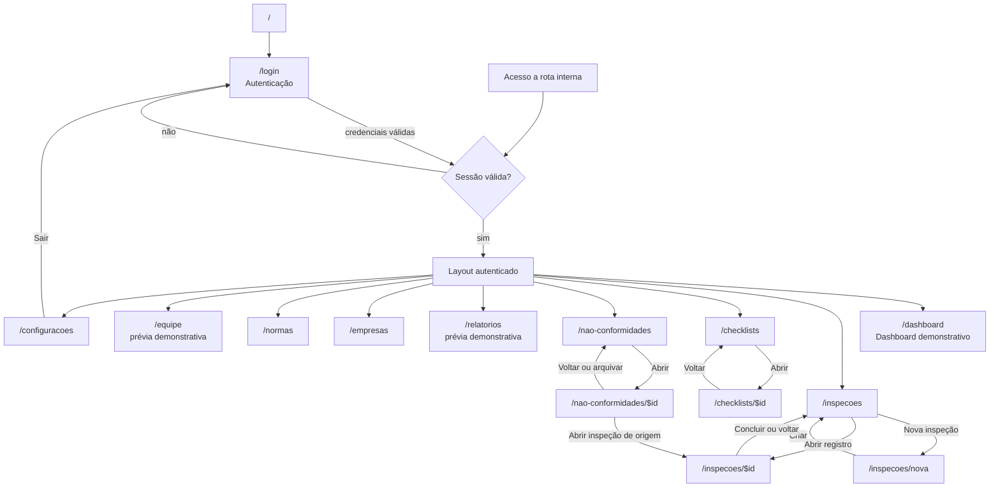

# Mapa de Navegação — Safe Watch Insight

Este documento registra as rotas atuais da aplicação, os controles de acesso e
as transições observadas no código em `src/routes/`. Ele integra a documentação
permanente do projeto e também serve como artefato do TCC.

## 1. Regras gerais de acesso

- `/` redireciona para `/login`.
- `/login` usa autenticação real por e-mail e senha; uma sessão válida
  redireciona diretamente para `/dashboard`.
- Todas as rotas internas pertencem ao layout autenticado `_app`.
- Quando a sessão não é válida, o guard do layout redireciona para `/login`.
- O menu lateral permite alternar entre todos os módulos internos.
- O avatar da barra superior abre `/configuracoes`.
- **Sair** encerra a sessão, limpa os dados offline do dispositivo quando
  possível e retorna para `/login`.

## 2. Rotas

| Rota                     | Tela                           | Estado dos dados                                             |
| ------------------------ | ------------------------------ | ------------------------------------------------------------ |
| `/`                      | Redirecionamento inicial       | —                                                            |
| `/login`                 | Autenticação                   | Backend e sessão reais                                       |
| `/dashboard`             | Dashboard                      | Prévia demonstrativa                                         |
| `/inspecoes`             | Lista de inspeções             | Backend real                                                 |
| `/inspecoes/nova`        | Criação de inspeção            | Backend real                                                 |
| `/inspecoes/$id`         | Execução e detalhe da inspeção | Backend e persistência offline parcial                       |
| `/checklists`            | Biblioteca de checklists       | Backend real                                                 |
| `/checklists/$id`        | Itens, normas e publicação     | Backend real                                                 |
| `/nao-conformidades`     | Kanban e lista de NCs          | Backend real                                                 |
| `/nao-conformidades/$id` | Tratamento da NC               | Backend real                                                 |
| `/relatorios`            | Prévia de relatórios           | Dados demonstrativos; saída desabilitada                     |
| `/empresas`              | Cadastro de empresas           | Backend real                                                 |
| `/normas`                | Catálogo de NRs                | Backend real                                                 |
| `/equipe`                | Equipe                         | Prévia demonstrativa                                         |
| `/configuracoes`         | Preferências e sincronização   | Estado offline real e controles demonstrativos identificados |

## 3. Diagrama global



O menu lateral conecta o layout autenticado a cada módulo. Essas arestas foram
representadas uma única vez para manter o diagrama legível.

## 4. Fluxos principais

### 4.1 Autenticação

```text
/ -> /login -> /dashboard
```

O formulário envia e-mail e senha ao backend. Credenciais válidas criam a
sessão; não existe seletor de perfil no login.

### 4.2 Empresas

```text
menu lateral -> /empresas
                     |
                     +-> Nova empresa (dialog) -> salvar -> /empresas
                     +-> Editar (dialog) -> salvar -> /empresas
                     +-> Excluir (confirmação) -> /empresas
```

Criação e edição usam diálogos na própria rota; não existe uma rota de detalhe
da empresa.

### 4.3 Checklists

```text
/checklists
  |-> Novo modelo (dialog)
  |-> Editar/Excluir
  +-> /checklists/$id
        |-> Novo/Editar/Excluir item (dialog)
        |-> Associar normas
        |-> Publicar versão
        +-> Voltar -> /checklists
```

A publicação ocorre na rota de detalhe. Uma versão publicada passa a ser
imutável; alterações subsequentes usam um novo rascunho.

### 4.4 Criação e execução de inspeção

```text
/inspecoes
  -> /inspecoes/nova
  -> empresa
  -> versão publicada + observações
  -> agendamento
  -> criar e retornar a /inspecoes
  -> abrir /inspecoes/$id
  -> responder itens / enviar evidências / concluir
  -> /inspecoes
```

Uma resposta **NC** cria a não conformidade no backend, mas não navega
automaticamente para o detalhe dela. A consulta e a tratativa ocorrem pelo
módulo **Não conformidades**.

A conclusão retorna para a lista de inspeções. Não há redirecionamento
automático para Relatórios, pois esse módulo ainda é demonstrativo.

### 4.5 Não conformidades

```text
/nao-conformidades
  -> selecionar cartão ou linha
  -> /nao-conformidades/$id
       |-> editar dados
       |-> alterar status
       |-> manter ações corretivas
       |-> enviar/remover evidências
       |-> abrir /inspecoes/$id
       +-> voltar/arquivar -> /nao-conformidades
```

### 4.6 Sincronização offline

A sincronização não cria uma rota separada:

- `/inspecoes/$id` grava respostas e conclusão localmente antes do envio;
- o indicador da barra superior apresenta o estado geral;
- `/configuracoes` mostra dados armazenados, pendências, falhas e conflitos e
  oferece **Sincronizar agora**;
- reconexão pode disparar a fila automaticamente.

## 5. Matriz de transições explícitas

| Origem                   | Destino                  | Gatilho                         |
| ------------------------ | ------------------------ | ------------------------------- |
| `/`                      | `/login`                 | Redirecionamento inicial        |
| `/login`                 | `/dashboard`             | Login válido ou sessão já ativa |
| Qualquer rota sem sessão | `/login`                 | Guard do layout                 |
| `/dashboard`             | `/inspecoes`             | **Ver todas**                   |
| `/inspecoes`             | `/inspecoes/nova`        | **Nova inspeção**               |
| `/inspecoes`             | `/inspecoes/$id`         | Seleção de uma inspeção         |
| `/inspecoes/nova`        | `/inspecoes`             | Criação concluída               |
| `/inspecoes/$id`         | `/inspecoes`             | **Voltar** ou conclusão         |
| `/checklists`            | `/checklists/$id`        | **Abrir**                       |
| `/checklists/$id`        | `/checklists`            | **Voltar**                      |
| `/nao-conformidades`     | `/nao-conformidades/$id` | Seleção de cartão ou linha      |
| `/nao-conformidades/$id` | `/inspecoes/$id`         | Link da inspeção de origem      |
| `/nao-conformidades/$id` | `/nao-conformidades`     | **Voltar** ou arquivamento      |
| Barra superior           | `/configuracoes`         | Clique no avatar                |
| Menu lateral             | qualquer módulo interno  | Seleção do item                 |
| Menu lateral             | `/login`                 | **Sair**                        |

## 6. Persistência por módulo

Autenticação, empresas, checklists, normas, inspeções, respostas, não
conformidades, ações corretivas e evidências usam a arquitetura real do backend.
Dashboard, relatórios e equipe continuam no store demonstrativo e são
identificados na interface. Configurações combina preferências locais e dados
demonstrativos com indicadores reais do IndexedDB e da fila de sincronização.
