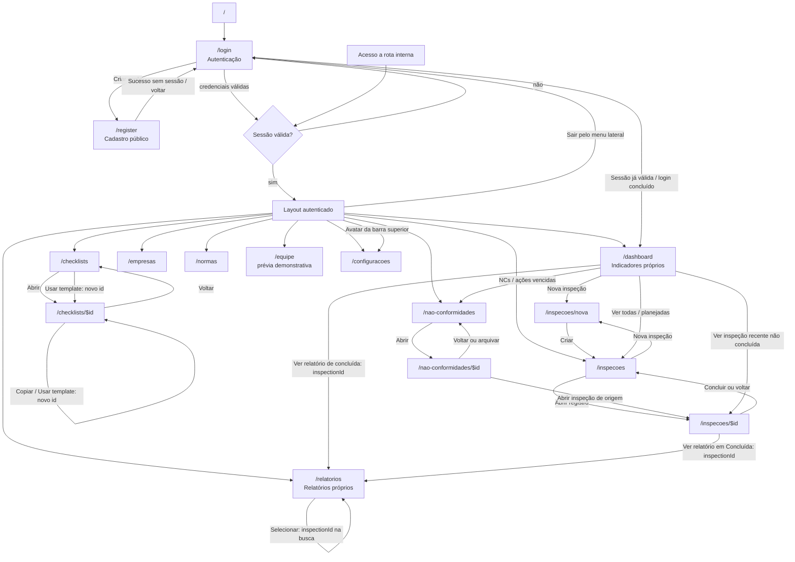

# Mapa de Navegação — Safe Watch Insight

Este documento registra as rotas atuais da aplicação, os controles de acesso e
as transições observadas no código em `src/routes/`. Ele integra a documentação
permanente do projeto e também serve como artefato do TCC. Conferência estática
na Fase 8, em **4 de outubro de 2026**, sobre
`5d323ae8d1e26d87198592564876616b04936f14`, sem nova execução em navegador.
`$id` representa identificador dinâmico; `_app` é layout sem segmento de URL.

## 1. Regras gerais de acesso

- `/` redireciona para `/login`.
- `/login` usa autenticação real por e-mail e senha; uma sessão válida
  redireciona diretamente para `/dashboard`.
- `/register` é público, sem guard de sessão; sucesso encaminha para `/login`,
  sem auto-login. Login e cadastro oferecem links entre si.
- Roles armazenados não criam menus/permissões administrativas; recursos
  operacionais são limitados à sessão conforme os [casos de uso](./DiagramaDeCasosDeUso.md).
- Todas as rotas internas pertencem ao layout autenticado `_app`.
- Quando a sessão não é válida, o guard do layout redireciona para `/login`.
- O menu lateral permite alternar entre todos os módulos internos.
- O avatar da barra superior abre `/configuracoes`.
- **Sair** encerra a sessão, limpa os dados offline do dispositivo quando
  possível e retorna para `/login`.

## 2. Rotas

| Rota                     | Tela                               | Estado dos dados                                               |
| ------------------------ | ---------------------------------- | -------------------------------------------------------------- |
| `/`                      | Redirecionamento inicial           | —                                                              |
| `/register`              | Cadastro público                   | Backend real; TECHNICIAN atribuído no servidor; sem auto-login |
| `/login`                 | Autenticação                       | Backend e sessão reais                                         |
| `/dashboard`             | Dashboard                          | Agregados reais das inspeções do usuário                       |
| `/inspecoes`             | Lista de inspeções                 | Backend e fallback para inspeções locais                       |
| `/inspecoes/nova`        | Criação de inspeção                | Backend real                                                   |
| `/inspecoes/$id`         | Execução e detalhe da inspeção     | Backend e persistência offline parcial                         |
| `/checklists`            | Biblioteca de checklists           | Backend real                                                   |
| `/checklists/$id`        | Detalhe, itens, publicação e cópia | Backend real                                                   |
| `/nao-conformidades`     | Kanban e lista de NCs              | Backend real                                                   |
| `/nao-conformidades/$id` | Tratamento da NC                   | Backend real                                                   |
| `/relatorios`            | Relatórios históricos              | Dados persistidos; impressão pelo navegador                    |
| `/empresas`              | Cadastro de empresas               | Backend real                                                   |
| `/normas`                | Catálogo de NRs                    | Backend real                                                   |
| `/equipe`                | Equipe                             | Prévia demonstrativa                                           |
| `/configuracoes`         | Preferências e sincronização       | Estado offline real e controles demonstrativos identificados   |

## 3. Diagrama global


```mermaid
flowchart TD
    Root["/"] --> Login["/login<br/>Autenticação"]
    Login -->|Criar conta| Register["/register<br/>Cadastro público"]
    Register -->|Sucesso sem sessão / voltar| Login
    Login -->|credenciais válidas| Guard
    Internal["Acesso a rota interna"] --> Guard

    Guard{"Sessão válida?"}
    Guard -->|não| Login
    Guard -->|sim| App["Layout autenticado"]

    App --> Dashboard["/dashboard<br/>Indicadores próprios"]
    App --> Inspections["/inspecoes"]
    App --> Checklists["/checklists"]
    App --> NCs["/nao-conformidades"]
    App --> Reports["/relatorios<br/>Relatórios próprios"]
    App --> Companies["/empresas"]
    App --> Standards["/normas"]
    App --> Team["/equipe<br/>prévia demonstrativa"]
    App --> Settings["/configuracoes"]

    Inspections -->|Nova inspeção| NewInspection["/inspecoes/nova"]
    NewInspection -->|Criar| Inspections
    Inspections -->|Abrir registro| Inspection["/inspecoes/$id"]
    Inspection -->|Concluir ou voltar| Inspections

    Checklists -->|Abrir| Checklist["/checklists/$id"]
    Checklist -->|Voltar| Checklists
    Checklists -->|Usar template: novo id| Checklist
    Checklist -->|Copiar / Usar template: novo id| Checklist

    NCs -->|Abrir| NC["/nao-conformidades/$id"]
    NC -->|Abrir inspeção de origem| Inspection
    NC -->|Voltar ou arquivar| NCs

    Login -->|Sessão já válida / login concluído| Dashboard
    Dashboard -->|Nova inspeção| NewInspection
    Dashboard -->|Ver todas / planejadas| Inspections
    Dashboard -->|Ver inspeção recente não concluída| Inspection
    Dashboard -->|Ver relatório de concluída: inspectionId| Reports
    Dashboard -->|NCs / ações vencidas| NCs
    Inspection -->|Ver relatório em Concluída: inspectionId| Reports
    Reports -->|Selecionar: inspectionId na busca| Reports
    App -->|Avatar da barra superior| Settings
    App -->|Sair pelo menu lateral| Login
```

O menu lateral conecta o layout autenticado a cada módulo. Essas arestas foram
representadas uma única vez para manter o diagrama legível. A aresta de cópia
retorna à mesma rota com **outro `$id`**, não compartilha a identidade original.
PlantUML equivalente: [navigation.puml](./diagrams/flows/navigation.puml).
Relatório mantém a rota `/relatorios`, alterando apenas a busca
`?inspectionId=UUID`; impressão e sincronização são ações, sem URL adicional.

### Organização do menu atual

```text
Público
├── /login
└── /register

Autenticado — Operação
├── /dashboard
├── /inspecoes
│   ├── /inspecoes/nova
│   └── /inspecoes/$id
├── /checklists
│   └── /checklists/$id — consulta/itens/publicação/cópia
├── /nao-conformidades
│   └── /nao-conformidades/$id — dados/ações/evidências
└── /relatorios — seleção pela busca inspectionId

Autenticado — Cadastros
├── /empresas — diálogos na mesma rota
├── /normas
├── /equipe — demonstrativo
└── /configuracoes — preferências/diagnóstico/retry
```

O menu **Cadastros** não representa autorização administrativa. Não existe rota
própria para ações corretivas, evidências, cópia, edição de empresa ou sincronização.

## 4. Fluxos principais

### 4.1 Autenticação

```text
/ -> /login -> /dashboard
```

```text
/login -> Criar conta -> /register -> cadastro sem sessão -> /login
```

Login envia e-mail/senha e cria sessão após autenticação; não há seletor de perfil.
Cadastro recebe nome/e-mail/senha/confirmação, valida campos e atribui papel
técnico no servidor; não inicia sessão. Cadastro não
redireciona automaticamente usuário já autenticado. [Fluxo de autenticação](../AI/Architecture.md).

### 4.2 Empresas

```text
menu lateral -> /empresas
                     |
                     +-> Nova empresa (dialog) -> salvar -> /empresas
                     +-> Editar (dialog) -> salvar -> /empresas
                     +-> Excluir (confirmação) -> /empresas
```

Criação e edição usam diálogos na própria rota; não existe uma rota de detalhe
da empresa.

### 4.3 Checklists

```text
/checklists
  |-> Novo modelo (dialog)
  |-> Editar/Excluir
  +-> /checklists/$id
        |-> Novo/Editar/Excluir item (dialog)
        |-> Associar normas
        |-> Publicar versão (próprio)
        |-> Copiar checklist / Usar template -> /checklists/$id (novo id)
        +-> Voltar -> /checklists
```

A publicação ocorre na rota de detalhe. Uma versão publicada passa a ser
imutável; alterações subsequentes usam um novo rascunho da mesma identidade.
Controles de manutenção só aparecem com canManage, sem dispensar autorização
no servidor. Publicação de terceiro e template oficial são de leitura/reutilização;
seus drafts não são editáveis pelo usuário da sessão.

**Usar template** também aparece na Biblioteca e navega ao detalhe da cópia.
**Copiar checklist** ocorre no detalhe e cria identidade pessoal/DRAFT v1 com
itens independentes; não existe rota `/checklists/copiar`, `/checklists/$id/edit`
ou rota de edição separada. Criação/edição de metadados usa diálogos na Biblioteca.
Regras: [ChecklistCopy.md](../AI/ChecklistCopy.md).

### 4.4 Criação e execução de inspeção

```text
/inspecoes
  -> /inspecoes/nova
  -> empresa
  -> versão publicada + observações
  -> agendamento
  -> criar e retornar a /inspecoes
  -> abrir /inspecoes/$id
  -> responder itens / enviar evidências / concluir
  -> /inspecoes
```

Uma resposta **NC** cria a não conformidade no backend, mas não navega
automaticamente para o detalhe dela. A consulta e a tratativa ocorrem pelo
módulo **Não conformidades**.

A conclusão retorna para a lista de inspeções. Relatórios consulta inspeções
concluídas próprias e permite impressão pelo navegador.

### 4.5 Não conformidades

```text
/nao-conformidades
  -> selecionar cartão ou linha
  -> /nao-conformidades/$id
       |-> editar dados
       |-> alterar status
       |-> manter ações corretivas
       |-> enviar/remover evidências
       |-> abrir /inspecoes/$id
       +-> voltar/arquivar -> /nao-conformidades
```

### 4.6 Sincronização offline

A sincronização não cria uma rota separada:

- `/inspecoes/$id` grava respostas e conclusão localmente antes do envio;
- o indicador da barra superior apresenta o estado geral;
- `/configuracoes` mostra dados armazenados, pendências, falhas e conflitos e
  oferece **Sincronizar agora**;
- reconexão pode disparar a fila automaticamente;
- o botão de retry também existe na barra superior quando há pendências/falhas;
- não há destino de resolução assistida de conflitos;
- sincronize antes de sair ou trocar de conta, pois sessão/pacotes/fila e cache
  local de navegação são limpos nos caminhos implementados.

## 5. Matriz de transições explícitas

| Origem                   | Destino                         | Gatilho                                   |
| ------------------------ | ------------------------------- | ----------------------------------------- |
| `/`                      | `/login`                        | Redirecionamento inicial                  |
| `/login`                 | `/register`                     | Link **Criar conta**                      |
| `/register`              | `/login`                        | Cadastro concluído ou link para entrar    |
| `/login`                 | `/dashboard`                    | Login válido ou sessão já ativa           |
| Rota interna sem sessão  | `/login`                        | Guard do layout                           |
| `/dashboard`             | `/inspecoes`                    | **Ver todas** ou pendências planejadas    |
| `/dashboard`             | `/inspecoes/nova`               | **Nova inspeção**                         |
| `/dashboard`             | `/inspecoes/$id`                | Recente não concluída                     |
| `/dashboard`             | `/relatorios?inspectionId=UUID` | Recente concluída: **Ver relatório**      |
| `/dashboard`             | `/nao-conformidades`            | Pendências de NCs/ações vencidas          |
| `/inspecoes/$id`         | `/relatorios?inspectionId=UUID` | **Ver relatório** em COMPLETED            |
| `/relatorios`            | `/relatorios?inspectionId=UUID` | Seleção, replace da busca                 |
| `/inspecoes`             | `/inspecoes/nova`               | **Nova inspeção**                         |
| `/inspecoes`             | `/inspecoes/$id`                | Seleção de uma inspeção                   |
| `/inspecoes/nova`        | `/inspecoes`                    | Criação concluída                         |
| `/inspecoes/$id`         | `/inspecoes`                    | **Voltar** ou conclusão                   |
| `/checklists`            | `/checklists/$id`               | **Abrir**                                 |
| `/checklists`            | `/checklists/$id` (novo id)     | **Usar template** cria cópia pessoal      |
| `/checklists/$id`        | `/checklists/$id` (novo id)     | **Copiar checklist** ou **Usar template** |
| `/checklists/$id`        | `/checklists`                   | **Voltar**                                |
| `/nao-conformidades`     | `/nao-conformidades/$id`        | Seleção de cartão ou linha                |
| `/nao-conformidades/$id` | `/inspecoes/$id`                | Link da inspeção de origem                |
| `/nao-conformidades/$id` | `/nao-conformidades`            | **Voltar** ou arquivamento                |
| Barra superior           | `/configuracoes`                | Clique no avatar                          |
| Menu lateral             | qualquer módulo interno         | Seleção do item                           |
| Menu lateral             | `/login`                        | **Sair**                                  |

## 6. Persistência por módulo

Autenticação, empresas, checklists, normas, inspeções, respostas, não
conformidades, ações corretivas e evidências usam a arquitetura real do backend.
Dashboard e relatórios consultam dados persistidos próprios; o relatório combina
conteúdo histórico do checklist com dados operacionais atuais. Equipe permanece
demonstrativa. Configurações combina preferências locais e dados demonstrativos
com indicadores reais do IndexedDB e da fila de sincronização.

## Relatórios e limites de navegação — Fase 6

/relatorios usa search opcional inspectionId UUID; valor inválido vira ausente.
Sem parâmetro usa o primeiro relatório disponível (data DESC/id DESC). O seletor
lista somente concluídas próprias com snapshot; parâmetro válido consulta direto,
sem exigir presença na lista ou COMPLETED no backend. Imprimir chama window.print()
na mesma tela; não navega a rota de download/PDF. Fluxo/read models:
[BusinessRules.md](../AI/BusinessRules.md).

Não há telas/operações públicas de edição geral/cancelamento/reabertura da
inspeção; CANCELLED é consultável, sem ação correspondente. deleteInspection
existe na API/hook, sem botão atual. Respostas/conclusão locais precedem sync;
**Ver relatório** após conclusão local pode anteceder confirmação remota, e o
relatório usa dados remotos. Fila em conflito exige revisão futura, sem rota de
reconciliação assistida. concerns: [RelatorioFase6.md](./RelatorioFase6.md).

## Referências históricas e conferência atual

O registro da Fase 7 conferiu as rotas sobre `da43f71`. A Fase 8 reconferiu os
16 destinos (incluindo `/`, login e cadastro) e os layouts sobre o HEAD inicial
indicado acima; `$id` é parâmetro TanStack,
não rota adicional por ação. Domínio/casos oficiais:
[DiagramaDeClasses_VersaoTecnica.md](./DiagramaDeClasses_VersaoTecnica.md) e
[DiagramaDeCasosDeUso.md](./DiagramaDeCasosDeUso.md). Personas e `/equipe` não
concedem acesso gerencial a dados de terceiro; `/configuracoes` não implementa
edição persistida de perfil/administração.

Fluxos atuais de [inspeção](./diagrams/flows/inspection.puml),
[evidência](./diagrams/flows/evidence.puml),
[relatório/dashboard](./diagrams/flows/reports-dashboard.puml) e
[offline](./diagrams/flows/offline-inspection.puml) permanecem os consolidados
na Fase 6, com Mermaid em [BusinessRules.md](../AI/BusinessRules.md) e
[Offline.md](../AI/Offline.md). Não há rota de reconciliação ou criação integral
offline. Ausência de campo solicitante permanece RF12/RN07 não entregue.
