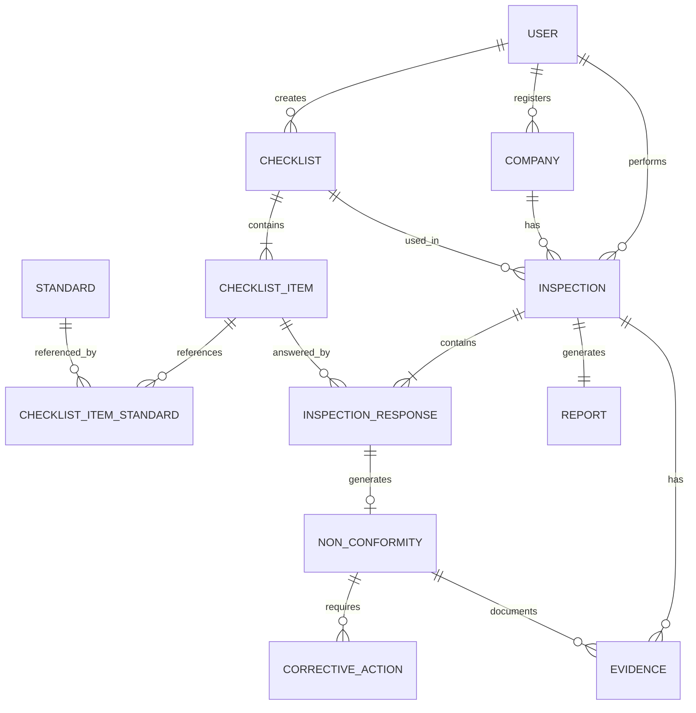

# 6. Modelo Conceitual do Banco de Dados

## 6.1 Objetivo

O Modelo Conceitual do Banco de Dados representa, de forma abstrata, as entidades que compõem a plataforma e os relacionamentos existentes entre elas, sem considerar aspectos específicos de implementação do sistema gerenciador de banco de dados.

Seu objetivo é demonstrar a organização das informações necessárias para apoiar o gerenciamento de inspeções e fiscalizações em Segurança e Saúde no Trabalho (SST), garantindo rastreabilidade, integridade dos registros e suporte às funcionalidades definidas nos requisitos do sistema.

A modelagem foi elaborada a partir do Diagrama de Classes da aplicação, servindo como base para a construção dos modelos lógico e físico do banco de dados.

---

## 6.2 Modelo Conceitual

A Figura 8 apresenta o Modelo Conceitual do Banco de Dados da plataforma.

> **Figura 8 – Modelo Conceitual do Banco de Dados da Plataforma SST**

**Fonte:** Elaborado pelo autor.

---

## 6.3 Descrição das Entidades

O modelo conceitual é composto pelas seguintes entidades:

| Entidade                  | Finalidade                                                                                                       |
| ------------------------- | ---------------------------------------------------------------------------------------------------------------- |
| **User**                  | Usuários autenticados da plataforma.                                                                             |
| **Company**               | Empresas inspecionadas.                                                                                          |
| **Checklist**             | Modelos de inspeção utilizados nas vistorias.                                                                    |
| **ChecklistItem**         | Itens que compõem um checklist.                                                                                  |
| **Standard**              | Normas regulamentadoras e técnicas relacionadas aos itens.                                                       |
| **Inspection**            | Inspeções realizadas pelos profissionais.                                                                        |
| **InspectionResponse**    | Respostas registradas para cada item da inspeção.                                                                |
| **NonConformity**         | Não conformidades identificadas durante a inspeção.                                                              |
| **CorrectiveAction**      | Ações corretivas propostas para resolver as não conformidades.                                                   |
| **Evidence**              | Evidências, principalmente fotografias, registradas durante a inspeção.                                          |
| **Report**                | Relatórios emitidos ao final das inspeções.                                                                      |
| **ChecklistItemStandard** | Entidade associativa responsável por representar a relação muitos-para-muitos entre itens de checklist e normas. |

---

## 6.4 Relacionamentos

O modelo estabelece que um usuário pode cadastrar diversas empresas, criar múltiplos checklists e realizar várias inspeções.

Cada empresa pode possuir diversas inspeções ao longo do tempo.

Cada checklist é composto por um ou mais itens, que poderão ser reutilizados em diferentes inspeções.

Os itens dos checklists podem estar associados a diversas normas técnicas (NR, NBR e NT), permitindo que o sistema apresente automaticamente os dispositivos normativos relacionados durante a criação e execução das inspeções.

Cada inspeção gera diversas respostas correspondentes aos itens avaliados. Quando aplicável, uma resposta poderá originar uma não conformidade.

Cada não conformidade poderá possuir uma ou mais ações corretivas e evidências fotográficas associadas.

Ao término da inspeção, a plataforma gera um relatório consolidando todas as informações registradas durante a vistoria.

---

## 6.5 Considerações

O Modelo Conceitual do Banco de Dados apresenta a estrutura de informações necessária para atender aos requisitos funcionais da plataforma proposta.

Sua elaboração priorizou a organização das entidades, a integridade dos relacionamentos e a possibilidade de expansão futura do sistema, permitindo a inclusão de novos módulos, normas técnicas e funcionalidades sem comprometer a estrutura principal do banco de dados.

Além disso, o modelo serve como base para a elaboração do Modelo Lógico e do Modelo Físico do banco de dados, garantindo consistência entre a documentação acadêmica e a implementação da aplicação.

