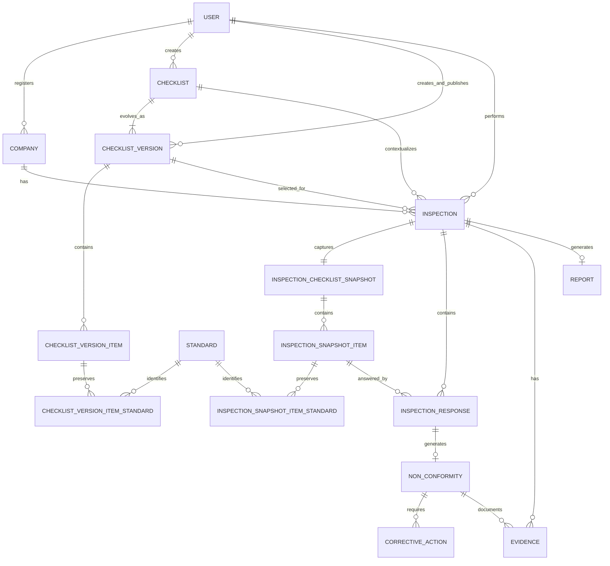

# 6. Modelo Conceitual do Banco de Dados

## 6.1 Objetivo

O modelo conceitual representa as entidades da plataforma Safe Watch Insight e
seus relacionamentos, com ênfase na rastreabilidade e na integridade histórica
das inspeções de Segurança e Saúde no Trabalho.

## 6.2 Modelo Conceitual

> **Figura 8 – Modelo Conceitual do Banco de Dados da Plataforma SST**

```mermaid
erDiagram
  USER ||--o{ COMPANY : registers
  USER ||--o{ CHECKLIST : creates
  USER ||--o{ CHECKLIST_VERSION : creates_and_publishes
  USER ||--o{ INSPECTION : performs

  COMPANY ||--o{ INSPECTION : has
  CHECKLIST ||--|{ CHECKLIST_VERSION : evolves_as
  CHECKLIST_VERSION ||--o{ CHECKLIST_VERSION_ITEM : contains
  CHECKLIST_VERSION_ITEM ||--o{ CHECKLIST_VERSION_ITEM_STANDARD : preserves
  STANDARD ||--o{ CHECKLIST_VERSION_ITEM_STANDARD : identifies

  CHECKLIST ||--o{ INSPECTION : contextualizes
  CHECKLIST_VERSION ||--o{ INSPECTION : selected_for
  INSPECTION ||--|| INSPECTION_CHECKLIST_SNAPSHOT : captures
  INSPECTION_CHECKLIST_SNAPSHOT ||--o{ INSPECTION_SNAPSHOT_ITEM : contains
  INSPECTION_SNAPSHOT_ITEM ||--o{ INSPECTION_SNAPSHOT_ITEM_STANDARD : preserves
  STANDARD ||--o{ INSPECTION_SNAPSHOT_ITEM_STANDARD : identifies

  INSPECTION ||--o{ INSPECTION_RESPONSE : contains
  INSPECTION_SNAPSHOT_ITEM ||--o{ INSPECTION_RESPONSE : answered_by
  INSPECTION_RESPONSE ||--o| NON_CONFORMITY : generates
  NON_CONFORMITY ||--o{ CORRECTIVE_ACTION : requires
  INSPECTION ||--o{ EVIDENCE : has
  NON_CONFORMITY ||--o{ EVIDENCE : documents
  INSPECTION ||--o| REPORT : generates
```

**Fonte:** Elaborado pelo autor.

## 6.3 Entidades centrais

| Entidade | Finalidade |
| --- | --- |
| **User** | Usuário autenticado, autor de cadastros, versões e inspeções. |
| **Company** | Empresa inspecionada. |
| **Checklist** | Identidade reutilizável do modelo de inspeção. |
| **ChecklistVersion** | Revisão numerada; draft editável ou publicação imutável. |
| **ChecklistVersionItem** | Pergunta pertencente a uma revisão específica. |
| **ChecklistVersionItemStandard** | Associação que preserva os dados normativos da versão. |
| **Standard** | Catálogo atual e reutilizável de normas. |
| **Inspection** | Inspeção realizada para empresa, usuário e versão publicada. |
| **InspectionChecklistSnapshot** | Cópia histórica e exclusiva do conteúdo usado na inspeção. |
| **InspectionSnapshotItem** | Pergunta exatamente como capturada para a inspeção. |
| **InspectionSnapshotItemStandard** | Fundamentação normativa histórica do item inspecionado. |
| **InspectionResponse** | Resposta vinculada ao item do snapshot. |
| **NonConformity** | Irregularidade originada por uma resposta não conforme. |
| **CorrectiveAction** | Ação destinada a tratar uma não conformidade. |
| **Evidence** | Metadados de imagem externa associados exatamente à inspeção com snapshot ou à não conformidade baseada no item histórico. |
| **Report** | Relatório emitido para uma inspeção. |

## 6.4 Integridade histórica

O checklist pode evoluir por novas versões. Uma publicação nunca é editada e
somente versões publicadas iniciam inspeções. Cada inspeção captura seu próprio
snapshot, e respostas, não conformidades e relatórios usam esse conteúdo
histórico. Assim, alterações posteriores de título, itens, ordem,
obrigatoriedade ou normas não modificam inspeções existentes.

As estruturas antigas de item de checklist continuam fisicamente disponíveis
durante a janela de compatibilidade, mas não são a fonte conceitual de novas
inspeções.

Evidências não se ligam ao checklist mutável. Quando anexadas à inspeção, o
contexto é seu snapshot exclusivo; quando anexadas à não conformidade, o
contexto é a resposta e o item do snapshot que a originaram.

## 6.5 Considerações

O modelo combina normalização para o catálogo reutilizável com duplicação
histórica controlada nas versões e snapshots. Essa escolha sustenta auditoria,
relatórios, assinatura e sincronização futuras sem exigir event sourcing nesta
etapa do TCC.
