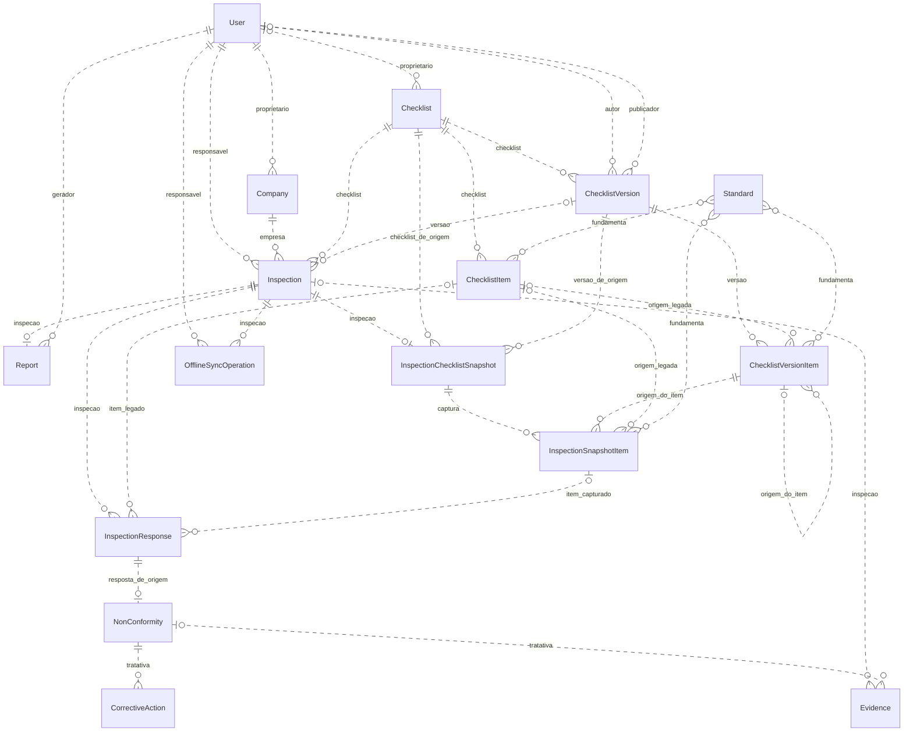

# 6. Modelo Conceitual do Banco de Dados

Documentação da Fase 2, conferida em 3 de outubro de 2026 no HEAD
`0e7c6e4fcebb3edaf8c5eba3efd23dc357dfb8f9`. Fontes primárias:
[schema Prisma](../prisma/schema.prisma) e as seis
[migrations](../prisma/migrations/). O estado físico descrito é o resultado
dessas migrations, sem consulta de catálogo a um banco remoto nesta tarefa.
Services/Repositories são citados somente para distinguir garantias da aplicação.

## 6.1 Objetivo e abstração

Representar os conceitos do domínio SST, sua autoria, execução e histórico,
sem atributos, tipos PostgreSQL, PKs, índices ou regras de DDL. Os nomes dos
conceitos usam os identificadores do projeto para facilitar rastreabilidade.
As três associações normativas são abstraídas como relações N:N; a preservação
de metadados em versão/snapshot é descrita no texto, sem transformar a tabela
associativa em conceito autônomo. Item legado permanece como conceito de
compatibilidade; sincronização representa a operação remota confirmada.

## 6.2 Diagrama

**Figura 8 — Modelo Conceitual do Banco de Dados da Plataforma SST.**
Fonte: elaborado pelo autor a partir da implementação.
PlantUML equivalente: [conceptual.puml](./diagrams/database/conceptual.puml).

```mermaid
erDiagram

  User ||..o{ Company : proprietario
  User |o..o{ Checklist : proprietario
  Checklist ||..o{ ChecklistItem : checklist
  User ||..o{ Inspection : responsavel
  Company ||..o{ Inspection : empresa
  Checklist ||..o{ Inspection : checklist
  Inspection ||..o{ InspectionResponse : inspecao
  ChecklistItem |o..o{ InspectionResponse : item_legado
  InspectionResponse ||..o| NonConformity : resposta_de_origem
  NonConformity ||..o{ CorrectiveAction : tratativa
  Inspection ||..o| Report : inspecao
  User ||..o{ Report : gerador
  Checklist ||..o{ ChecklistVersion : checklist
  User |o..o{ ChecklistVersion : autor
  User |o..o{ ChecklistVersion : publicador
  ChecklistVersion ||..o{ ChecklistVersionItem : versao
  ChecklistVersionItem |o..o{ ChecklistVersionItem : origem_do_item
  ChecklistItem |o..o{ ChecklistVersionItem : origem_legada
  ChecklistVersion |o..o{ Inspection : versao
  Inspection ||..o| InspectionChecklistSnapshot : inspecao
  Checklist ||..o{ InspectionChecklistSnapshot : checklist_de_origem
  ChecklistVersion ||..o{ InspectionChecklistSnapshot : versao_de_origem
  InspectionChecklistSnapshot ||..o{ InspectionSnapshotItem : captura
  ChecklistVersionItem ||..o{ InspectionSnapshotItem : origem_do_item
  ChecklistItem |o..o{ InspectionSnapshotItem : origem_legada
  InspectionSnapshotItem |o..o{ InspectionResponse : item_capturado
  Inspection |o..o{ Evidence : inspecao
  NonConformity |o..o{ Evidence : tratativa
  User ||..o{ OfflineSyncOperation : responsavel
  Inspection ||..o{ OfflineSyncOperation : inspecao
  Standard }o..o{ ChecklistItem : fundamenta
  Standard }o..o{ ChecklistVersionItem : fundamenta
  Standard }o..o{ InspectionSnapshotItem : fundamenta
```

## 6.3 Conceitos

| Conceito                      | Papel no domínio                                                                                                        |
| ----------------------------- | ----------------------------------------------------------------------------------------------------------------------- |
| `User`                        | Pessoa autenticada que assume responsabilidade por cadastros, inspeções e registros de relatório.                       |
| `Company`                     | Organização fiscalizada, com dados cadastrais e contexto de risco ocupacional.                                          |
| `Standard`                    | Norma reutilizável como fundamentação de perguntas e registros históricos.                                              |
| `Checklist`                   | Identidade reutilizável de um conjunto de perguntas, de propriedade pessoal ou autoria institucional.                   |
| `ChecklistItem`               | Pergunta mantida por compatibilidade com inspeções e conteúdo anteriores ao versionamento.                              |
| `ChecklistVersion`            | Revisão do conteúdo do checklist, com autoria e ciclo de elaboração, publicação e retirada.                             |
| `ChecklistVersionItem`        | Pergunta pertencente a uma revisão, com ordem, obrigatoriedade, fundamentação e linhagem.                               |
| `Inspection`                  | Avaliação de uma empresa pelo responsável, com contexto de checklist e situação de execução.                            |
| `InspectionChecklistSnapshot` | Captura histórica exclusiva do conteúdo utilizado pela inspeção.                                                        |
| `InspectionSnapshotItem`      | Pergunta preservada tal como capturada para avaliação na inspeção.                                                      |
| `InspectionResponse`          | Resultado da avaliação de uma pergunta, acompanhado de observação quando informada.                                     |
| `NonConformity`               | Irregularidade identificada em uma resposta, com gravidade, prazo e situação de tratamento.                             |
| `CorrectiveAction`            | Plano de tratamento de uma irregularidade, com definição de o quê, por quê, onde, quem, quando, como e quanto.          |
| `Evidence`                    | Registro documental de uma inspeção ou irregularidade, com arquivo externo e contexto exclusivo.                        |
| `Report`                      | Registro persistível de relatório de inspeção, com gerador e momento de geração; distinto da visão montada sob demanda. |
| `OfflineSyncOperation`        | Confirmação remota de uma alteração da inspeção enviada pelo dispositivo, permitindo reconhecer tentativas repetidas.   |

## 6.4 Relações e limites

Um usuário cadastra empresas, é responsável por inspeções e pode possuir
checklists pessoais. Checklist institucional admite ausência de proprietário
usuário e identifica a autoria da plataforma; não representa conta fictícia.
Autor da versão, publicador da versão e proprietário são papéis distintos,
por isso as duas relações de autoria/publicação aparecem separadamente.

O checklist reúne revisões e pode originar várias inspeções e capturas.
A versão reúne perguntas com fundamentação normativa, e seus itens mantêm
linhagem entre revisões e origem legada. O snapshot pertence a uma única
inspeção, conserva conteúdo de checklist/versão e reúne itens capturados,
com fundamentação normativa própria. Norma é reutilizável; sua descrição
histórica preservada não deve ser reconstruída a partir do catálogo mutável.

As cardinalidades exibem o domínio implementado incluindo compatibilidade:
uma inspeção pode estar sem versão/snapshot no banco, enquanto o fluxo atual
cria ambos atomicamente. Um checklist pode fisicamente ainda não ter versões.
Uma resposta admite item capturado e/ou referência legada; o caminho atual
usa item capturado da própria inspeção. Esses limites são detalhados no
[modelo lógico](./ModeloLogico.md), sem converter exigência do fluxo em
cardinalidade física falsa.

Uma resposta pode originar zero ou uma não conformidade, que reúne ações
corretivas. Cada evidência pertence a **inspeção OU não conformidade (XOR)**;
as duas relações opcionais devem ser lidas junto dessa exclusividade.
Uma operação de sincronização confirmada pertence ao usuário e à inspeção;
não é toda a fila local ou suporte offline completo.

Relatório, neste modelo, é o registro persistível relacionado à inspeção e
ao usuário gerador. Uma inspeção admite zero ou um desses registros. A visão
de relatório montada sob demanda e a impressão pelo navegador não são outro
nome para esse conceito e não criam registros automaticamente.

## 6.5 História preservada

Capturas novas recebem `INSPECTION_CREATION`/`VERIFIED` no fluxo de criação;
o hash só é recalculado para publicação de formato 1. Publicação legada 0 com
hash presente pode iniciar inspeção sem recálculo: o rótulo não comprova sua
integridade canônica. Cópia dessa publicação exige formato 1, como delimitado
em [BusinessRules.md](../AI/BusinessRules.md#inspeções-e-snapshot-limites-relevantes).
O legado importado pelo backfill é
explicitamente não verificável: o banco anterior não permitia reconstruir o
conteúdo original na data da inspeção. Itens legados e suas relações não foram
removidos. Imutabilidade é uma garantia do fluxo de aplicação apoiada por
integridade física; não se afirma que qualquer atualização SQL é impedida.

Para as 19 tabelas/12 enums e todas as restrições, consultar o
[dicionário canônico](./DicionarioDeDados.md) e o
[modelo físico](./ModeloFisicoDB.md). Versões anteriores desta figura permanecem
no histórico Git; o diagrama acima é o modelo atual.
