# 8. Modelo Físico do Banco de Dados

Documentação da Fase 2, conferida em 3 de outubro de 2026 no HEAD
`0e7c6e4fcebb3edaf8c5eba3efd23dc357dfb8f9`. Fontes primárias:
[schema Prisma](../prisma/schema.prisma) e as seis
[migrations](../prisma/migrations/). O estado físico descrito é o resultado
dessas migrations, sem consulta de catálogo a um banco remoto nesta tarefa.
Services/Repositories são citados somente para distinguir garantias da aplicação.

## 8.1 PostgreSQL e convenções

Banco PostgreSQL hospedado no Neon, acessado por Prisma ORM. As 19 tabelas
usam os nomes exatos dos models, sem remapeamento; no SQL são identificadores
entre aspas. Tipos enum PostgreSQL são os 12 tipos listados neste documento.
UUID é tipo nativo. Não há DEFAULT SQL para os IDs; uuid() é comportamento
do Prisma. OfflineSyncOperation.id é fornecido pelo cliente, sem default.

DateTime = TIMESTAMP(3) sem fuso horário; String = TEXT, salvo UUID e CHAR(64)
anotados. updatedAt não possui default SQL ou trigger; @updatedAt atua no Prisma.
Os defaults abaixo são exclusivamente os efetivos das migrations, não valores
temporários usados no backfill. Metadados de arquivo ficam no banco; binários
de evidência ficam no Cloudinary. _prisma_migrations é metadado do migrador,
não um vigésimo model de domínio.

## 8.2 Diagrama completo

**Figura 10 — Modelo Físico do Banco de Dados da Plataforma SST.**
Fonte: elaborado pelo autor a partir de schema e migrations.
PlantUML oficial: [physical.puml](./diagrams/database/physical.puml).
Inclui todos os campos escalares, PKs/FKs/UK, nullability, defaults SQL,
índices e nomes/expressões de CHECKs. Este caminho substitui o diagrama físico
anterior Documentation/DiagramaModeloFisicoDB.puml; o conteúdo anterior fica
preservado no histórico Git. DiagramTest.puml contém casos de uso, não um
modelo físico, e permanece fora do escopo desta fase.

No Mermaid, TIMESTAMP3 significa TIMESTAMP(3), CHAR64 significa CHAR(64), e
os outros tipos usam sua grafia SQL. Os comentários indicam defaults e a
gestão Prisma; restrições que Mermaid não expressa estão nas seções normativas.
As relações são as mesmas do PlantUML, com opcionais físicos preservados.

```mermaid
erDiagram
  User {
    UUID id PK "NOT NULL; Prisma: uuid(); SQL: sem default"
    TEXT name "NOT NULL; Sem default"
    TEXT email UK "NOT NULL; Sem default"
    TEXT password "NOT NULL; Sem default"
    UserRole role "NOT NULL; Sem default"
    TIMESTAMP3 createdAt "NOT NULL; Prisma: now(); SQL: CURRENT_TIMESTAMP"
    TIMESTAMP3 updatedAt "NOT NULL; Sem default SQL; @updatedAt no Prisma"
    TIMESTAMP3 deletedAt "NULL; Sem default"
  }
  Company {
    UUID id PK "NOT NULL; Prisma: uuid(); SQL: sem default"
    TEXT corporateName "NOT NULL; Sem default"
    TEXT tradeName "NULL; Sem default"
    TEXT cnpj UK "NULL; Sem default"
    TEXT cnae "NOT NULL; Sem default"
    INTEGER riskLevel "NOT NULL; Sem default"
    INTEGER employeeCount "NOT NULL; Sem default"
    TEXT address "NULL; Sem default"
    TEXT notes "NULL; Sem default"
    UUID createdById FK "NOT NULL; Sem default"
    TIMESTAMP3 createdAt "NOT NULL; Prisma: now(); SQL: CURRENT_TIMESTAMP"
    TIMESTAMP3 updatedAt "NOT NULL; Sem default SQL; @updatedAt no Prisma"
    TIMESTAMP3 deletedAt "NULL; Sem default"
  }
  Standard {
    UUID id PK "NOT NULL; Prisma: uuid(); SQL: sem default"
    StandardType type "NOT NULL; Sem default"
    TEXT code UK "NOT NULL; Sem default"
    TEXT title "NOT NULL; Sem default"
    TEXT summary "NULL; Sem default"
    TEXT officialUrl "NULL; Sem default"
    BOOLEAN isActive "NOT NULL; SQL/Prisma: true"
  }
  Checklist {
    UUID id PK "NOT NULL; Prisma: uuid(); SQL: sem default"
    TEXT title "NOT NULL; Sem default"
    TEXT description "NULL; Sem default"
    BOOLEAN isTemplate "NOT NULL; SQL/Prisma: false"
    BOOLEAN isOfficial "NOT NULL; SQL/Prisma: false"
    BOOLEAN isActive "NOT NULL; SQL/Prisma: true"
    UUID createdById FK "NULL; Sem default"
    TIMESTAMP3 createdAt "NOT NULL; Prisma: now(); SQL: CURRENT_TIMESTAMP"
    TIMESTAMP3 updatedAt "NOT NULL; Sem default SQL; @updatedAt no Prisma"
    TIMESTAMP3 deletedAt "NULL; Sem default"
  }
  ChecklistItem {
    UUID id PK "NOT NULL; Prisma: uuid(); SQL: sem default"
    UUID checklistId FK "NOT NULL; Sem default"
    TEXT description "NOT NULL; Sem default"
    INTEGER orderIndex "NOT NULL; Sem default"
    BOOLEAN isRequired "NOT NULL; SQL/Prisma: true"
  }
  ChecklistItemStandard {
    UUID checklistItemId PK, FK "NOT NULL; Sem default"
    UUID standardId PK, FK "NOT NULL; Sem default"
  }
  ChecklistVersion {
    UUID id PK "NOT NULL; Prisma: uuid(); SQL: sem default"
    UUID checklistId FK "NOT NULL; Sem default"
    INTEGER versionNumber "NOT NULL; Sem default"
    ChecklistVersionStatus status "NOT NULL; SQL/Prisma: 'DRAFT'"
    TEXT title "NOT NULL; Sem default"
    TEXT description "NULL; Sem default"
    INTEGER contentSchemaVersion "NOT NULL; SQL/Prisma: 1"
    CHAR64 contentHash "NULL; Sem default"
    UUID createdById FK "NULL; Sem default"
    UUID publishedById FK "NULL; Sem default"
    TIMESTAMP3 publishedAt "NULL; Sem default"
    TIMESTAMP3 createdAt "NOT NULL; Prisma: now(); SQL: CURRENT_TIMESTAMP"
    TIMESTAMP3 updatedAt "NOT NULL; Sem default SQL; @updatedAt no Prisma"
  }
  ChecklistVersionItem {
    UUID id PK "NOT NULL; Prisma: uuid(); SQL: sem default"
    UUID checklistVersionId FK "NOT NULL; Sem default"
    UUID sourceVersionItemId FK "NULL; Sem default"
    UUID sourceChecklistItemId FK "NULL; Sem default"
    TEXT description "NOT NULL; Sem default"
    INTEGER orderIndex "NOT NULL; Sem default"
    BOOLEAN isRequired "NOT NULL; SQL/Prisma: true"
    TIMESTAMP3 createdAt "NOT NULL; Prisma: now(); SQL: CURRENT_TIMESTAMP"
    TIMESTAMP3 updatedAt "NOT NULL; Sem default SQL; @updatedAt no Prisma"
  }
  ChecklistVersionItemStandard {
    UUID checklistVersionItemId PK, FK "NOT NULL; Sem default"
    UUID standardId PK, FK "NOT NULL; Sem default"
    StandardType type "NOT NULL; Sem default"
    TEXT code "NOT NULL; Sem default"
    TEXT title "NOT NULL; Sem default"
    TEXT summary "NULL; Sem default"
    TEXT officialUrl "NULL; Sem default"
  }
  Inspection {
    UUID id PK "NOT NULL; Prisma: uuid(); SQL: sem default"
    UUID userId FK "NOT NULL; Sem default"
    UUID companyId FK "NOT NULL; Sem default"
    UUID checklistId FK "NOT NULL; Sem default"
    UUID checklistVersionId FK "NULL; Sem default"
    TIMESTAMP3 inspectionDate "NOT NULL; Sem default"
    InspectionStatus status "NOT NULL; SQL/Prisma: 'PLANNED'"
    SyncStatus syncStatus "NOT NULL; SQL/Prisma: 'SYNCED'"
    TEXT notes "NULL; Sem default"
    TIMESTAMP3 createdAt "NOT NULL; Prisma: now(); SQL: CURRENT_TIMESTAMP"
    TIMESTAMP3 updatedAt "NOT NULL; Sem default SQL; @updatedAt no Prisma"
    TIMESTAMP3 deletedAt "NULL; Sem default"
  }
  InspectionChecklistSnapshot {
    UUID id PK "NOT NULL; Prisma: uuid(); SQL: sem default"
    UUID inspectionId FK, UK "NOT NULL; Sem default"
    UUID sourceChecklistId FK "NOT NULL; Sem default"
    UUID sourceChecklistVersionId FK "NOT NULL; Sem default"
    INTEGER sourceVersionNumber "NOT NULL; Sem default"
    TEXT title "NOT NULL; Sem default"
    TEXT description "NULL; Sem default"
    BOOLEAN isTemplate "NOT NULL; Sem default"
    INTEGER snapshotSchemaVersion "NOT NULL; SQL/Prisma: 1"
    CHAR64 contentHash "NOT NULL; Sem default"
    InspectionSnapshotOrigin origin "NOT NULL; Sem default"
    InspectionSnapshotIntegrityStatus integrityStatus "NOT NULL; Sem default"
    TIMESTAMP3 capturedAt "NOT NULL; Prisma: now(); SQL: CURRENT_TIMESTAMP"
  }
  InspectionSnapshotItem {
    UUID id PK "NOT NULL; Prisma: uuid(); SQL: sem default"
    UUID snapshotId FK "NOT NULL; Sem default"
    UUID sourceVersionItemId FK "NOT NULL; Sem default"
    UUID sourceChecklistItemId FK "NULL; Sem default"
    TEXT description "NOT NULL; Sem default"
    INTEGER orderIndex "NOT NULL; Sem default"
    BOOLEAN isRequired "NOT NULL; SQL/Prisma: true"
  }
  InspectionSnapshotItemStandard {
    UUID snapshotItemId PK, FK "NOT NULL; Sem default"
    UUID standardId PK, FK "NOT NULL; Sem default"
    StandardType type "NOT NULL; Sem default"
    TEXT code "NOT NULL; Sem default"
    TEXT title "NOT NULL; Sem default"
    TEXT summary "NULL; Sem default"
    TEXT officialUrl "NULL; Sem default"
  }
  InspectionResponse {
    UUID id PK "NOT NULL; Prisma: uuid(); SQL: sem default"
    UUID inspectionId FK "NOT NULL; Sem default"
    UUID checklistItemId FK "NULL; Sem default"
    UUID snapshotItemId FK "NULL; Sem default"
    ResponseStatus status "NOT NULL; Sem default"
    TEXT observation "NULL; Sem default"
    TIMESTAMP3 clientUpdatedAt "NULL; Sem default"
    TIMESTAMP3 createdAt "NOT NULL; Prisma: now(); SQL: CURRENT_TIMESTAMP"
    TIMESTAMP3 updatedAt "NOT NULL; Sem default SQL; @updatedAt no Prisma"
  }
  NonConformity {
    UUID id PK "NOT NULL; Prisma: uuid(); SQL: sem default"
    UUID inspectionResponseId FK, UK "NOT NULL; Sem default"
    TEXT description "NOT NULL; Sem default"
    Severity severity "NOT NULL; Sem default"
    TIMESTAMP3 dueDate "NULL; Sem default"
    NonConformityStatus status "NOT NULL; SQL/Prisma: 'OPEN'"
    TIMESTAMP3 createdAt "NOT NULL; Prisma: now(); SQL: CURRENT_TIMESTAMP"
    TIMESTAMP3 updatedAt "NOT NULL; Sem default SQL; @updatedAt no Prisma"
    TIMESTAMP3 deletedAt "NULL; Sem default"
  }
  CorrectiveAction {
    UUID id PK "NOT NULL; Prisma: uuid(); SQL: sem default"
    UUID nonConformityId FK "NOT NULL; Sem default"
    TEXT description "NOT NULL; Sem default"
    TEXT why "NULL; Sem default"
    TEXT location "NULL; Sem default"
    TEXT responsible "NULL; Sem default"
    TIMESTAMP3 dueDate "NULL; Sem default"
    TEXT method "NULL; Sem default"
    TEXT estimatedCost "NULL; Sem default"
    CorrectiveActionStatus status "NOT NULL; SQL/Prisma: 'PENDING'"
    TIMESTAMP3 completedAt "NULL; Sem default"
    TIMESTAMP3 createdAt "NOT NULL; Prisma: now(); SQL: CURRENT_TIMESTAMP"
    TIMESTAMP3 updatedAt "NOT NULL; Sem default SQL; @updatedAt no Prisma"
    TIMESTAMP3 deletedAt "NULL; Sem default"
  }
  Evidence {
    UUID id PK "NOT NULL; Prisma: uuid(); SQL: sem default"
    UUID inspectionId FK "NULL; Sem default"
    UUID nonConformityId FK "NULL; Sem default"
    TEXT publicId UK "NOT NULL; Sem default"
    TEXT storageUrl "NOT NULL; Sem default"
    TEXT fileName "NOT NULL; Sem default"
    TEXT mimeType "NOT NULL; Sem default"
    BIGINT fileSize "NOT NULL; Sem default"
    INTEGER width "NULL; Sem default"
    INTEGER height "NULL; Sem default"
    TEXT caption "NULL; Sem default"
    TIMESTAMP3 createdAt "NOT NULL; Prisma: now(); SQL: CURRENT_TIMESTAMP"
    TIMESTAMP3 updatedAt "NOT NULL; Sem default SQL; @updatedAt no Prisma"
    TIMESTAMP3 deletedAt "NULL; Sem default"
  }
  Report {
    UUID id PK "NOT NULL; Prisma: uuid(); SQL: sem default"
    UUID inspectionId FK, UK "NOT NULL; Sem default"
    UUID generatedById FK "NOT NULL; Sem default"
    INTEGER version "NOT NULL; SQL/Prisma: 1"
    TIMESTAMP3 generatedAt "NOT NULL; Prisma: now(); SQL: CURRENT_TIMESTAMP"
    TEXT observations "NULL; Sem default"
  }
  OfflineSyncOperation {
    UUID id PK "NOT NULL; Sem default"
    UUID userId FK "NOT NULL; Sem default"
    UUID inspectionId FK "NOT NULL; Sem default"
    OfflineOperationType type "NOT NULL; Sem default"
    CHAR64 payloadHash "NOT NULL; Sem default"
    TIMESTAMP3 clientCreatedAt "NOT NULL; Sem default"
    TIMESTAMP3 completedAt "NOT NULL; Prisma: now(); SQL: CURRENT_TIMESTAMP"
  }

  User ||..o{ Company : createdById
  User |o..o{ Checklist : createdById
  Checklist ||..o{ ChecklistItem : checklistId
  ChecklistItem ||..o{ ChecklistItemStandard : checklistItemId
  Standard ||..o{ ChecklistItemStandard : standardId
  User ||..o{ Inspection : userId
  Company ||..o{ Inspection : companyId
  Checklist ||..o{ Inspection : checklistId
  Inspection ||..o{ InspectionResponse : inspectionId
  ChecklistItem |o..o{ InspectionResponse : checklistItemId
  InspectionResponse ||..o| NonConformity : inspectionResponseId
  NonConformity ||..o{ CorrectiveAction : nonConformityId
  Inspection ||..o| Report : inspectionId
  User ||..o{ Report : generatedById
  Checklist ||..o{ ChecklistVersion : checklistId
  User |o..o{ ChecklistVersion : createdById
  User |o..o{ ChecklistVersion : publishedById
  ChecklistVersion ||..o{ ChecklistVersionItem : checklistVersionId
  ChecklistVersionItem |o..o{ ChecklistVersionItem : sourceVersionItemId
  ChecklistItem |o..o{ ChecklistVersionItem : sourceChecklistItemId
  ChecklistVersionItem ||..o{ ChecklistVersionItemStandard : checklistVersionItemId
  Standard ||..o{ ChecklistVersionItemStandard : standardId
  ChecklistVersion |o..o{ Inspection : checklistVersionId
  Inspection ||..o| InspectionChecklistSnapshot : inspectionId
  Checklist ||..o{ InspectionChecklistSnapshot : sourceChecklistId
  ChecklistVersion ||..o{ InspectionChecklistSnapshot : sourceChecklistVersionId
  InspectionChecklistSnapshot ||..o{ InspectionSnapshotItem : snapshotId
  ChecklistVersionItem ||..o{ InspectionSnapshotItem : sourceVersionItemId
  ChecklistItem |o..o{ InspectionSnapshotItem : sourceChecklistItemId
  InspectionSnapshotItem ||..o{ InspectionSnapshotItemStandard : snapshotItemId
  Standard ||..o{ InspectionSnapshotItemStandard : standardId
  InspectionSnapshotItem |o..o{ InspectionResponse : snapshotItemId
  Inspection |o..o{ Evidence : inspectionId
  NonConformity |o..o{ Evidence : nonConformityId
  User ||..o{ OfflineSyncOperation : userId
  Inspection ||..o{ OfflineSyncOperation : inspectionId
```

## 8.3 Inventário físico de colunas

### User

Representa o usuário autenticado, sua identificação, credencial armazenada como hash e perfil declarado.

PK: `(id)`.

| Coluna      | Tipo PostgreSQL | Null | Default SQL         | Chave |
| ----------- | --------------- | ---- | ------------------- | ----- |
| `id`        | `UUID`          | Não  | Sem default         | PK    |
| `name`      | `TEXT`          | Não  | Sem default         | —     |
| `email`     | `TEXT`          | Não  | Sem default         | UK    |
| `password`  | `TEXT`          | Não  | Sem default         | —     |
| `role`      | `"UserRole"`    | Não  | Sem default         | —     |
| `createdAt` | `TIMESTAMP(3)`  | Não  | `CURRENT_TIMESTAMP` | —     |
| `updatedAt` | `TIMESTAMP(3)`  | Não  | Sem default         | —     |
| `deletedAt` | `TIMESTAMP(3)`  | Sim  | Sem default         | —     |

### Company

Representa a empresa fiscalizada, seus dados cadastrais e o usuário responsável pelo cadastro.

PK: `(id)`.

| Coluna          | Tipo PostgreSQL | Null | Default SQL         | Chave |
| --------------- | --------------- | ---- | ------------------- | ----- |
| `id`            | `UUID`          | Não  | Sem default         | PK    |
| `corporateName` | `TEXT`          | Não  | Sem default         | —     |
| `tradeName`     | `TEXT`          | Sim  | Sem default         | —     |
| `cnpj`          | `TEXT`          | Sim  | Sem default         | UK    |
| `cnae`          | `TEXT`          | Não  | Sem default         | —     |
| `riskLevel`     | `INTEGER`       | Não  | Sem default         | —     |
| `employeeCount` | `INTEGER`       | Não  | Sem default         | —     |
| `address`       | `TEXT`          | Sim  | Sem default         | —     |
| `notes`         | `TEXT`          | Sim  | Sem default         | —     |
| `createdById`   | `UUID`          | Não  | Sem default         | FK    |
| `createdAt`     | `TIMESTAMP(3)`  | Não  | `CURRENT_TIMESTAMP` | —     |
| `updatedAt`     | `TIMESTAMP(3)`  | Não  | Sem default         | —     |
| `deletedAt`     | `TIMESTAMP(3)`  | Sim  | Sem default         | —     |

### Standard

Mantém o catálogo reutilizável de normas; versões e snapshots copiam seus metadados para preservar a fundamentação histórica.

PK: `(id)`.

| Coluna        | Tipo PostgreSQL  | Null | Default SQL | Chave |
| ------------- | ---------------- | ---- | ----------- | ----- |
| `id`          | `UUID`           | Não  | Sem default | PK    |
| `type`        | `"StandardType"` | Não  | Sem default | —     |
| `code`        | `TEXT`           | Não  | Sem default | UK    |
| `title`       | `TEXT`           | Não  | Sem default | —     |
| `summary`     | `TEXT`           | Sim  | Sem default | —     |
| `officialUrl` | `TEXT`           | Sim  | Sem default | —     |
| `isActive`    | `BOOLEAN`        | Não  | `true`      | —     |

### Checklist

Mantém a identidade reutilizável do checklist e sua propriedade pessoal ou institucional; o conteúdo executável pertence às versões.

PK: `(id)`.

| Coluna        | Tipo PostgreSQL | Null | Default SQL         | Chave |
| ------------- | --------------- | ---- | ------------------- | ----- |
| `id`          | `UUID`          | Não  | Sem default         | PK    |
| `title`       | `TEXT`          | Não  | Sem default         | —     |
| `description` | `TEXT`          | Sim  | Sem default         | —     |
| `isTemplate`  | `BOOLEAN`       | Não  | `false`             | —     |
| `isOfficial`  | `BOOLEAN`       | Não  | `false`             | —     |
| `isActive`    | `BOOLEAN`       | Não  | `true`              | —     |
| `createdById` | `UUID`          | Sim  | Sem default         | FK    |
| `createdAt`   | `TIMESTAMP(3)`  | Não  | `CURRENT_TIMESTAMP` | —     |
| `updatedAt`   | `TIMESTAMP(3)`  | Não  | Sem default         | —     |
| `deletedAt`   | `TIMESTAMP(3)`  | Sim  | Sem default         | —     |

### ChecklistItem

Mantém perguntas do checklist anterior ao versionamento, necessárias às referências de compatibilidade e ao backfill.

PK: `(id)`.

| Coluna        | Tipo PostgreSQL | Null | Default SQL | Chave |
| ------------- | --------------- | ---- | ----------- | ----- |
| `id`          | `UUID`          | Não  | Sem default | PK    |
| `checklistId` | `UUID`          | Não  | Sem default | FK    |
| `description` | `TEXT`          | Não  | Sem default | —     |
| `orderIndex`  | `INTEGER`       | Não  | Sem default | —     |
| `isRequired`  | `BOOLEAN`       | Não  | `true`      | —     |

### ChecklistItemStandard

Relaciona item legado e norma do catálogo, sem copiar metadados normativos.

PK: `(checklistItemId, standardId)`.

| Coluna            | Tipo PostgreSQL | Null | Default SQL | Chave           |
| ----------------- | --------------- | ---- | ----------- | --------------- |
| `checklistItemId` | `UUID`          | Não  | Sem default | PK composta, FK |
| `standardId`      | `UUID`          | Não  | Sem default | PK composta, FK |

### ChecklistVersion

Representa uma revisão numerada do checklist, com estado editorial, autor, publicador, data, formato e hash de integridade do conteúdo.

PK: `(id)`.

| Coluna                 | Tipo PostgreSQL            | Null | Default SQL         | Chave |
| ---------------------- | -------------------------- | ---- | ------------------- | ----- |
| `id`                   | `UUID`                     | Não  | Sem default         | PK    |
| `checklistId`          | `UUID`                     | Não  | Sem default         | FK    |
| `versionNumber`        | `INTEGER`                  | Não  | Sem default         | —     |
| `status`               | `"ChecklistVersionStatus"` | Não  | `'DRAFT'`           | —     |
| `title`                | `TEXT`                     | Não  | Sem default         | —     |
| `description`          | `TEXT`                     | Sim  | Sem default         | —     |
| `contentSchemaVersion` | `INTEGER`                  | Não  | `1`                 | —     |
| `contentHash`          | `CHAR(64)`                 | Sim  | Sem default         | —     |
| `createdById`          | `UUID`                     | Sim  | Sem default         | FK    |
| `publishedById`        | `UUID`                     | Sim  | Sem default         | FK    |
| `publishedAt`          | `TIMESTAMP(3)`             | Sim  | Sem default         | —     |
| `createdAt`            | `TIMESTAMP(3)`             | Não  | `CURRENT_TIMESTAMP` | —     |
| `updatedAt`            | `TIMESTAMP(3)`             | Não  | Sem default         | —     |

### ChecklistVersionItem

Mantém a pergunta de uma versão, sua ordem, obrigatoriedade e referências de linhagem.

PK: `(id)`.

| Coluna                  | Tipo PostgreSQL | Null | Default SQL         | Chave |
| ----------------------- | --------------- | ---- | ------------------- | ----- |
| `id`                    | `UUID`          | Não  | Sem default         | PK    |
| `checklistVersionId`    | `UUID`          | Não  | Sem default         | FK    |
| `sourceVersionItemId`   | `UUID`          | Sim  | Sem default         | FK    |
| `sourceChecklistItemId` | `UUID`          | Sim  | Sem default         | FK    |
| `description`           | `TEXT`          | Não  | Sem default         | —     |
| `orderIndex`            | `INTEGER`       | Não  | Sem default         | —     |
| `isRequired`            | `BOOLEAN`       | Não  | `true`              | —     |
| `createdAt`             | `TIMESTAMP(3)`  | Não  | `CURRENT_TIMESTAMP` | —     |
| `updatedAt`             | `TIMESTAMP(3)`  | Não  | Sem default         | —     |

### ChecklistVersionItemStandard

Associa uma norma ao item de versão e preserva os metadados normativos copiados na publicação.

PK: `(checklistVersionItemId, standardId)`.

| Coluna                   | Tipo PostgreSQL  | Null | Default SQL | Chave           |
| ------------------------ | ---------------- | ---- | ----------- | --------------- |
| `checklistVersionItemId` | `UUID`           | Não  | Sem default | PK composta, FK |
| `standardId`             | `UUID`           | Não  | Sem default | PK composta, FK |
| `type`                   | `"StandardType"` | Não  | Sem default | —               |
| `code`                   | `TEXT`           | Não  | Sem default | —               |
| `title`                  | `TEXT`           | Não  | Sem default | —               |
| `summary`                | `TEXT`           | Sim  | Sem default | —               |
| `officialUrl`            | `TEXT`           | Sim  | Sem default | —               |

### Inspection

Registra a inspeção de uma empresa pelo usuário responsável, com checklist, versão opcional fisicamente e estados de execução/sincronização.

PK: `(id)`.

| Coluna               | Tipo PostgreSQL      | Null | Default SQL         | Chave |
| -------------------- | -------------------- | ---- | ------------------- | ----- |
| `id`                 | `UUID`               | Não  | Sem default         | PK    |
| `userId`             | `UUID`               | Não  | Sem default         | FK    |
| `companyId`          | `UUID`               | Não  | Sem default         | FK    |
| `checklistId`        | `UUID`               | Não  | Sem default         | FK    |
| `checklistVersionId` | `UUID`               | Sim  | Sem default         | FK    |
| `inspectionDate`     | `TIMESTAMP(3)`       | Não  | Sem default         | —     |
| `status`             | `"InspectionStatus"` | Não  | `'PLANNED'`         | —     |
| `syncStatus`         | `"SyncStatus"`       | Não  | `'SYNCED'`          | —     |
| `notes`              | `TEXT`               | Sim  | Sem default         | —     |
| `createdAt`          | `TIMESTAMP(3)`       | Não  | `CURRENT_TIMESTAMP` | —     |
| `updatedAt`          | `TIMESTAMP(3)`       | Não  | Sem default         | —     |
| `deletedAt`          | `TIMESTAMP(3)`       | Sim  | Sem default         | —     |

### InspectionChecklistSnapshot

Captura o conteúdo histórico de uma inspeção, sua origem, versão, formato e condição de integridade.

PK: `(id)`.

| Coluna                     | Tipo PostgreSQL                       | Null | Default SQL         | Chave  |
| -------------------------- | ------------------------------------- | ---- | ------------------- | ------ |
| `id`                       | `UUID`                                | Não  | Sem default         | PK     |
| `inspectionId`             | `UUID`                                | Não  | Sem default         | FK, UK |
| `sourceChecklistId`        | `UUID`                                | Não  | Sem default         | FK     |
| `sourceChecklistVersionId` | `UUID`                                | Não  | Sem default         | FK     |
| `sourceVersionNumber`      | `INTEGER`                             | Não  | Sem default         | —      |
| `title`                    | `TEXT`                                | Não  | Sem default         | —      |
| `description`              | `TEXT`                                | Sim  | Sem default         | —      |
| `isTemplate`               | `BOOLEAN`                             | Não  | Sem default         | —      |
| `snapshotSchemaVersion`    | `INTEGER`                             | Não  | `1`                 | —      |
| `contentHash`              | `CHAR(64)`                            | Não  | Sem default         | —      |
| `origin`                   | `"InspectionSnapshotOrigin"`          | Não  | Sem default         | —      |
| `integrityStatus`          | `"InspectionSnapshotIntegrityStatus"` | Não  | Sem default         | —      |
| `capturedAt`               | `TIMESTAMP(3)`                        | Não  | `CURRENT_TIMESTAMP` | —      |

### InspectionSnapshotItem

Preserva a pergunta capturada na inspeção, sua ordem, obrigatoriedade e origem.

PK: `(id)`.

| Coluna                  | Tipo PostgreSQL | Null | Default SQL | Chave |
| ----------------------- | --------------- | ---- | ----------- | ----- |
| `id`                    | `UUID`          | Não  | Sem default | PK    |
| `snapshotId`            | `UUID`          | Não  | Sem default | FK    |
| `sourceVersionItemId`   | `UUID`          | Não  | Sem default | FK    |
| `sourceChecklistItemId` | `UUID`          | Sim  | Sem default | FK    |
| `description`           | `TEXT`          | Não  | Sem default | —     |
| `orderIndex`            | `INTEGER`       | Não  | Sem default | —     |
| `isRequired`            | `BOOLEAN`       | Não  | `true`      | —     |

### InspectionSnapshotItemStandard

Preserva a fundamentação normativa capturada por item do snapshot, mantendo também a FK ao catálogo.

PK: `(snapshotItemId, standardId)`.

| Coluna           | Tipo PostgreSQL  | Null | Default SQL | Chave           |
| ---------------- | ---------------- | ---- | ----------- | --------------- |
| `snapshotItemId` | `UUID`           | Não  | Sem default | PK composta, FK |
| `standardId`     | `UUID`           | Não  | Sem default | PK composta, FK |
| `type`           | `"StandardType"` | Não  | Sem default | —               |
| `code`           | `TEXT`           | Não  | Sem default | —               |
| `title`          | `TEXT`           | Não  | Sem default | —               |
| `summary`        | `TEXT`           | Sim  | Sem default | —               |
| `officialUrl`    | `TEXT`           | Sim  | Sem default | —               |

### InspectionResponse

Registra a resposta e observação de uma inspeção, com referência histórica ou legada e horários distintos do servidor e dispositivo.

PK: `(id)`.

| Coluna            | Tipo PostgreSQL    | Null | Default SQL         | Chave |
| ----------------- | ------------------ | ---- | ------------------- | ----- |
| `id`              | `UUID`             | Não  | Sem default         | PK    |
| `inspectionId`    | `UUID`             | Não  | Sem default         | FK    |
| `checklistItemId` | `UUID`             | Sim  | Sem default         | FK    |
| `snapshotItemId`  | `UUID`             | Sim  | Sem default         | FK    |
| `status`          | `"ResponseStatus"` | Não  | Sem default         | —     |
| `observation`     | `TEXT`             | Sim  | Sem default         | —     |
| `clientUpdatedAt` | `TIMESTAMP(3)`     | Sim  | Sem default         | —     |
| `createdAt`       | `TIMESTAMP(3)`     | Não  | `CURRENT_TIMESTAMP` | —     |
| `updatedAt`       | `TIMESTAMP(3)`     | Não  | Sem default         | —     |

### NonConformity

Registra a irregularidade associada a uma resposta, sua gravidade, prazo e situação de tratamento.

PK: `(id)`.

| Coluna                 | Tipo PostgreSQL         | Null | Default SQL         | Chave  |
| ---------------------- | ----------------------- | ---- | ------------------- | ------ |
| `id`                   | `UUID`                  | Não  | Sem default         | PK     |
| `inspectionResponseId` | `UUID`                  | Não  | Sem default         | FK, UK |
| `description`          | `TEXT`                  | Não  | Sem default         | —      |
| `severity`             | `"Severity"`            | Não  | Sem default         | —      |
| `dueDate`              | `TIMESTAMP(3)`          | Sim  | Sem default         | —      |
| `status`               | `"NonConformityStatus"` | Não  | `'OPEN'`            | —      |
| `createdAt`            | `TIMESTAMP(3)`          | Não  | `CURRENT_TIMESTAMP` | —      |
| `updatedAt`            | `TIMESTAMP(3)`          | Não  | Sem default         | —      |
| `deletedAt`            | `TIMESTAMP(3)`          | Sim  | Sem default         | —      |

### CorrectiveAction

Registra a ação de tratamento de uma não conformidade e os campos textuais/data do plano 5W2H.

PK: `(id)`.

| Coluna            | Tipo PostgreSQL            | Null | Default SQL         | Chave |
| ----------------- | -------------------------- | ---- | ------------------- | ----- |
| `id`              | `UUID`                     | Não  | Sem default         | PK    |
| `nonConformityId` | `UUID`                     | Não  | Sem default         | FK    |
| `description`     | `TEXT`                     | Não  | Sem default         | —     |
| `why`             | `TEXT`                     | Sim  | Sem default         | —     |
| `location`        | `TEXT`                     | Sim  | Sem default         | —     |
| `responsible`     | `TEXT`                     | Sim  | Sem default         | —     |
| `dueDate`         | `TIMESTAMP(3)`             | Sim  | Sem default         | —     |
| `method`          | `TEXT`                     | Sim  | Sem default         | —     |
| `estimatedCost`   | `TEXT`                     | Sim  | Sem default         | —     |
| `status`          | `"CorrectiveActionStatus"` | Não  | `'PENDING'`         | —     |
| `completedAt`     | `TIMESTAMP(3)`             | Sim  | Sem default         | —     |
| `createdAt`       | `TIMESTAMP(3)`             | Não  | `CURRENT_TIMESTAMP` | —     |
| `updatedAt`       | `TIMESTAMP(3)`             | Não  | Sem default         | —     |
| `deletedAt`       | `TIMESTAMP(3)`             | Sim  | Sem default         | —     |

### Evidence

Persiste metadados do arquivo externo associado exclusivamente a uma inspeção ou a uma não conformidade.

PK: `(id)`.

| Coluna            | Tipo PostgreSQL | Null | Default SQL         | Chave |
| ----------------- | --------------- | ---- | ------------------- | ----- |
| `id`              | `UUID`          | Não  | Sem default         | PK    |
| `inspectionId`    | `UUID`          | Sim  | Sem default         | FK    |
| `nonConformityId` | `UUID`          | Sim  | Sem default         | FK    |
| `publicId`        | `TEXT`          | Não  | Sem default         | UK    |
| `storageUrl`      | `TEXT`          | Não  | Sem default         | —     |
| `fileName`        | `TEXT`          | Não  | Sem default         | —     |
| `mimeType`        | `TEXT`          | Não  | Sem default         | —     |
| `fileSize`        | `BIGINT`        | Não  | Sem default         | —     |
| `width`           | `INTEGER`       | Sim  | Sem default         | —     |
| `height`          | `INTEGER`       | Sim  | Sem default         | —     |
| `caption`         | `TEXT`          | Sim  | Sem default         | —     |
| `createdAt`       | `TIMESTAMP(3)`  | Não  | `CURRENT_TIMESTAMP` | —     |
| `updatedAt`       | `TIMESTAMP(3)`  | Não  | Sem default         | —     |
| `deletedAt`       | `TIMESTAMP(3)`  | Sim  | Sem default         | —     |

### Report

Representa um registro persistível de relatório de inspeção, com gerador, versão, data e observações; não é o DTO/HTML sob demanda.

PK: `(id)`.

| Coluna          | Tipo PostgreSQL | Null | Default SQL         | Chave  |
| --------------- | --------------- | ---- | ------------------- | ------ |
| `id`            | `UUID`          | Não  | Sem default         | PK     |
| `inspectionId`  | `UUID`          | Não  | Sem default         | FK, UK |
| `generatedById` | `UUID`          | Não  | Sem default         | FK     |
| `version`       | `INTEGER`       | Não  | `1`                 | —      |
| `generatedAt`   | `TIMESTAMP(3)`  | Não  | `CURRENT_TIMESTAMP` | —      |
| `observations`  | `TEXT`          | Sim  | Sem default         | —      |

### OfflineSyncOperation

Registra a confirmação remota de uma operação offline para deduplicação; não contém a fila local nem o payload completo.

PK: `(id)`.

| Coluna            | Tipo PostgreSQL          | Null | Default SQL         | Chave |
| ----------------- | ------------------------ | ---- | ------------------- | ----- |
| `id`              | `UUID`                   | Não  | Sem default         | PK    |
| `userId`          | `UUID`                   | Não  | Sem default         | FK    |
| `inspectionId`    | `UUID`                   | Não  | Sem default         | FK    |
| `type`            | `"OfflineOperationType"` | Não  | Sem default         | —     |
| `payloadHash`     | `CHAR(64)`               | Não  | Sem default         | —     |
| `clientCreatedAt` | `TIMESTAMP(3)`           | Não  | Sem default         | —     |
| `completedAt`     | `TIMESTAMP(3)`           | Não  | `CURRENT_TIMESTAMP` | —     |

## 8.4 Enumerações físicas

| Enum PostgreSQL/Prisma              | Finalidade                                          | Valores                                            | Utilizado em                                                                                |
| ----------------------------------- | --------------------------------------------------- | -------------------------------------------------- | ------------------------------------------------------------------------------------------- |
| `UserRole`                          | Perfil declarado do usuário.                        | `ADMIN`, `TECHNICIAN`, `SUPERVISOR`, `AUDITOR`     | `User.role`                                                                                 |
| `StandardType`                      | Classificação da norma e de suas cópias históricas. | `NR`, `NBR`, `NT`, `OTHER`                         | `Standard.type`, `ChecklistVersionItemStandard.type`, `InspectionSnapshotItemStandard.type` |
| `InspectionStatus`                  | Situação de execução da inspeção.                   | `PLANNED`, `IN_PROGRESS`, `COMPLETED`, `CANCELLED` | `Inspection.status`                                                                         |
| `SyncStatus`                        | Situação declarada de sincronização da inspeção.    | `PENDING`, `SYNCING`, `SYNCED`, `ERROR`            | `Inspection.syncStatus`                                                                     |
| `OfflineOperationType`              | Tipo de mutação offline confirmada.                 | `SAVE_INSPECTION_RESPONSE`, `FINISH_INSPECTION`    | `OfflineSyncOperation.type`                                                                 |
| `ChecklistVersionStatus`            | Estado editorial da versão.                         | `DRAFT`, `PUBLISHED`, `RETIRED`                    | `ChecklistVersion.status`                                                                   |
| `InspectionSnapshotOrigin`          | Origem da captura histórica.                        | `INSPECTION_CREATION`, `LEGACY_BACKFILL`           | `InspectionChecklistSnapshot.origin`                                                        |
| `InspectionSnapshotIntegrityStatus` | Condição de verificabilidade do conteúdo capturado. | `VERIFIED`, `UNVERIFIED_LEGACY`                    | `InspectionChecklistSnapshot.integrityStatus`                                               |
| `ResponseStatus`                    | Resultado de avaliação do item.                     | `COMPLIANT`, `NON_COMPLIANT`, `NOT_APPLICABLE`     | `InspectionResponse.status`                                                                 |
| `Severity`                          | Gravidade da não conformidade.                      | `LOW`, `MEDIUM`, `HIGH`, `CRITICAL`                | `NonConformity.severity`                                                                    |
| `NonConformityStatus`               | Situação de tratamento da não conformidade.         | `OPEN`, `IN_PROGRESS`, `RESOLVED`, `OVERDUE`       | `NonConformity.status`                                                                      |
| `CorrectiveActionStatus`            | Situação de execução da ação corretiva.             | `PENDING`, `IN_PROGRESS`, `COMPLETED`, `OVERDUE`   | `CorrectiveAction.status`                                                                   |

## 8.5 Chaves estrangeiras

Todas as FKs vigentes são RESTRICT na deleção e CASCADE na atualização da PK,
conforme os ALTER TABLE das migrations. Nenhuma possui ON DELETE CASCADE.
Evidências usaram SET NULL somente antes da migration do MVP, que substituiu
as duas FKs. A remoção de NOT NULL do proprietário do checklist preservou sua
FK RESTRICT. Soft delete não dispara ação referencial.

O inventário por constraint, coluna, destino, cardinalidade e nullability
está no [dicionário, seção 5](./DicionarioDeDados.md#5-inventário-de-fks).
Abaixo estão todas as relações físicas também presentes nos diagramas:

| Constraint FK                                               | Origem                                                 | Destino                          | Cardinalidade                                     | Null | ON DELETE | ON UPDATE | Observações                                                                                           |
| ----------------------------------------------------------- | ------------------------------------------------------ | -------------------------------- | ------------------------------------------------- | ---- | --------- | --------- | ----------------------------------------------------------------------------------------------------- |
| `Company_createdById_fkey`                                  | `Company.createdById`                                  | `User.id`                        | 1 destino por origem; 0..N origens por destino    | Não  | RESTRICT  | CASCADE   | FK simples; não valida correspondência com outras FKs do registro.                                    |
| `Checklist_createdById_fkey`                                | `Checklist.createdById`                                | `User.id`                        | 0..1 destino por origem; 0..N origens por destino | Sim  | RESTRICT  | CASCADE   | Ownership condicional por CHECK; SQL RESTRICT diverge do SET NULL implícito do schema.                |
| `ChecklistItem_checklistId_fkey`                            | `ChecklistItem.checklistId`                            | `Checklist.id`                   | 1 destino por origem; 0..N origens por destino    | Não  | RESTRICT  | CASCADE   | Compatibilidade/linhagem legada preservada.                                                           |
| `ChecklistItemStandard_checklistItemId_fkey`                | `ChecklistItemStandard.checklistItemId`                | `ChecklistItem.id`               | 1 destino por origem; 0..N origens por destino    | Não  | RESTRICT  | CASCADE   | Compatibilidade/linhagem legada preservada.                                                           |
| `ChecklistItemStandard_standardId_fkey`                     | `ChecklistItemStandard.standardId`                     | `Standard.id`                    | 1 destino por origem; 0..N origens por destino    | Não  | RESTRICT  | CASCADE   | FK simples; não valida correspondência com outras FKs do registro.                                    |
| `Inspection_userId_fkey`                                    | `Inspection.userId`                                    | `User.id`                        | 1 destino por origem; 0..N origens por destino    | Não  | RESTRICT  | CASCADE   | FK simples; não valida correspondência com outras FKs do registro.                                    |
| `Inspection_companyId_fkey`                                 | `Inspection.companyId`                                 | `Company.id`                     | 1 destino por origem; 0..N origens por destino    | Não  | RESTRICT  | CASCADE   | FK simples; não valida correspondência com outras FKs do registro.                                    |
| `Inspection_checklistId_fkey`                               | `Inspection.checklistId`                               | `Checklist.id`                   | 1 destino por origem; 0..N origens por destino    | Não  | RESTRICT  | CASCADE   | FK simples; não valida correspondência com outras FKs do registro.                                    |
| `InspectionResponse_inspectionId_fkey`                      | `InspectionResponse.inspectionId`                      | `Inspection.id`                  | 1 destino por origem; 0..N origens por destino    | Não  | RESTRICT  | CASCADE   | FK simples; não valida correspondência com outras FKs do registro.                                    |
| `InspectionResponse_checklistItemId_fkey`                   | `InspectionResponse.checklistItemId`                   | `ChecklistItem.id`               | 0..1 destino por origem; 0..N origens por destino | Sim  | RESTRICT  | CASCADE   | CHECK exige pelo menos uma referência; ambas podem coexistir. Mesma inspeção é validada na aplicação. |
| `NonConformity_inspectionResponseId_fkey`                   | `NonConformity.inspectionResponseId`                   | `InspectionResponse.id`          | 1 destino por origem; 0..1 origens por destino    | Não  | RESTRICT  | CASCADE   | FK simples; não valida correspondência com outras FKs do registro.                                    |
| `CorrectiveAction_nonConformityId_fkey`                     | `CorrectiveAction.nonConformityId`                     | `NonConformity.id`               | 1 destino por origem; 0..N origens por destino    | Não  | RESTRICT  | CASCADE   | FK simples; não valida correspondência com outras FKs do registro.                                    |
| `Report_inspectionId_fkey`                                  | `Report.inspectionId`                                  | `Inspection.id`                  | 1 destino por origem; 0..1 origens por destino    | Não  | RESTRICT  | CASCADE   | FK simples; não valida correspondência com outras FKs do registro.                                    |
| `Report_generatedById_fkey`                                 | `Report.generatedById`                                 | `User.id`                        | 1 destino por origem; 0..N origens por destino    | Não  | RESTRICT  | CASCADE   | FK simples; não valida correspondência com outras FKs do registro.                                    |
| `ChecklistVersion_checklistId_fkey`                         | `ChecklistVersion.checklistId`                         | `Checklist.id`                   | 1 destino por origem; 0..N origens por destino    | Não  | RESTRICT  | CASCADE   | FK simples; não valida correspondência com outras FKs do registro.                                    |
| `ChecklistVersion_createdById_fkey`                         | `ChecklistVersion.createdById`                         | `User.id`                        | 0..1 destino por origem; 0..N origens por destino | Sim  | RESTRICT  | CASCADE   | Autoria/publicação opcional fisicamente; coerência com checklist pai é da aplicação.                  |
| `ChecklistVersion_publishedById_fkey`                       | `ChecklistVersion.publishedById`                       | `User.id`                        | 0..1 destino por origem; 0..N origens por destino | Sim  | RESTRICT  | CASCADE   | Autoria/publicação opcional fisicamente; coerência com checklist pai é da aplicação.                  |
| `ChecklistVersionItem_checklistVersionId_fkey`              | `ChecklistVersionItem.checklistVersionId`              | `ChecklistVersion.id`            | 1 destino por origem; 0..N origens por destino    | Não  | RESTRICT  | CASCADE   | FK simples; não valida correspondência com outras FKs do registro.                                    |
| `ChecklistVersionItem_sourceVersionItemId_fkey`             | `ChecklistVersionItem.sourceVersionItemId`             | `ChecklistVersionItem.id`        | 0..1 destino por origem; 0..N origens por destino | Sim  | RESTRICT  | CASCADE   | FK simples; não valida correspondência com outras FKs do registro.                                    |
| `ChecklistVersionItem_sourceChecklistItemId_fkey`           | `ChecklistVersionItem.sourceChecklistItemId`           | `ChecklistItem.id`               | 0..1 destino por origem; 0..N origens por destino | Sim  | RESTRICT  | CASCADE   | Compatibilidade/linhagem legada preservada.                                                           |
| `ChecklistVersionItemStandard_checklistVersionItemId_fkey`  | `ChecklistVersionItemStandard.checklistVersionItemId`  | `ChecklistVersionItem.id`        | 1 destino por origem; 0..N origens por destino    | Não  | RESTRICT  | CASCADE   | FK simples; não valida correspondência com outras FKs do registro.                                    |
| `ChecklistVersionItemStandard_standardId_fkey`              | `ChecklistVersionItemStandard.standardId`              | `Standard.id`                    | 1 destino por origem; 0..N origens por destino    | Não  | RESTRICT  | CASCADE   | FK simples; não valida correspondência com outras FKs do registro.                                    |
| `Inspection_checklistVersionId_fkey`                        | `Inspection.checklistVersionId`                        | `ChecklistVersion.id`            | 0..1 destino por origem; 0..N origens por destino | Sim  | RESTRICT  | CASCADE   | Opcional no banco; preenchida na criação atual com snapshot transacional.                             |
| `InspectionChecklistSnapshot_inspectionId_fkey`             | `InspectionChecklistSnapshot.inspectionId`             | `Inspection.id`                  | 1 destino por origem; 0..1 origens por destino    | Não  | RESTRICT  | CASCADE   | FK simples; não valida correspondência com outras FKs do registro.                                    |
| `InspectionChecklistSnapshot_sourceChecklistId_fkey`        | `InspectionChecklistSnapshot.sourceChecklistId`        | `Checklist.id`                   | 1 destino por origem; 0..N origens por destino    | Não  | RESTRICT  | CASCADE   | FK simples; não valida correspondência com outras FKs do registro.                                    |
| `InspectionChecklistSnapshot_sourceChecklistVersionId_fkey` | `InspectionChecklistSnapshot.sourceChecklistVersionId` | `ChecklistVersion.id`            | 1 destino por origem; 0..N origens por destino    | Não  | RESTRICT  | CASCADE   | FK simples; não valida correspondência com outras FKs do registro.                                    |
| `InspectionSnapshotItem_snapshotId_fkey`                    | `InspectionSnapshotItem.snapshotId`                    | `InspectionChecklistSnapshot.id` | 1 destino por origem; 0..N origens por destino    | Não  | RESTRICT  | CASCADE   | FK simples; não valida correspondência com outras FKs do registro.                                    |
| `InspectionSnapshotItem_sourceVersionItemId_fkey`           | `InspectionSnapshotItem.sourceVersionItemId`           | `ChecklistVersionItem.id`        | 1 destino por origem; 0..N origens por destino    | Não  | RESTRICT  | CASCADE   | FK simples; não valida correspondência com outras FKs do registro.                                    |
| `InspectionSnapshotItem_sourceChecklistItemId_fkey`         | `InspectionSnapshotItem.sourceChecklistItemId`         | `ChecklistItem.id`               | 0..1 destino por origem; 0..N origens por destino | Sim  | RESTRICT  | CASCADE   | Compatibilidade/linhagem legada preservada.                                                           |
| `InspectionSnapshotItemStandard_snapshotItemId_fkey`        | `InspectionSnapshotItemStandard.snapshotItemId`        | `InspectionSnapshotItem.id`      | 1 destino por origem; 0..N origens por destino    | Não  | RESTRICT  | CASCADE   | FK simples; não valida correspondência com outras FKs do registro.                                    |
| `InspectionSnapshotItemStandard_standardId_fkey`            | `InspectionSnapshotItemStandard.standardId`            | `Standard.id`                    | 1 destino por origem; 0..N origens por destino    | Não  | RESTRICT  | CASCADE   | FK simples; não valida correspondência com outras FKs do registro.                                    |
| `InspectionResponse_snapshotItemId_fkey`                    | `InspectionResponse.snapshotItemId`                    | `InspectionSnapshotItem.id`      | 0..1 destino por origem; 0..N origens por destino | Sim  | RESTRICT  | CASCADE   | CHECK exige pelo menos uma referência; ambas podem coexistir. Mesma inspeção é validada na aplicação. |
| `Evidence_inspectionId_fkey`                                | `Evidence.inspectionId`                                | `Inspection.id`                  | 0..1 destino por origem; 0..N origens por destino | Sim  | RESTRICT  | CASCADE   | Nullable individualmente; CHECK XOR exige exatamente uma das duas FKs.                                |
| `Evidence_nonConformityId_fkey`                             | `Evidence.nonConformityId`                             | `NonConformity.id`               | 0..1 destino por origem; 0..N origens por destino | Sim  | RESTRICT  | CASCADE   | Nullable individualmente; CHECK XOR exige exatamente uma das duas FKs.                                |
| `OfflineSyncOperation_userId_fkey`                          | `OfflineSyncOperation.userId`                          | `User.id`                        | 1 destino por origem; 0..N origens por destino    | Não  | RESTRICT  | CASCADE   | FK simples; não valida correspondência com outras FKs do registro.                                    |
| `OfflineSyncOperation_inspectionId_fkey`                    | `OfflineSyncOperation.inspectionId`                    | `Inspection.id`                  | 1 destino por origem; 0..N origens por destino    | Não  | RESTRICT  | CASCADE   | FK simples; não valida correspondência com outras FKs do registro.                                    |

## 8.6 Índices físicos

As 19 PKs criam índices únicos B-tree (`<Tabela>_pkey`). Há ainda
74 índices explícitos, inclusive os únicos abaixo. Nenhum define
USING alternativo. Únicos comuns permitem múltiplos NULL; somente o índice
de DRAFT é parcial. Não se inferem índices adicionais para todas as FKs.

| Índice                                                     | Tabela                           | Colunas (na ordem)                 | Tipo   | Único | Parcial/predicado    | Finalidade                                                   |
| ---------------------------------------------------------- | -------------------------------- | ---------------------------------- | ------ | ----- | -------------------- | ------------------------------------------------------------ |
| `User_email_key`                                           | `User`                           | `email`                            | B-tree | Sim   | Não                  | Impede repetição do valor/conjunto não NULL indicado.        |
| `User_role_idx`                                            | `User`                           | `role`                             | B-tree | Não   | Não                  | Apoia filtragem pelo atributo indexado.                      |
| `User_deletedAt_idx`                                       | `User`                           | `deletedAt`                        | B-tree | Não   | Não                  | Apoia filtragem por exclusão lógica.                         |
| `Company_cnpj_key`                                         | `Company`                        | `cnpj`                             | B-tree | Sim   | Não                  | Impede repetição do valor/conjunto não NULL indicado.        |
| `Company_createdById_idx`                                  | `Company`                        | `createdById`                      | B-tree | Não   | Não                  | Apoia busca/junção pelo vínculo.                             |
| `Company_cnpj_idx`                                         | `Company`                        | `cnpj`                             | B-tree | Não   | Não                  | Apoia filtragem pelo atributo indexado.                      |
| `Company_deletedAt_idx`                                    | `Company`                        | `deletedAt`                        | B-tree | Não   | Não                  | Apoia filtragem por exclusão lógica.                         |
| `Checklist_createdById_idx`                                | `Checklist`                      | `createdById`                      | B-tree | Não   | Não                  | Apoia busca/junção pelo vínculo.                             |
| `Checklist_isTemplate_idx`                                 | `Checklist`                      | `isTemplate`                       | B-tree | Não   | Não                  | Apoia filtragem pelo atributo indexado.                      |
| `Checklist_isActive_idx`                                   | `Checklist`                      | `isActive`                         | B-tree | Não   | Não                  | Apoia filtragem pelo atributo indexado.                      |
| `Checklist_deletedAt_idx`                                  | `Checklist`                      | `deletedAt`                        | B-tree | Não   | Não                  | Apoia filtragem por exclusão lógica.                         |
| `ChecklistItem_checklistId_idx`                            | `ChecklistItem`                  | `checklistId`                      | B-tree | Não   | Não                  | Apoia busca/junção pelo vínculo.                             |
| `ChecklistItem_checklistId_orderIndex_key`                 | `ChecklistItem`                  | `checklistId`, `orderIndex`        | B-tree | Sim   | Não                  | Impede repetição do valor/conjunto não NULL indicado.        |
| `Standard_code_key`                                        | `Standard`                       | `code`                             | B-tree | Sim   | Não                  | Impede repetição do valor/conjunto não NULL indicado.        |
| `Standard_type_idx`                                        | `Standard`                       | `type`                             | B-tree | Não   | Não                  | Apoia filtragem pelo atributo indexado.                      |
| `Standard_code_idx`                                        | `Standard`                       | `code`                             | B-tree | Não   | Não                  | Apoia filtragem pelo atributo indexado.                      |
| `Standard_isActive_idx`                                    | `Standard`                       | `isActive`                         | B-tree | Não   | Não                  | Apoia filtragem pelo atributo indexado.                      |
| `ChecklistItemStandard_standardId_idx`                     | `ChecklistItemStandard`          | `standardId`                       | B-tree | Não   | Não                  | Apoia busca/junção pelo vínculo.                             |
| `Inspection_userId_idx`                                    | `Inspection`                     | `userId`                           | B-tree | Não   | Não                  | Apoia busca/junção pelo vínculo.                             |
| `Inspection_companyId_idx`                                 | `Inspection`                     | `companyId`                        | B-tree | Não   | Não                  | Apoia busca/junção pelo vínculo.                             |
| `Inspection_checklistId_idx`                               | `Inspection`                     | `checklistId`                      | B-tree | Não   | Não                  | Apoia busca/junção pelo vínculo.                             |
| `Inspection_inspectionDate_idx`                            | `Inspection`                     | `inspectionDate`                   | B-tree | Não   | Não                  | Apoia busca/ordenação por data.                              |
| `Inspection_status_idx`                                    | `Inspection`                     | `status`                           | B-tree | Não   | Não                  | Apoia filtragem pelo atributo indexado.                      |
| `Inspection_syncStatus_idx`                                | `Inspection`                     | `syncStatus`                       | B-tree | Não   | Não                  | Apoia filtragem pelo atributo indexado.                      |
| `Inspection_deletedAt_idx`                                 | `Inspection`                     | `deletedAt`                        | B-tree | Não   | Não                  | Apoia filtragem por exclusão lógica.                         |
| `InspectionResponse_inspectionId_idx`                      | `InspectionResponse`             | `inspectionId`                     | B-tree | Não   | Não                  | Apoia busca/junção pelo vínculo.                             |
| `InspectionResponse_checklistItemId_idx`                   | `InspectionResponse`             | `checklistItemId`                  | B-tree | Não   | Não                  | Apoia busca/junção pelo vínculo.                             |
| `InspectionResponse_status_idx`                            | `InspectionResponse`             | `status`                           | B-tree | Não   | Não                  | Apoia filtragem pelo atributo indexado.                      |
| `InspectionResponse_inspectionId_checklistItemId_key`      | `InspectionResponse`             | `inspectionId`, `checklistItemId`  | B-tree | Sim   | Não                  | Impede repetição do valor/conjunto não NULL indicado.        |
| `NonConformity_inspectionResponseId_key`                   | `NonConformity`                  | `inspectionResponseId`             | B-tree | Sim   | Não                  | Impede repetição do valor/conjunto não NULL indicado.        |
| `NonConformity_severity_idx`                               | `NonConformity`                  | `severity`                         | B-tree | Não   | Não                  | Apoia filtragem pelo atributo indexado.                      |
| `NonConformity_status_idx`                                 | `NonConformity`                  | `status`                           | B-tree | Não   | Não                  | Apoia filtragem pelo atributo indexado.                      |
| `NonConformity_dueDate_idx`                                | `NonConformity`                  | `dueDate`                          | B-tree | Não   | Não                  | Apoia busca/ordenação por data.                              |
| `NonConformity_deletedAt_idx`                              | `NonConformity`                  | `deletedAt`                        | B-tree | Não   | Não                  | Apoia filtragem por exclusão lógica.                         |
| `CorrectiveAction_nonConformityId_idx`                     | `CorrectiveAction`               | `nonConformityId`                  | B-tree | Não   | Não                  | Apoia busca/junção pelo vínculo.                             |
| `CorrectiveAction_status_idx`                              | `CorrectiveAction`               | `status`                           | B-tree | Não   | Não                  | Apoia filtragem pelo atributo indexado.                      |
| `CorrectiveAction_dueDate_idx`                             | `CorrectiveAction`               | `dueDate`                          | B-tree | Não   | Não                  | Apoia busca/ordenação por data.                              |
| `CorrectiveAction_deletedAt_idx`                           | `CorrectiveAction`               | `deletedAt`                        | B-tree | Não   | Não                  | Apoia filtragem por exclusão lógica.                         |
| `Evidence_inspectionId_idx`                                | `Evidence`                       | `inspectionId`                     | B-tree | Não   | Não                  | Apoia busca/junção pelo vínculo.                             |
| `Evidence_nonConformityId_idx`                             | `Evidence`                       | `nonConformityId`                  | B-tree | Não   | Não                  | Apoia busca/junção pelo vínculo.                             |
| `Evidence_mimeType_idx`                                    | `Evidence`                       | `mimeType`                         | B-tree | Não   | Não                  | Apoia filtragem pelo atributo indexado.                      |
| `Evidence_deletedAt_idx`                                   | `Evidence`                       | `deletedAt`                        | B-tree | Não   | Não                  | Apoia filtragem por exclusão lógica.                         |
| `Report_inspectionId_key`                                  | `Report`                         | `inspectionId`                     | B-tree | Sim   | Não                  | Impede repetição do valor/conjunto não NULL indicado.        |
| `Report_generatedById_idx`                                 | `Report`                         | `generatedById`                    | B-tree | Não   | Não                  | Apoia busca/junção pelo vínculo.                             |
| `Report_generatedAt_idx`                                   | `Report`                         | `generatedAt`                      | B-tree | Não   | Não                  | Apoia busca/ordenação por data.                              |
| `ChecklistVersion_checklistId_versionNumber_key`           | `ChecklistVersion`               | `checklistId`, `versionNumber`     | B-tree | Sim   | Não                  | Impede repetição do valor/conjunto não NULL indicado.        |
| `ChecklistVersion_one_draft_per_checklist_key`             | `ChecklistVersion`               | `checklistId`                      | B-tree | Sim   | `"status" = 'DRAFT'` | Limita a uma versão DRAFT por checklist.                     |
| `ChecklistVersion_checklistId_status_idx`                  | `ChecklistVersion`               | `checklistId`, `status`            | B-tree | Não   | Não                  | Apoia busca/junção pelo vínculo.                             |
| `ChecklistVersion_status_idx`                              | `ChecklistVersion`               | `status`                           | B-tree | Não   | Não                  | Apoia filtragem pelo atributo indexado.                      |
| `ChecklistVersion_publishedAt_idx`                         | `ChecklistVersion`               | `publishedAt`                      | B-tree | Não   | Não                  | Apoia busca/ordenação por data.                              |
| `ChecklistVersionItem_checklistVersionId_orderIndex_key`   | `ChecklistVersionItem`           | `checklistVersionId`, `orderIndex` | B-tree | Sim   | Não                  | Impede repetição do valor/conjunto não NULL indicado.        |
| `ChecklistVersionItem_checklistVersionId_idx`              | `ChecklistVersionItem`           | `checklistVersionId`               | B-tree | Não   | Não                  | Apoia busca/junção pelo vínculo.                             |
| `ChecklistVersionItem_sourceVersionItemId_idx`             | `ChecklistVersionItem`           | `sourceVersionItemId`              | B-tree | Não   | Não                  | Apoia busca/junção pelo vínculo.                             |
| `ChecklistVersionItem_sourceChecklistItemId_idx`           | `ChecklistVersionItem`           | `sourceChecklistItemId`            | B-tree | Não   | Não                  | Apoia busca/junção pelo vínculo.                             |
| `ChecklistVersionItemStandard_standardId_idx`              | `ChecklistVersionItemStandard`   | `standardId`                       | B-tree | Não   | Não                  | Apoia busca/junção pelo vínculo.                             |
| `ChecklistVersionItemStandard_code_idx`                    | `ChecklistVersionItemStandard`   | `code`                             | B-tree | Não   | Não                  | Apoia filtragem pelo atributo indexado.                      |
| `Inspection_checklistVersionId_idx`                        | `Inspection`                     | `checklistVersionId`               | B-tree | Não   | Não                  | Apoia busca/junção pelo vínculo.                             |
| `InspectionChecklistSnapshot_inspectionId_key`             | `InspectionChecklistSnapshot`    | `inspectionId`                     | B-tree | Sim   | Não                  | Impede repetição do valor/conjunto não NULL indicado.        |
| `InspectionChecklistSnapshot_sourceChecklistId_idx`        | `InspectionChecklistSnapshot`    | `sourceChecklistId`                | B-tree | Não   | Não                  | Apoia busca/junção pelo vínculo.                             |
| `InspectionChecklistSnapshot_sourceChecklistVersionId_idx` | `InspectionChecklistSnapshot`    | `sourceChecklistVersionId`         | B-tree | Não   | Não                  | Apoia busca/junção pelo vínculo.                             |
| `InspectionChecklistSnapshot_origin_idx`                   | `InspectionChecklistSnapshot`    | `origin`                           | B-tree | Não   | Não                  | Apoia filtragem pelo atributo indexado.                      |
| `InspectionChecklistSnapshot_integrityStatus_idx`          | `InspectionChecklistSnapshot`    | `integrityStatus`                  | B-tree | Não   | Não                  | Apoia filtragem pelo atributo indexado.                      |
| `InspectionSnapshotItem_snapshotId_orderIndex_key`         | `InspectionSnapshotItem`         | `snapshotId`, `orderIndex`         | B-tree | Sim   | Não                  | Impede repetição do valor/conjunto não NULL indicado.        |
| `InspectionSnapshotItem_snapshotId_idx`                    | `InspectionSnapshotItem`         | `snapshotId`                       | B-tree | Não   | Não                  | Apoia busca/junção pelo vínculo.                             |
| `InspectionSnapshotItem_sourceVersionItemId_idx`           | `InspectionSnapshotItem`         | `sourceVersionItemId`              | B-tree | Não   | Não                  | Apoia busca/junção pelo vínculo.                             |
| `InspectionSnapshotItem_sourceChecklistItemId_idx`         | `InspectionSnapshotItem`         | `sourceChecklistItemId`            | B-tree | Não   | Não                  | Apoia busca/junção pelo vínculo.                             |
| `InspectionSnapshotItemStandard_standardId_idx`            | `InspectionSnapshotItemStandard` | `standardId`                       | B-tree | Não   | Não                  | Apoia busca/junção pelo vínculo.                             |
| `InspectionSnapshotItemStandard_code_idx`                  | `InspectionSnapshotItemStandard` | `code`                             | B-tree | Não   | Não                  | Apoia filtragem pelo atributo indexado.                      |
| `InspectionResponse_snapshotItemId_idx`                    | `InspectionResponse`             | `snapshotItemId`                   | B-tree | Não   | Não                  | Apoia busca/junção pelo vínculo.                             |
| `InspectionResponse_inspectionId_snapshotItemId_key`       | `InspectionResponse`             | `inspectionId`, `snapshotItemId`   | B-tree | Sim   | Não                  | Impede repetição do valor/conjunto não NULL indicado.        |
| `Evidence_publicId_key`                                    | `Evidence`                       | `publicId`                         | B-tree | Sim   | Não                  | Impede repetição do valor/conjunto não NULL indicado.        |
| `OfflineSyncOperation_userId_completedAt_idx`              | `OfflineSyncOperation`           | `userId`, `completedAt`            | B-tree | Não   | Não                  | Apoia busca/junção pelo vínculo e ordenação por confirmação. |
| `OfflineSyncOperation_inspectionId_completedAt_idx`        | `OfflineSyncOperation`           | `inspectionId`, `completedAt`      | B-tree | Não   | Não                  | Apoia busca/junção pelo vínculo e ordenação por confirmação. |
| `OfflineSyncOperation_type_idx`                            | `OfflineSyncOperation`           | `type`                             | B-tree | Não   | Não                  | Apoia filtragem pelo atributo indexado.                      |

## 8.7 CHECKs SQL vigentes

| CHECK físico                                            | Tabela                        | Expressão vigente                                                                                                                                                                                                                                                         | Garantia e limite                                                                                                                        | Migration de definição vigente                                                                                                                                      |
| ------------------------------------------------------- | ----------------------------- | ------------------------------------------------------------------------------------------------------------------------------------------------------------------------------------------------------------------------------------------------------------------------- | ---------------------------------------------------------------------------------------------------------------------------------------- | ------------------------------------------------------------------------------------------------------------------------------------------------------------------- |
| `ChecklistVersion_versionNumber_check`                  | `ChecklistVersion`            | `"versionNumber" > 0`                                                                                                                                                                                                                                                     | Número de versão estritamente positivo.                                                                                                  | [20260803150000_add_checklist_versions_and_inspection_snapshots](../prisma/migrations/20260803150000_add_checklist_versions_and_inspection_snapshots/migration.sql) |
| `ChecklistVersion_contentSchemaVersion_check`           | `ChecklistVersion`            | `"contentSchemaVersion" >= 0`                                                                                                                                                                                                                                             | Formato não negativo; admite o formato legado 0.                                                                                         | [20260803150000_add_checklist_versions_and_inspection_snapshots](../prisma/migrations/20260803150000_add_checklist_versions_and_inspection_snapshots/migration.sql) |
| `ChecklistVersion_contentHash_check`                    | `ChecklistVersion`            | `"contentHash" IS NULL OR "contentHash" ~ '^[0-9a-f]{64}$'`                                                                                                                                                                                                               | NULL ou 64 caracteres hexadecimais minúsculos; não verifica o conteúdo.                                                                  | [20260803150000_add_checklist_versions_and_inspection_snapshots](../prisma/migrations/20260803150000_add_checklist_versions_and_inspection_snapshots/migration.sql) |
| `ChecklistVersionItem_orderIndex_check`                 | `ChecklistVersionItem`        | `"orderIndex" > 0`                                                                                                                                                                                                                                                        | Ordem positiva no item de versão.                                                                                                        | [20260803150000_add_checklist_versions_and_inspection_snapshots](../prisma/migrations/20260803150000_add_checklist_versions_and_inspection_snapshots/migration.sql) |
| `InspectionChecklistSnapshot_sourceVersionNumber_check` | `InspectionChecklistSnapshot` | `"sourceVersionNumber" > 0`                                                                                                                                                                                                                                               | Número de origem positivo.                                                                                                               | [20260803150000_add_checklist_versions_and_inspection_snapshots](../prisma/migrations/20260803150000_add_checklist_versions_and_inspection_snapshots/migration.sql) |
| `InspectionChecklistSnapshot_schemaVersion_check`       | `InspectionChecklistSnapshot` | `"snapshotSchemaVersion" >= 0`                                                                                                                                                                                                                                            | Formato de snapshot não negativo.                                                                                                        | [20260803150000_add_checklist_versions_and_inspection_snapshots](../prisma/migrations/20260803150000_add_checklist_versions_and_inspection_snapshots/migration.sql) |
| `InspectionChecklistSnapshot_contentHash_check`         | `InspectionChecklistSnapshot` | `"contentHash" ~ '^[0-9a-f]{64}$'`                                                                                                                                                                                                                                        | 64 caracteres hexadecimais minúsculos; não recalcula SHA-256.                                                                            | [20260803150000_add_checklist_versions_and_inspection_snapshots](../prisma/migrations/20260803150000_add_checklist_versions_and_inspection_snapshots/migration.sql) |
| `InspectionSnapshotItem_orderIndex_check`               | `InspectionSnapshotItem`      | `"orderIndex" > 0`                                                                                                                                                                                                                                                        | Ordem positiva no item capturado.                                                                                                        | [20260803150000_add_checklist_versions_and_inspection_snapshots](../prisma/migrations/20260803150000_add_checklist_versions_and_inspection_snapshots/migration.sql) |
| `InspectionResponse_itemReference_check`                | `InspectionResponse`          | `"snapshotItemId" IS NOT NULL OR "checklistItemId" IS NOT NULL`                                                                                                                                                                                                           | Ao menos uma referência a item; é OR inclusivo, não XOR.                                                                                 | [20260803150000_add_checklist_versions_and_inspection_snapshots](../prisma/migrations/20260803150000_add_checklist_versions_and_inspection_snapshots/migration.sql) |
| `Evidence_exactly_one_historical_context_check`         | `Evidence`                    | `num_nonnulls("inspectionId", "nonConformityId") = 1`                                                                                                                                                                                                                     | Exatamente um contexto de evidência: inspectionId XOR nonConformityId.                                                                   | [20260806120000_complete_evidence_mvp](../prisma/migrations/20260806120000_complete_evidence_mvp/migration.sql)                                                     |
| `OfflineSyncOperation_payloadHash_check`                | `OfflineSyncOperation`        | `"payloadHash" ~ '^[0-9a-f]{64}$'`                                                                                                                                                                                                                                        | 64 caracteres hexadecimais minúsculos; não confere igualdade de payload.                                                                 | [20260806220000_add_offline_sync_idempotency](../prisma/migrations/20260806220000_add_offline_sync_idempotency/migration.sql)                                       |
| `Checklist_ownership_check`                             | `Checklist`                   | `("isOfficial" AND "createdById" IS NULL AND "isTemplate") OR (NOT "isOfficial" AND "createdById" IS NOT NULL)`                                                                                                                                                           | Oficial exige template e proprietário NULL; pessoal exige proprietário preenchido.                                                       | [20261003000000_add_official_checklist_templates](../prisma/migrations/20261003000000_add_official_checklist_templates/migration.sql)                               |
| `ChecklistVersion_publicationState_check`               | `ChecklistVersion`            | `("status" = 'DRAFT' AND "publishedById" IS NULL AND "publishedAt" IS NULL AND "contentHash" IS NULL) OR ( "status" IN ('PUBLISHED', 'RETIRED') AND ("publishedById" IS NOT NULL OR "createdById" IS NULL) AND "publishedAt" IS NOT NULL AND "contentHash" IS NOT NULL )` | DRAFT sem publicador/data/hash. PUBLISHED/RETIRED com data/hash e (publicador preenchido OU criador NULL); não consulta o checklist pai. | [20261003000000_add_official_checklist_templates](../prisma/migrations/20261003000000_add_official_checklist_templates/migration.sql)                               |

Essas expressões são físicas e não aparecem integralmente no schema Prisma.
Não há trigger que proíba UPDATE de versão publicada/snapshot, recalcule hash,
atualize updatedAt, force snapshot para toda inspeção, imponha item da mesma
inspeção, vincule autores ao proprietário ou sincronize metadados de norma.
Tais comportamentos do fluxo são delimitados no dicionário, seção 7.

InspectionResponse_itemReference_check é OR inclusivo (um ou ambos os itens).
Evidence_exactly_one_historical_context_check é XOR. São garantias distintas.
O CHECK de publicação foi substituído pela migration institucional: draft
exige publicador/data/hash NULL; publicada/retirada exige data/hash e
(publishedById não NULL OU createdById NULL), sem testar o checklist pai.

## 8.8 Migrations, backfill e estado do schema

| Migration                                                                                                                                                           | Efeito físico/histórico                                                                                                                                     |
| ------------------------------------------------------------------------------------------------------------------------------------------------------------------- | ----------------------------------------------------------------------------------------------------------------------------------------------------------- |
| [20260705165125_init](../prisma/migrations/20260705165125_init/migration.sql)                                                                                       | Cria 12 tabelas iniciais, 8 enums, UUIDs nativos, índices e FKs. Evidências inicialmente usam SET NULL.                                                     |
| [20260725180000_add_corrective_action_5w2h](../prisma/migrations/20260725180000_add_corrective_action_5w2h/migration.sql)                                           | Adiciona why, location, method e estimatedCost como TEXT nullable; responsible/dueDate já existiam.                                                         |
| [20260803150000_add_checklist_versions_and_inspection_snapshots](../prisma/migrations/20260803150000_add_checklist_versions_and_inspection_snapshots/migration.sql) | Cria seis tabelas históricas e três enums; adiciona versão da inspeção, item de snapshot/timestamps da resposta, checks/índices e pgcrypto para o backfill. |
| [20260806120000_complete_evidence_mvp](../prisma/migrations/20260806120000_complete_evidence_mvp/migration.sql)                                                     | Adiciona publicId/dimensões/updatedAt; preenche `legacy/<id>`, torna publicId obrigatório e único, troca FKs para RESTRICT e aplica XOR.                    |
| [20260806220000_add_offline_sync_idempotency](../prisma/migrations/20260806220000_add_offline_sync_idempotency/migration.sql)                                       | Cria OfflineSyncOperation e OfflineOperationType; adiciona clientUpdatedAt na resposta, índices e CHECK de payloadHash.                                     |
| [20261003000000_add_official_checklist_templates](../prisma/migrations/20261003000000_add_official_checklist_templates/migration.sql)                               | Adiciona isOfficial=false; permite autores NULL, aplica ownership e substitui o CHECK de publicação por sua versão vigente.                                 |

O backfill de agosto importou versões e snapshots do estado recuperável,
com formato 0, LEGACY_BACKFILL e UNVERIFIED_LEGACY. Usou pgcrypto para digest
SHA-256 e identificadores determinísticos/reutilizados entre tabelas. O DO de
checagem de mapeamento é validação da migration, não constraint persistente.
Esses registros não comprovam revisões na data original. ChecklistItem,
ChecklistItemStandard e as relações de item legado permanecem no banco.

A migration de evidências removeu o default temporário de updatedAt; publicId
legado foi preenchido com `legacy/<id>`. A migration offline não armazena payload
ou estado pendente: cada linha confirma operação, com completedAt padrão e
clientCreatedAt obrigatório. Os hashes físicos são CHAR(64): versão nullable,
snapshot/operação NOT NULL, com finalidade distinta e CHECK de hexadecimal.

**Divergência schema/migrations:** o Prisma instalado, ao gerar DDL apenas do
schema atual, produz SET NULL para Checklist_createdById_fkey, porque createdById
é nullable e onDelete está implícito. As seis migrations mantêm RESTRICT.
O modelo físico acima descreve o estado produzido pelas migrations. A conferência
foi offline, sem verificar drift de uma instância remota e sem alterar banco,
schema ou migrations históricas. Detalhes no
[dicionário, seção 8](./DicionarioDeDados.md#8-divergência-constatada-entre-schema-e-migrations).

## 8.9 Limites da documentação física

Uma inspeção pode fisicamente ter zero snapshot/versão; o fluxo atual cria-os
atomicamente. A resposta pode conter ambas as referências legada/histórica;
o Service valida o item dentro do snapshot da própria inspeção. Os CHECKs de
hash validam a representação, não correspondência criptográfica ao conteúdo.
Autoria institucional é identificada pelo checklist e bootstrap, além do CHECK
de ownership. Report é tabela vigente com unicidade por inspeção, sem obrigação
de inserir linha ao visualizar DTO/HTML. CorrectiveAction.estimatedCost é TEXT
nullable e responsible é texto livre. Não há padrão universal de timestamps.

Consultar o [dicionário canônico](./DicionarioDeDados.md),
[modelo lógico](./ModeloLogico.md) e
[modelo conceitual](./ModeloConceitualDoBancoDeDados.md).
Propostas anteriores de expansão/remoção do legado permanecem históricas;
nenhuma alteração estrutural foi executada nesta fase documental.
