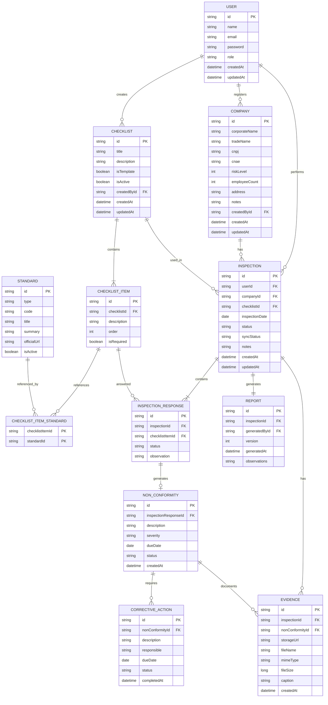

# 7. Modelo Lógico do Banco de Dados

## 7.1 Objetivo

O Modelo Lógico do Banco de Dados descreve a estrutura lógica das tabelas que compõem a plataforma, especificando seus atributos, chaves primárias, chaves estrangeiras e relacionamentos.

Sua finalidade é representar a organização dos dados de forma independente do Sistema Gerenciador de Banco de Dados (SGBD), servindo como base para a implementação física utilizando PostgreSQL e Prisma ORM.

A modelagem foi elaborada a partir do Modelo Conceitual, preservando os requisitos funcionais e as regras de negócio definidas para a plataforma.

---

## 7.2 Modelo Lógico

A Figura 9 apresenta o Modelo Lógico do Banco de Dados da plataforma.

> **Figura 9 – Modelo Lógico do Banco de Dados da Plataforma SST**
(Provisoriamente em Mermaid)

**Fonte:** Elaborado pelo autor.

---

## 7.3 Descrição das Relações

## Modelo Lógico (Representação em Tabela)

### USER

| Campo      | Tipo     | Restrição |
| ---------- | -------- | --------- |
| id         | UUID     | PK        |
| name       | VARCHAR  | NOT NULL  |
| email      | VARCHAR  | UNIQUE    |
| password   | VARCHAR  | NOT NULL  |
| role       | ENUM     | NOT NULL  |
| created_at | DATETIME | NOT NULL  |
| updated_at | DATETIME | NOT NULL  |

---

### COMPANY

| Campo          | Tipo     | Restrição |
| -------------- | -------- | --------- |
| id             | UUID     | PK        |
| corporate_name | VARCHAR  | NOT NULL  |
| trade_name     | VARCHAR  | NULL      |
| cnpj           | VARCHAR  | UNIQUE    |
| cnae           | VARCHAR  | NOT NULL  |
| risk_level     | INTEGER  | NOT NULL  |
| employee_count | INTEGER  | NOT NULL  |
| address        | VARCHAR  | NULL      |
| notes          | TEXT     | NULL      |
| created_by_id  | UUID     | FK → USER |
| created_at     | DATETIME | NOT NULL  |
| updated_at     | DATETIME | NOT NULL  |

---

### CHECKLIST

| Campo         | Tipo     | Restrição |
| ------------- | -------- | --------- |
| id            | UUID     | PK        |
| title         | VARCHAR  | NOT NULL  |
| description   | TEXT     | NULL      |
| is_template   | BOOLEAN  | NOT NULL  |
| is_active     | BOOLEAN  | NOT NULL  |
| created_by_id | UUID     | FK → USER |
| created_at    | DATETIME | NOT NULL  |
| updated_at    | DATETIME | NOT NULL  |

---

### CHECKLIST_ITEM

| Campo        | Tipo    | Restrição |
| ------------ | ------- | --------- |
| id           | UUID    | PK        |
| checklist_id | UUID    | FK        |
| description  | TEXT    | NOT NULL  |
| order        | INTEGER | NOT NULL  |
| is_required  | BOOLEAN | NOT NULL  |

---

### STANDARD

| Campo        | Tipo    | Restrição |
| ------------ | ------- | --------- |
| id           | UUID    | PK        |
| type         | ENUM    | NOT NULL  |
| code         | VARCHAR | NOT NULL  |
| title        | VARCHAR | NOT NULL  |
| summary      | TEXT    | NULL      |
| official_url | VARCHAR | NULL      |
| is_active    | BOOLEAN | NOT NULL  |

---

### CHECKLIST_ITEM_STANDARD

| Campo             | Tipo | Restrição |
| ----------------- | ---- | --------- |
| checklist_item_id | UUID | PK, FK    |
| standard_id       | UUID | PK, FK    |

---

### INSPECTION

| Campo           | Tipo     | Restrição |
| --------------- | -------- | --------- |
| id              | UUID     | PK        |
| user_id         | UUID     | FK        |
| company_id      | UUID     | FK        |
| checklist_id    | UUID     | FK        |
| inspection_date | DATE     | NOT NULL  |
| status          | ENUM     | NOT NULL  |
| sync_status     | ENUM     | NOT NULL  |
| notes           | TEXT     | NULL      |
| created_at      | DATETIME | NOT NULL  |
| updated_at      | DATETIME | NOT NULL  |

---

### INSPECTION_RESPONSE

| Campo             | Tipo | Restrição |
| ----------------- | ---- | --------- |
| id                | UUID | PK        |
| inspection_id     | UUID | FK        |
| checklist_item_id | UUID | FK        |
| status            | ENUM | NOT NULL  |
| observation       | TEXT | NULL      |

---

### NON_CONFORMITY

| Campo                  | Tipo     | Restrição |
| ---------------------- | -------- | --------- |
| id                     | UUID     | PK        |
| inspection_response_id | UUID     | FK        |
| description            | TEXT     | NOT NULL  |
| severity               | ENUM     | NOT NULL  |
| due_date               | DATE     | NULL      |
| status                 | ENUM     | NOT NULL  |
| created_at             | DATETIME | NOT NULL  |

---

### CORRECTIVE_ACTION

| Campo             | Tipo     | Restrição |
| ----------------- | -------- | --------- |
| id                | UUID     | PK        |
| non_conformity_id | UUID     | FK        |
| description       | TEXT     | NOT NULL  |
| responsible       | VARCHAR  | NULL      |
| due_date          | DATE     | NULL      |
| status            | ENUM     | NOT NULL  |
| completed_at      | DATETIME | NULL      |

---

### EVIDENCE

| Campo             | Tipo     | Restrição |
| ----------------- | -------- | --------- |
| id                | UUID     | PK        |
| inspection_id     | UUID     | FK (NULL) |
| non_conformity_id | UUID     | FK (NULL) |
| storage_url       | VARCHAR  | NOT NULL  |
| file_name         | VARCHAR  | NOT NULL  |
| mime_type         | VARCHAR  | NOT NULL  |
| file_size         | BIGINT   | NOT NULL  |
| caption           | TEXT     | NULL      |
| created_at        | DATETIME | NOT NULL  |

---

### REPORT

| Campo           | Tipo     | Restrição  |
| --------------- | -------- | ---------- |
| id              | UUID     | PK         |
| inspection_id   | UUID     | UNIQUE, FK |
| generated_by_id | UUID     | FK         |
| version         | INTEGER  | NOT NULL   |
| generated_at    | DATETIME | NOT NULL   |
| observations    | TEXT     | NULL       |

---

## 7.4 Regras de Integridade

A modelagem lógica foi construída observando as seguintes regras:

* Cada usuário pode cadastrar diversas empresas, criar vários checklists e realizar múltiplas inspeções.
* Cada empresa pode possuir diversas inspeções ao longo do tempo.
* Cada checklist é composto por um ou mais itens.
* Um item de checklist pode estar relacionado a diversas normas, assim como uma norma pode ser utilizada em diversos itens, sendo essa relação implementada por meio da entidade associativa `CHECKLIST_ITEM_STANDARD`.
* Cada inspeção utiliza exatamente um checklist e gera diversas respostas correspondentes aos itens avaliados.
* Cada resposta pode originar, no máximo, uma não conformidade.
* Cada não conformidade pode possuir diversas ações corretivas e evidências.
* Cada inspeção gera um único relatório consolidado.

---

## 7.5 Considerações

O Modelo Lógico detalha a organização das tabelas e dos relacionamentos que serão implementados na plataforma, servindo como referência direta para a construção do banco de dados.

Sua estrutura foi desenvolvida considerando boas práticas de modelagem relacional, normalização dos dados e compatibilidade com PostgreSQL e Prisma ORM, permitindo que a implementação mantenha consistência com os documentos de requisitos, o Diagrama de Classes e o Modelo Conceitual apresentados anteriormente.
