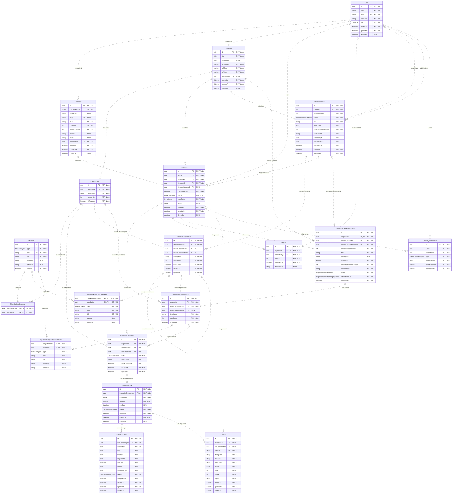

# 7. Modelo Lógico do Banco de Dados

Documentação da Fase 2, conferida em 3 de outubro de 2026 no HEAD
`0e7c6e4fcebb3edaf8c5eba3efd23dc357dfb8f9`. Fontes primárias:
[schema Prisma](../prisma/schema.prisma) e as seis
[migrations](../prisma/migrations/). O estado físico descrito é o resultado
dessas migrations, sem consulta de catálogo a um banco remoto nesta tarefa.
Services/Repositories são citados somente para distinguir garantias da aplicação.

## 7.1 Objetivo e notação

Representar as 19 entidades, seus atributos escalares, PKs/FKs, unicidades e
cardinalidades, incluindo associações normativas, snapshots, offline e legado.
Os comentários de atributo indicam NULL/NOT NULL; os tipos são lógicos,
mantendo nomes de enums para rastreabilidade. PK, FK e UK são marcadores
independentes (PK, FK nas chaves associativas; FK, UK nas relações únicas).
UK de campo isolado não é usado para versionNumber ou orderIndex.

Todas as relações desenhadas correspondem às FKs vigentes. A extremidade junto
ao pai indica 1 ou 0..1 pai por filho; a extremidade junto ao filho indica
0..N ou 0..1 filhos por pai. Linhas pontilhadas representam vínculos não
identificadores nesta notação; identidade por PK é explícita nos atributos.

## 7.2 Diagrama

**Figura 9 — Modelo Lógico do Banco de Dados da Plataforma SST.**
Fonte: elaborado pelo autor a partir da implementação.
PlantUML equivalente: [logical.puml](./diagrams/database/logical.puml).

```mermaid
erDiagram
  User {
    uuid id PK "NOT NULL"
    string name "NOT NULL"
    string email UK "NOT NULL"
    string password "NOT NULL"
    UserRole role "NOT NULL"
    datetime createdAt "NOT NULL"
    datetime updatedAt "NOT NULL"
    datetime deletedAt "NULL"
  }
  Company {
    uuid id PK "NOT NULL"
    string corporateName "NOT NULL"
    string tradeName "NULL"
    string cnpj UK "NULL"
    string cnae "NOT NULL"
    int riskLevel "NOT NULL"
    int employeeCount "NOT NULL"
    string address "NULL"
    string notes "NULL"
    uuid createdById FK "NOT NULL"
    datetime createdAt "NOT NULL"
    datetime updatedAt "NOT NULL"
    datetime deletedAt "NULL"
  }
  Standard {
    uuid id PK "NOT NULL"
    StandardType type "NOT NULL"
    string code UK "NOT NULL"
    string title "NOT NULL"
    string summary "NULL"
    string officialUrl "NULL"
    boolean isActive "NOT NULL"
  }
  Checklist {
    uuid id PK "NOT NULL"
    string title "NOT NULL"
    string description "NULL"
    boolean isTemplate "NOT NULL"
    boolean isOfficial "NOT NULL"
    boolean isActive "NOT NULL"
    uuid createdById FK "NULL"
    datetime createdAt "NOT NULL"
    datetime updatedAt "NOT NULL"
    datetime deletedAt "NULL"
  }
  ChecklistItem {
    uuid id PK "NOT NULL"
    uuid checklistId FK "NOT NULL"
    string description "NOT NULL"
    int orderIndex "NOT NULL"
    boolean isRequired "NOT NULL"
  }
  ChecklistItemStandard {
    uuid checklistItemId PK, FK "NOT NULL"
    uuid standardId PK, FK "NOT NULL"
  }
  ChecklistVersion {
    uuid id PK "NOT NULL"
    uuid checklistId FK "NOT NULL"
    int versionNumber "NOT NULL"
    ChecklistVersionStatus status "NOT NULL"
    string title "NOT NULL"
    string description "NULL"
    int contentSchemaVersion "NOT NULL"
    string contentHash "NULL"
    uuid createdById FK "NULL"
    uuid publishedById FK "NULL"
    datetime publishedAt "NULL"
    datetime createdAt "NOT NULL"
    datetime updatedAt "NOT NULL"
  }
  ChecklistVersionItem {
    uuid id PK "NOT NULL"
    uuid checklistVersionId FK "NOT NULL"
    uuid sourceVersionItemId FK "NULL"
    uuid sourceChecklistItemId FK "NULL"
    string description "NOT NULL"
    int orderIndex "NOT NULL"
    boolean isRequired "NOT NULL"
    datetime createdAt "NOT NULL"
    datetime updatedAt "NOT NULL"
  }
  ChecklistVersionItemStandard {
    uuid checklistVersionItemId PK, FK "NOT NULL"
    uuid standardId PK, FK "NOT NULL"
    StandardType type "NOT NULL"
    string code "NOT NULL"
    string title "NOT NULL"
    string summary "NULL"
    string officialUrl "NULL"
  }
  Inspection {
    uuid id PK "NOT NULL"
    uuid userId FK "NOT NULL"
    uuid companyId FK "NOT NULL"
    uuid checklistId FK "NOT NULL"
    uuid checklistVersionId FK "NULL"
    datetime inspectionDate "NOT NULL"
    InspectionStatus status "NOT NULL"
    SyncStatus syncStatus "NOT NULL"
    string notes "NULL"
    datetime createdAt "NOT NULL"
    datetime updatedAt "NOT NULL"
    datetime deletedAt "NULL"
  }
  InspectionChecklistSnapshot {
    uuid id PK "NOT NULL"
    uuid inspectionId FK, UK "NOT NULL"
    uuid sourceChecklistId FK "NOT NULL"
    uuid sourceChecklistVersionId FK "NOT NULL"
    int sourceVersionNumber "NOT NULL"
    string title "NOT NULL"
    string description "NULL"
    boolean isTemplate "NOT NULL"
    int snapshotSchemaVersion "NOT NULL"
    string contentHash "NOT NULL"
    InspectionSnapshotOrigin origin "NOT NULL"
    InspectionSnapshotIntegrityStatus integrityStatus "NOT NULL"
    datetime capturedAt "NOT NULL"
  }
  InspectionSnapshotItem {
    uuid id PK "NOT NULL"
    uuid snapshotId FK "NOT NULL"
    uuid sourceVersionItemId FK "NOT NULL"
    uuid sourceChecklistItemId FK "NULL"
    string description "NOT NULL"
    int orderIndex "NOT NULL"
    boolean isRequired "NOT NULL"
  }
  InspectionSnapshotItemStandard {
    uuid snapshotItemId PK, FK "NOT NULL"
    uuid standardId PK, FK "NOT NULL"
    StandardType type "NOT NULL"
    string code "NOT NULL"
    string title "NOT NULL"
    string summary "NULL"
    string officialUrl "NULL"
  }
  InspectionResponse {
    uuid id PK "NOT NULL"
    uuid inspectionId FK "NOT NULL"
    uuid checklistItemId FK "NULL"
    uuid snapshotItemId FK "NULL"
    ResponseStatus status "NOT NULL"
    string observation "NULL"
    datetime clientUpdatedAt "NULL"
    datetime createdAt "NOT NULL"
    datetime updatedAt "NOT NULL"
  }
  NonConformity {
    uuid id PK "NOT NULL"
    uuid inspectionResponseId FK, UK "NOT NULL"
    string description "NOT NULL"
    Severity severity "NOT NULL"
    datetime dueDate "NULL"
    NonConformityStatus status "NOT NULL"
    datetime createdAt "NOT NULL"
    datetime updatedAt "NOT NULL"
    datetime deletedAt "NULL"
  }
  CorrectiveAction {
    uuid id PK "NOT NULL"
    uuid nonConformityId FK "NOT NULL"
    string description "NOT NULL"
    string why "NULL"
    string location "NULL"
    string responsible "NULL"
    datetime dueDate "NULL"
    string method "NULL"
    string estimatedCost "NULL"
    CorrectiveActionStatus status "NOT NULL"
    datetime completedAt "NULL"
    datetime createdAt "NOT NULL"
    datetime updatedAt "NOT NULL"
    datetime deletedAt "NULL"
  }
  Evidence {
    uuid id PK "NOT NULL"
    uuid inspectionId FK "NULL"
    uuid nonConformityId FK "NULL"
    string publicId UK "NOT NULL"
    string storageUrl "NOT NULL"
    string fileName "NOT NULL"
    string mimeType "NOT NULL"
    bigint fileSize "NOT NULL"
    int width "NULL"
    int height "NULL"
    string caption "NULL"
    datetime createdAt "NOT NULL"
    datetime updatedAt "NOT NULL"
    datetime deletedAt "NULL"
  }
  Report {
    uuid id PK "NOT NULL"
    uuid inspectionId FK, UK "NOT NULL"
    uuid generatedById FK "NOT NULL"
    int version "NOT NULL"
    datetime generatedAt "NOT NULL"
    string observations "NULL"
  }
  OfflineSyncOperation {
    uuid id PK "NOT NULL"
    uuid userId FK "NOT NULL"
    uuid inspectionId FK "NOT NULL"
    OfflineOperationType type "NOT NULL"
    string payloadHash "NOT NULL"
    datetime clientCreatedAt "NOT NULL"
    datetime completedAt "NOT NULL"
  }

  User ||..o{ Company : createdById
  User |o..o{ Checklist : createdById
  Checklist ||..o{ ChecklistItem : checklistId
  ChecklistItem ||..o{ ChecklistItemStandard : checklistItemId
  Standard ||..o{ ChecklistItemStandard : standardId
  User ||..o{ Inspection : userId
  Company ||..o{ Inspection : companyId
  Checklist ||..o{ Inspection : checklistId
  Inspection ||..o{ InspectionResponse : inspectionId
  ChecklistItem |o..o{ InspectionResponse : checklistItemId
  InspectionResponse ||..o| NonConformity : inspectionResponseId
  NonConformity ||..o{ CorrectiveAction : nonConformityId
  Inspection ||..o| Report : inspectionId
  User ||..o{ Report : generatedById
  Checklist ||..o{ ChecklistVersion : checklistId
  User |o..o{ ChecklistVersion : createdById
  User |o..o{ ChecklistVersion : publishedById
  ChecklistVersion ||..o{ ChecklistVersionItem : checklistVersionId
  ChecklistVersionItem |o..o{ ChecklistVersionItem : sourceVersionItemId
  ChecklistItem |o..o{ ChecklistVersionItem : sourceChecklistItemId
  ChecklistVersionItem ||..o{ ChecklistVersionItemStandard : checklistVersionItemId
  Standard ||..o{ ChecklistVersionItemStandard : standardId
  ChecklistVersion |o..o{ Inspection : checklistVersionId
  Inspection ||..o| InspectionChecklistSnapshot : inspectionId
  Checklist ||..o{ InspectionChecklistSnapshot : sourceChecklistId
  ChecklistVersion ||..o{ InspectionChecklistSnapshot : sourceChecklistVersionId
  InspectionChecklistSnapshot ||..o{ InspectionSnapshotItem : snapshotId
  ChecklistVersionItem ||..o{ InspectionSnapshotItem : sourceVersionItemId
  ChecklistItem |o..o{ InspectionSnapshotItem : sourceChecklistItemId
  InspectionSnapshotItem ||..o{ InspectionSnapshotItemStandard : snapshotItemId
  Standard ||..o{ InspectionSnapshotItemStandard : standardId
  InspectionSnapshotItem |o..o{ InspectionResponse : snapshotItemId
  Inspection |o..o{ Evidence : inspectionId
  NonConformity |o..o{ Evidence : nonConformityId
  User ||..o{ OfflineSyncOperation : userId
  Inspection ||..o{ OfflineSyncOperation : inspectionId
```

## 7.3 Chaves e unicidades

| Entidade                         | PK                                     |
| -------------------------------- | -------------------------------------- |
| `User`                           | `(id)`                                 |
| `Company`                        | `(id)`                                 |
| `Standard`                       | `(id)`                                 |
| `Checklist`                      | `(id)`                                 |
| `ChecklistItem`                  | `(id)`                                 |
| `ChecklistItemStandard`          | `(checklistItemId, standardId)`        |
| `ChecklistVersion`               | `(id)`                                 |
| `ChecklistVersionItem`           | `(id)`                                 |
| `ChecklistVersionItemStandard`   | `(checklistVersionItemId, standardId)` |
| `Inspection`                     | `(id)`                                 |
| `InspectionChecklistSnapshot`    | `(id)`                                 |
| `InspectionSnapshotItem`         | `(id)`                                 |
| `InspectionSnapshotItemStandard` | `(snapshotItemId, standardId)`         |
| `InspectionResponse`             | `(id)`                                 |
| `NonConformity`                  | `(id)`                                 |
| `CorrectiveAction`               | `(id)`                                 |
| `Evidence`                       | `(id)`                                 |
| `Report`                         | `(id)`                                 |
| `OfflineSyncOperation`           | `(id)`                                 |

As três associações têm **PK composta pelas duas FKs**, sem campo id.
Os demais 16 models usam PK UUID simples. As unicidades simples, compostas e a parcial são:

| Entidade                      | Conjunto único (simples ou composto)       |
| ----------------------------- | ------------------------------------------ |
| `User`                        | `(email)`                                  |
| `Company`                     | `(cnpj)`                                   |
| `ChecklistItem`               | `(checklistId, orderIndex)`                |
| `Standard`                    | `(code)`                                   |
| `InspectionResponse`          | `(inspectionId, checklistItemId)`          |
| `NonConformity`               | `(inspectionResponseId)`                   |
| `Report`                      | `(inspectionId)`                           |
| `ChecklistVersion`            | `(checklistId, versionNumber)`             |
| `ChecklistVersion`            | `(checklistId)` WHERE `"status" = 'DRAFT'` |
| `ChecklistVersionItem`        | `(checklistVersionId, orderIndex)`         |
| `InspectionChecklistSnapshot` | `(inspectionId)`                           |
| `InspectionSnapshotItem`      | `(snapshotId, orderIndex)`                 |
| `InspectionResponse`          | `(inspectionId, snapshotItemId)`           |
| `Evidence`                    | `(publicId)`                               |

Company.cnpj aceita vários NULL. Nos dois UNIQUE de InspectionResponse,
NULL não impede várias linhas sem a respectiva referência; o CHECK de item
exige pelo menos uma. NonConformity.inspectionResponseId e Report.inspectionId
são únicos, portanto uma resposta admite zero ou uma NC e uma inspeção admite
zero ou um Report persistido. Exclusão lógica não retira essas unicidades.

## 7.4 Vínculos e compatibilidade

Checklist.createdById é opcional no atributo, com ownership condicional:
oficial exige template e proprietário NULL; pessoal exige proprietário.
ChecklistVersion.createdById e publishedById são opcionais; a relação de
publicação é distinta da autoria e da propriedade. O banco não impõe igualdade
entre autor e proprietário nem autoria institucional por consulta ao pai.

ChecklistVersion não tem FK de versão anterior. A linhagem é por item:
sourceVersionItemId autorreferente opcional. Em InspectionSnapshotItem,
sourceVersionItemId é obrigatório. sourceChecklistItemId preserva a origem
legada em ambos os tipos de item. As três associações com Standard são N:N,
mas versões/snapshots também guardam cópias dos dados normativos.

Inspection.checklistVersionId é nullable e Inspection admite 0..1 snapshot;
o snapshot exige exatamente uma inspeção. A criação atual exige versão
PUBLISHED e cria a captura na transação. A associação das respostas permite
snapshotItemId OR checklistItemId, inclusive ambos; a aplicação exige que
o item histórico pertença à inspeção. As FKs simples não verificam essa
coerência entre tabelas nem que a versão pertença ao checklist escolhido.

Evidence usa duas relações opcionais acompanhadas da regra **XOR**: exatamente
uma deve estar preenchida. A exigência de snapshot, autenticação e formato
de imagem pertence à aplicação. OfflineSyncOperation representa a confirmação
remota, sem campo status/payload, com UUID do cliente sem default.

## 7.5 Dados e regras que exigem texto complementar

- versionNumber é positivo e único por checklist; há um DRAFT por checklist
  via índice único parcial. Não existe unicidade global de número/ordem.
- Ordem é única por checklist legado, versão ou snapshot. Positividade possui
  CHECK somente nos itens de versão e snapshot, sem sequência contígua exigida.
- Hash de versão é nullable no draft; hash de snapshot/operação é obrigatório.
  CHECK valida formato, a aplicação calcula/verifica o conteúdo canônico.
- A publicação exige data/hash e publicador OU criador NULL na condição vigente;
  autor/publicador institucionais são NULL no bootstrap. Imutabilidade não é trigger.
- CorrectiveAction mantém o 5W2H; estimatedCost é texto nullable, assim como
  why/location/responsible/method. dueDate/completedAt são datas opcionais.
- updatedAt da resposta é revisão remota por horário; clientUpdatedAt guarda
  horário do dispositivo. Não há contador numérico de revisão.
- LEGACY_BACKFILL/UNVERIFIED_LEGACY/formato 0 identificam conteúdo importado sem
  comprovação histórica; os models legados permanecem vigentes.
- Report é persistível; DTO/HTML sob demanda e impressão não o persistem
  automaticamente. Sua versão não cria várias linhas por inspeção.

## 7.6 Ações referenciais e fontes detalhadas

Todas as FKs das migrations usam ON DELETE RESTRICT e ON UPDATE CASCADE.
Há uma divergência conhecida: o schema nullable de Checklist.createdById
sem onDelete gera SET NULL, mas a FK histórica continua RESTRICT. Esta
documentação segue o estado migrado, sem alteração do schema/banco.

Inventários completos de campos, FKs, índices, CHECKs e limites das camadas:
[DicionarioDeDados.md](./DicionarioDeDados.md). Tipos, defaults SQL e evolução
das migrations: [ModeloFisicoDB.md](./ModeloFisicoDB.md). A abstração de domínio
está no [modelo conceitual](./ModeloConceitualDoBancoDeDados.md).
