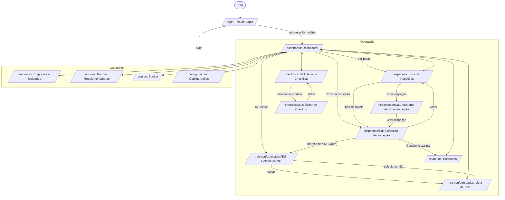
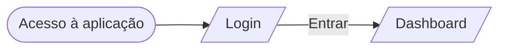
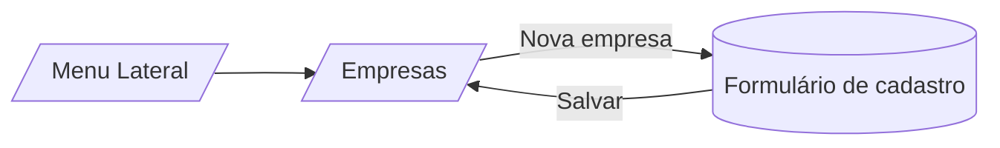
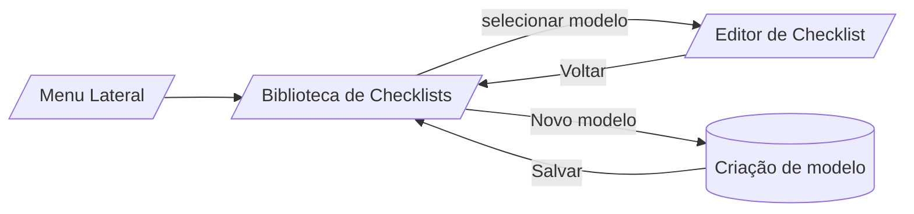
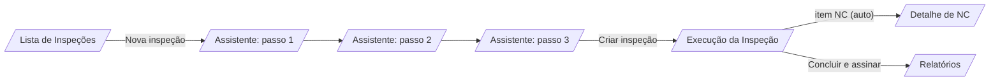
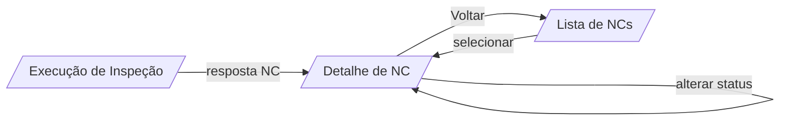
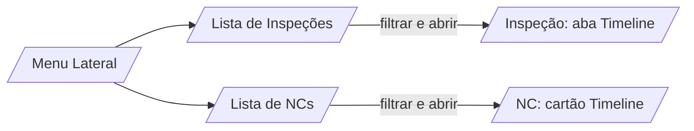
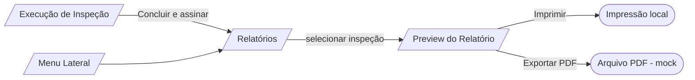

# Mapa de Navegação — Plataforma SST Inspeções

Documento de apoio à entrega acadêmica que descreve, de forma textual e gráfica, o mapa de navegação da plataforma de apoio a inspeções, auditorias e fiscalizações de Segurança e Saúde no Trabalho (SST). A descrição reflete as rotas implementadas em `src/routes/` e os vínculos de navegação reais entre as telas. Na entrega atual, o fluxo principal possui backend e autenticação real; alguns módulos secundários ainda mantêm dados mockados.

---

## 1. Visão Geral do Fluxo do Usuário

O acesso à plataforma ocorre por meio da **Tela de Login**, na qual o usuário simula sua autenticação e seleciona o perfil operacional (Inspetor, Gestor SST ou Auditor). Concluída essa etapa, o sistema o conduz ao **Dashboard**, que centraliza indicadores estratégicos e ofertas de navegação contextual para as principais atividades do domínio.

A partir do Dashboard, o usuário ingressa em uma das três grandes rotas de trabalho: (i) o **ciclo operacional de inspeção**, que parte da *Lista de Inspeções*, passa pelo *Assistente de Nova Inspeção* e culmina na *Tela de Execução*, em que respostas, evidências e a assinatura digital do responsável são coletadas; (ii) o **ciclo de tratativa de não conformidades**, organizado em *Lista* (com visões *Kanban* e tabular) e *Detalhe*, onde é elaborado o Plano de Ação 5W2H; e (iii) o **ciclo documental**, no qual o usuário aciona a *Tela de Relatórios* para selecionar uma inspeção concluída e gerar o documento consolidado. Telas auxiliares de **Cadastros** (Empresas, Checklists, Normas e Equipe) e **Configurações** permanecem acessíveis em qualquer momento, por meio do menu lateral persistente do *AppShell*.

A coesão da navegação é assegurada por três elementos transversais: o **menu lateral**, que oferece acesso direto a qualquer área; a **barra superior**, que dá acesso ao perfil e à alternância do modo *offline*; e a **navegação programática** disparada por ações de negócio, como a conclusão de uma inspeção, que redireciona automaticamente o usuário à tela de Relatórios.

---

## 2. Diagrama Global de Navegação

> O diagrama representa os subgrafos *Operação* e *Cadastros* tal como agrupados no menu lateral. Para preservar a legibilidade, as arestas bidirecionais entre o Dashboard e os módulos representam o acesso simétrico via menu lateral, disponível em qualquer tela autenticada.

---

## 3. Fluxos Principais

### 3.1 Autenticação (Login)

A autenticação inaugura a sessão do usuário, registrando, no *store* local, o identificador do usuário e o perfil escolhido. No protótipo, quaisquer credenciais são aceitas; o foco reside na simulação da diferenciação de papéis e na transição para o Dashboard.

**Sequência de telas:** `/` → `/login` → `/dashboard`.

### 3.2 Cadastro de Empresa

A tela de **Empresas e Unidades** apresenta o catálogo de organizações fiscalizadas. O ato de cadastro é iniciado pelo botão *Nova empresa* na barra de ações do cabeçalho; no protótipo atual a operação é representativa, sem formulário dedicado, mas o ponto de entrada e o local de retorno são claramente definidos.

**Sequência de telas:** menu lateral → `/empresas` → ação *Nova empresa* → retorno a `/empresas` com o novo cartão listado.

### 3.3 Cadastro de Checklist

A **Biblioteca de Checklists** funciona como repositório dos instrumentos avaliativos, organizados por norma. A partir dela, o usuário pode visualizar um modelo existente no **Editor de Checklist** ou iniciar a criação de um novo modelo por meio do botão *Novo modelo*.

**Sequência de telas:** menu lateral → `/checklists` → `/checklists/$id` (visualização) **ou** ação *Novo modelo* → retorno à biblioteca.

### 3.4 Execução de Inspeção

Trata-se do fluxo central do sistema. O usuário inicia pelo planejamento, percorre o assistente em três passos (empresa/unidade, checklist/título e agendamento) e é direcionado à **Tela de Execução**, na qual o checklist é respondido item a item. Ao registrar uma resposta de *Não Conforme*, o sistema cria automaticamente uma Não Conformidade vinculada à inspeção. O encerramento é realizado mediante coleta de assinatura digital, momento em que o sistema redireciona o usuário à área de Relatórios.

**Sequência de telas:** `/inspecoes` → `/inspecoes/nova` → `/inspecoes/$id` → (criação automática) `/nao-conformidades/$id` → `/relatorios`.

### 3.5 Registro de Não Conformidades

Há dois caminhos para a criação e a tratativa de uma NC. O caminho **implícito** ocorre durante a execução de uma inspeção, quando a resposta *Não Conforme* gera automaticamente o registro. O caminho **explícito** parte da listagem de NCs (Kanban ou Lista), em que o usuário acessa o **Detalhe de NC** para descrever o problema, elaborar o **Plano de Ação 5W2H**, atualizar o *status* e anexar evidências. A linha do tempo de eventos permite rastrear todas as alterações.

**Sequência de telas:** `/inspecoes/$id` *ou* `/nao-conformidades` → `/nao-conformidades/$id` → preenchimento do plano e mudança de *status* → retorno à listagem.

### 3.6 Consulta de Histórico

O histórico é consultado em três pontos da plataforma: (i) na aba **Timeline** da *Tela de Execução de Inspeção*, que registra eventos do ciclo de vida da inspeção; (ii) no cartão **Timeline** do *Detalhe de NC*, que documenta cada intervenção sobre a não conformidade; e (iii) nas listagens filtráveis de *Inspeções* e de *NCs*, que permitem reconstituir o histórico agregado por *status*, critério textual ou criticidade.

**Sequência de telas:** menu lateral → `/inspecoes` (filtros) → `/inspecoes/$id` (aba Timeline) → `/nao-conformidades` → `/nao-conformidades/$id` (cartão Timeline).

### 3.7 Relatórios

A emissão de relatórios encerra o ciclo documental. O usuário seleciona uma inspeção concluída e visualiza o relatório consolidado, contendo dados cadastrais, resumo quantitativo, detalhamento item a item, NCs registradas e a assinatura digital. As ações de *Imprimir* e *Exportar PDF* completam o fluxo de saída.

**Sequência de telas:** `/inspecoes/$id` (após conclusão) → `/relatorios` → seleção da inspeção → ações de saída (impressão ou exportação simulada).

---

## 4. Matriz de Navegação

| Tela de origem | Telas de destino | Gatilho |
|---|---|---|
| `/` | `/login` | Redirecionamento inicial |
| `/login` | `/dashboard` | Botão *Entrar* |
| `/dashboard` | `/inspecoes` | Botão *Ver todas* / menu lateral |
| `/dashboard` | `/inspecoes/$id` | Clique em *próxima inspeção* |
| `/dashboard` | `/nao-conformidades/$id` | Clique em *NC crítica* |
| `/inspecoes` | `/inspecoes/nova` | Botão *Nova inspeção* |
| `/inspecoes` | `/inspecoes/$id` | Linha da tabela |
| `/inspecoes/nova` | `/inspecoes/$id` | Botão *Criar inspeção* |
| `/inspecoes/$id` | `/nao-conformidades/$id` | Resposta *Não Conforme* (criação automática) |
| `/inspecoes/$id` | `/relatorios` | Botão *Concluir e assinar* |
| `/inspecoes/$id` | `/inspecoes` | Botão *Voltar* |
| `/checklists` | `/checklists/$id` | Clique em cartão de modelo |
| `/checklists/$id` | `/checklists` | Botão *Voltar* |
| `/nao-conformidades` | `/nao-conformidades/$id` | Clique em cartão (Kanban) ou linha (Lista) |
| `/nao-conformidades/$id` | `/nao-conformidades` | Botão *Voltar* |
| `/relatorios` | — | Ações *Imprimir* / *Exportar PDF* (sem navegação) |
| `/empresas`, `/normas`, `/equipe`, `/configuracoes` | qualquer rota | Menu lateral |
| `/configuracoes` | `/login` | Botão *Sair* (rodapé do menu lateral) |
| Barra superior (qualquer tela) | `/configuracoes` | Clique no avatar do usuário |

---

## 5. Observações sobre Persistência e Navegação Programática

Por se tratar de protótipo de *frontend*, todas as transições e mutações de estado são geridas pelo *store* em memória (`mockStore`), com persistência local em `localStorage`. Não há *backend* nem autenticação real, e os modais clássicos de confirmação foram substituídos por **notificações *toast***, que sinalizam o sucesso ou a advertência de uma ação sem interromper o fluxo de navegação. As transições disparadas por regras de negócio — notadamente a criação automática de Não Conformidades durante a execução de uma inspeção e o redirecionamento à tela de Relatórios após o encerramento — são exemplos de **navegação programática**, executadas pelo *router* sem ação direta do usuário sobre elementos de interface.
